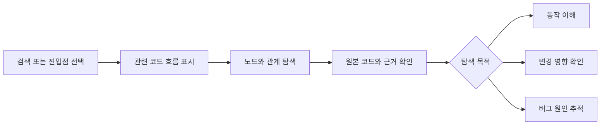
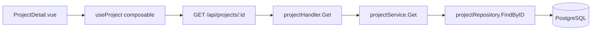
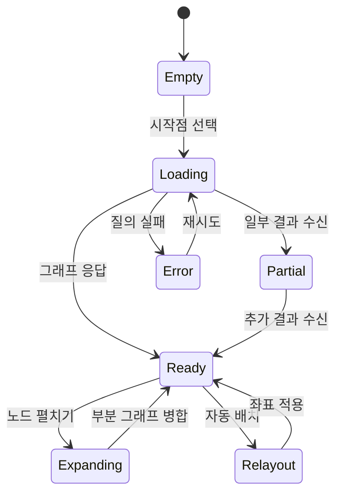
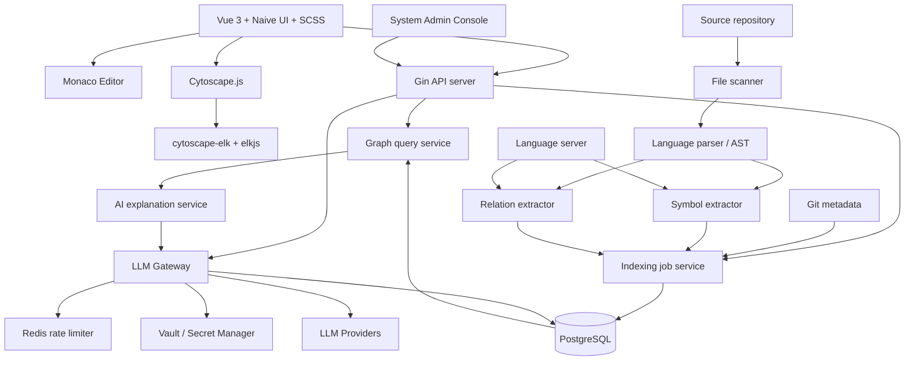
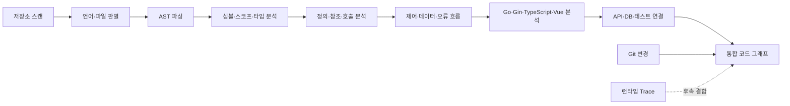
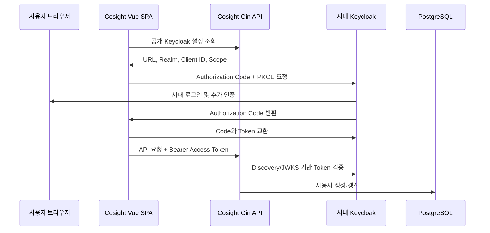
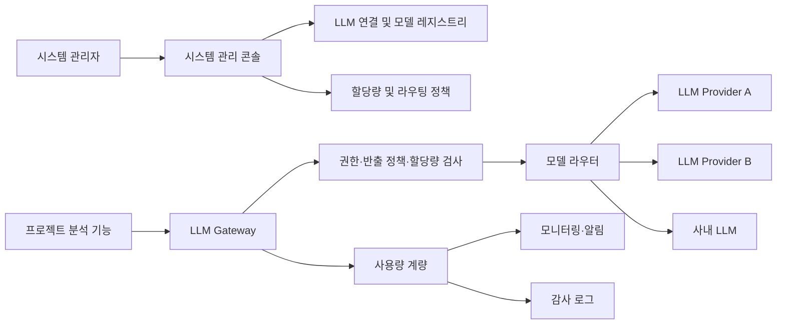
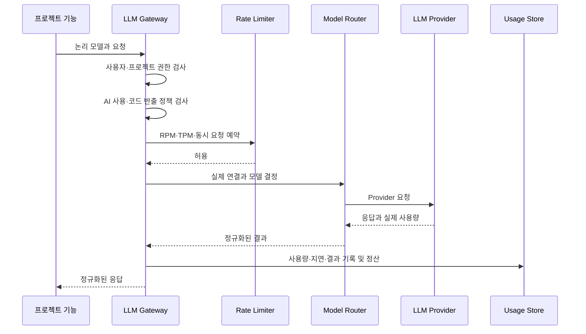

# Cosight 제품 설계서

> 상태: 초안 1.0  
> 작성일: 2026-09-18  
> 목적: 복잡한 소스코드를 구조, 실행 흐름, 변경 영향 관점에서 빠르게 탐색하고 이해할 수 있는 도구를 설계한다.
> MVP 실행 명세: [MVP_SPEC.md](./MVP_SPEC.md)

## 0. 확정 기술 스택

Cosight 애플리케이션은 다음 기술 스택으로 개발한다. 이 항목은 분석 대상이 되는 프로그래밍 언어와 별개의 제품 구현 기술이다.

### 백엔드

- **언어:** Go
- **웹 프레임워크:** Gin
- **데이터베이스:** PostgreSQL
- **분산 제한 및 단기 상태:** Redis
- **비밀 관리:** 사내 Vault 또는 승인된 Secret Manager
- **역할:** 프로젝트 인덱싱 조정, 코드 그래프 저장 및 질의, 검색, 영향 분석, 중앙 LLM Gateway, 사용자 설정과 탐색 세션 관리

### 프런트엔드

- **프레임워크:** Vue 3
- **UI 컴포넌트:** Naive UI
- **스타일:** SCSS
- **코드 뷰어:** Monaco Editor
- **그래프 렌더링 및 탐색:** Cytoscape.js
- **그래프 자동 배치:** ELK의 JavaScript 배포판인 elkjs
- **그래프-레이아웃 연결:** cytoscape-elk
- **통계 차트:** Apache ECharts + vue-echarts
- **역할:** 프로젝트 탐색기, 코드 및 그래프 시각화, 분석 조건 입력, 결과 상세 표시, 탐색 상태 관리

### 구현 원칙

- Vue 3에서는 Composition API와 `<script setup>` 사용을 기본으로 한다.
- 공통 UI 요소는 Naive UI 컴포넌트를 우선 사용하고, 제품 고유의 레이아웃과 시각화 스타일은 SCSS로 관리한다.
- 코드 표시와 탐색은 Monaco Editor를 직접 감싼 Vue 컴포넌트로 구현한다.
- 그래프 렌더링과 기본 상호작용은 Cytoscape.js를 사용하고 계층형 자동 배치는 elkjs를 사용한다.
- 언어·노드·관계·경고 집계는 Apache ECharts로 표시하고 동일 데이터를 접근 가능한 표로도 제공한다.
- 점진적 펼치기, 경로 고정, 집중 보기, 분석 모드, 신뢰도와 근거 표현은 Cosight의 제품 로직으로 구현한다.
- 프런트엔드와 백엔드는 명시적인 API 계약으로 분리한다.
- Gin 핸들러에는 비즈니스 로직을 직접 두지 않고 서비스 및 분석 계층으로 분리한다.
- PostgreSQL은 프로젝트 메타데이터뿐 아니라 코드 노드, 관계, 분석 근거 및 탐색 세션을 저장한다.
- Redis는 LLM RPM·TPM, 동시 요청, 단기 예약량 및 Circuit Breaker 상태처럼 짧고 원자적인 분산 상태를 관리한다.
- LLM API Key와 Client Secret은 PostgreSQL에 평문으로 저장하지 않고 Secret Manager의 참조만 저장한다.
- 장시간 실행되는 인덱싱과 분석 작업은 일반 요청과 분리하고 진행 상태를 조회할 수 있게 한다.

## 1. 문서 목적

이 문서는 Cosight의 제품 목표, 핵심 사용자 경험, 기능 범위, 분석 모델, 기술 구조 및 단계별 구현 계획을 정의한다.

Cosight는 단순히 전체 코드를 거대한 그래프로 변환하는 도구가 아니다. 사용자가 현재 해결하려는 질문을 중심으로 필요한 코드와 관계만 점진적으로 보여주는 탐색 도구를 지향한다.

## 2. 제품 정의

### 2.1 한 문장 설명

Cosight는 소스코드를 파일 목록이 아닌 **구조, 실행 흐름, 상태 변화, 변경 영향**으로 탐색하게 해주는 코드 이해 도구다.

### 2.2 해결하려는 핵심 질문

사용자가 다음 질문에 빠르게 답할 수 있어야 한다.

1. 이 기능은 어디서 시작하고 어떻게 동작하는가?
2. 이 함수 또는 모듈은 시스템에서 어떤 역할을 하는가?
3. 이 코드를 변경하면 어디까지 영향을 받는가?
4. 이 버그가 발생할 수 있는 실행 경로는 무엇인가?
5. 관련 테스트와 외부 시스템 경계는 어디에 있는가?

### 2.3 핵심 가치

- **빠른 온보딩:** 처음 보는 코드베이스의 구조와 주요 흐름을 짧은 시간 안에 파악한다.
- **근거 기반 이해:** 모든 관계와 설명을 실제 코드 위치에서 검증할 수 있다.
- **점진적 탐색:** 전체 그래프가 아닌 현재 질문에 필요한 범위부터 펼친다.
- **변경 위험 감소:** 수정 전에 영향 범위와 관련 테스트를 확인한다.
- **버그 추적 지원:** 오류 지점, 상태 변화, 조건 분기 및 예외 전파 경로를 연결한다.

## 3. 목표와 비목표

### 3.1 초기 목표

- 저장소의 파일, 심볼 및 정적 의존 관계를 인덱싱한다.
- 특정 진입점에서 시작하는 주요 호출 흐름을 시각화한다.
- 그래프와 원본 코드 사이를 양방향으로 탐색한다.
- 특정 심볼 또는 변경 사항의 영향 범위를 확인한다.
- 분석 결과와 AI의 추론을 명확히 구분한다.
- 로컬 코드가 외부로 전송되지 않는 기본 사용 방식을 제공한다.

### 3.2 초기 비목표

- 모든 프로그래밍 언어 지원
- 완전한 런타임 실행 경로 재현
- 자동 버그 수정 및 자동 리팩터링
- 여러 저장소에 걸친 분산 시스템 전체 분석
- IDE 기능 전체 대체
- 정적 분석만으로 동적 호출을 확정적으로 판정

## 4. 대상 사용자

### 4.1 신규 합류 개발자

- 낯선 코드베이스의 모듈 구조와 주요 기능 흐름을 이해한다.
- 문서가 부족하거나 오래된 프로젝트에서 실제 코드를 기준으로 학습한다.

### 4.2 유지보수 개발자

- 오래된 기능의 진입점과 영향 범위를 확인한다.
- 수정 전에 관련 코드와 테스트를 찾는다.

### 4.3 버그 분석 담당자

- 오류가 관찰된 위치에서 원인이 생성된 위치까지 역방향으로 추적한다.
- 예외 처리, 조건 분기, 공유 상태 및 비동기 경계를 조사한다.

### 4.4 코드 리뷰어 및 기술 리더

- 변경된 코드가 기존 구조에 미치는 영향을 검토한다.
- 모듈 간 결합도와 의존 방향의 이상 징후를 발견한다.

## 5. 제품 원칙

1. **질문이 그래프보다 먼저다.** 사용자가 수행할 작업을 선택하면 그 목적에 맞는 관계만 표시한다.
2. **점진적으로 공개한다.** 시스템, 패키지, 파일, 심볼, 실행 경로 순으로 상세 수준을 조절한다.
3. **모든 결과에는 근거가 있다.** 관계, 경고 및 설명은 파일과 코드 위치로 연결한다.
4. **확실성을 숨기지 않는다.** 정적 분석으로 확인된 사실과 휴리스틱 또는 AI 추론을 구분한다.
5. **코드와 시각화는 항상 동기화한다.** 그래프 선택은 코드 위치를 열고, 코드 선택은 관련 그래프를 구성한다.
6. **그래프 크기를 가치로 착각하지 않는다.** 더 많은 노드보다 더 적절한 경로가 중요하다.
7. **분석 실패도 정보다.** 동적 호출 등 확인할 수 없는 부분을 누락하지 않고 불확실한 경계로 표시한다.

## 6. 핵심 사용자 여정

### 6.1 기능 동작 이해

1. 사용자가 저장소를 연다.
2. API 경로, 이벤트 핸들러, 명령 또는 함수를 검색한다.
3. Cosight가 가능한 진입점을 제시한다.
4. 사용자가 진입점을 선택한다.
5. 주요 호출 흐름과 외부 경계를 우선 표시한다.
6. 사용자는 원하는 노드의 내부 구현을 펼친다.
7. 선택한 흐름을 저장하거나 공유 가능한 설명으로 내보낸다.

### 6.2 변경 영향 분석

1. 사용자가 함수, 타입, 파일 또는 Git 변경 사항을 선택한다.
2. 직접 참조와 직접 호출자를 표시한다.
3. 간접 영향 경로를 거리 및 신뢰도와 함께 계산한다.
4. 영향받을 가능성이 있는 API, 데이터 모델, 외부 시스템 및 테스트를 분류한다.
5. 사용자는 각 관계의 코드 근거를 확인한다.

### 6.3 버그 탐색

1. 사용자가 오류 메시지, 스택 프레임 또는 문제의 코드 위치를 입력한다.
2. 해당 위치로 들어오는 호출 및 데이터 흐름을 역방향으로 탐색한다.
3. 중요한 조건 분기, 상태 변경, 예외 변환 및 비동기 경계를 강조한다.
4. 최근 변경 이력과 관련 테스트를 함께 표시한다.
5. AI는 가능한 조사 경로를 제안하되 원인으로 확정하지 않는다.

## 7. 정보 구조와 화면 설계

### 7.1 기본 레이아웃

데스크톱 화면은 다음 세 영역으로 구성한다.

| 영역 | 역할 | 주요 요소 |
| --- | --- | --- |
| 왼쪽 탐색 영역 | 검색과 범위 선택 | 프로젝트 트리, 심볼 검색, 진입점, 저장된 탐색 |
| 중앙 시각화 영역 | 관계와 흐름 탐색 | 구조 그래프, 호출 흐름, 영향 경로, 필터 |
| 오른쪽 상세 영역 | 근거 확인 | 원본 코드, 심볼 정보, 관계 근거, 관련 테스트, Git 정보 |

### 7.2 탐색 모드

#### 구조 모드

- 패키지, 디렉터리, 파일, 클래스 및 함수의 포함 관계
- 모듈 간 의존 방향
- 순환 의존 및 과도한 결합 강조

#### 흐름 모드

- 선택한 진입점의 호출 경로
- 조건 분기와 예외 경로
- 데이터베이스, 네트워크, 파일 시스템 및 메시지 큐 경계

#### 영향 모드

- 선택 대상의 직접 및 간접 사용처
- 영향 거리와 신뢰도
- 관련 API, 데이터 구조 및 테스트

#### 버그 탐색 모드

- 오류 지점으로 들어오는 역방향 경로
- 상태 변경 지점
- 예외 생성, 변환 및 처리 위치
- 최근 변경된 경로

### 7.3 공통 상호작용

- 노드 선택: 코드와 메타데이터 표시
- 노드 펼치기: 한 단계의 내부 또는 인접 관계 추가
- 경로 고정: 중요한 노드와 연결을 화면에 유지
- 주변 숨기기: 선택한 경로 외 노드를 임시로 제거
- 상세 수준 변경: 패키지, 파일, 심볼 단위 전환
- 뒤로/앞으로: 탐색 이력 이동
- 근거 열기: 관계를 생성한 코드 위치 표시

### 7.4 메인화면의 목적

메인화면은 전체 코드를 한 번에 보여주는 그래프 뷰가 아니라 다음 작업이 연결되는 분석 작업 공간으로 설계한다.



핵심 동작은 다음 세 단계로 요약한다.

1. **찾기:** 분석을 시작할 함수, API, 컴포넌트, 오류 또는 변경 사항을 찾는다.
2. **좁히기:** 현재 질문과 관련된 노드와 경로만 남긴다.
3. **검증하기:** 그래프의 모든 관계를 실제 코드와 분석 근거로 확인한다.

### 7.5 메인화면 상세 레이아웃

```text
┌──────────────────────────────────────────────────────────────────────────────┐
│ 프로젝트 │ 브랜치 │ 통합 검색                         인덱싱 상태 │ 설정     │
├──────────────────┬─────────────────────────────────────┬─────────────────────┤
│ 탐색 영역        │ 시각화 영역                        │ 상세 영역           │
│                  │                                     │                     │
│ 프로젝트         │ 구조 | 흐름 | 영향 | 버그          │ 개요 | 코드 | 근거  │
│ 진입점           │                                     │ 참조 | 테스트 | Git │
│ 변경 파일        │       선택한 코드 그래프           │                     │
│ 저장된 탐색      │                                     │ 선택한 노드의       │
│                  │                                     │ 코드와 분석 정보    │
├──────────────────┴─────────────────────────────────────┴─────────────────────┤
│ 분석 작업 상태 · 경고 · 분석하지 못한 파일 · 백그라운드 작업              │
└──────────────────────────────────────────────────────────────────────────────┘
```

#### 상단 바

프로젝트 전체에 적용되는 상태와 탐색 이력을 관리한다.

- 현재 프로젝트 선택
- Git 브랜치 또는 비교 기준 선택
- 파일, 심볼, API, 문자열을 대상으로 하는 통합 검색
- 인덱싱 진행 상태와 마지막 갱신 시각
- 탐색 이력 뒤로 및 앞으로 이동
- 현재 탐색 세션 저장
- 프로젝트와 분석 설정 열기

#### 왼쪽 탐색 영역

분석을 시작할 대상을 선택한다. 다음 탭을 제공한다.

- **프로젝트:** 디렉터리, 파일, 타입, 함수 및 테스트를 트리로 표시한다.
- **진입점:** Gin 라우트, 미들웨어, CLI, 작업, Vue 라우트와 이벤트 핸들러를 표시한다.
- **변경 파일:** Git 변경 파일과 변경된 심볼을 표시한다.
- **저장된 탐색:** 저장한 시작점, 경로, 필터 및 메모를 다시 불러온다.

파일이나 심볼을 한 번 선택하면 오른쪽 상세 영역에서 미리 본다. 명시적으로 `중심으로 탐색`을 실행하거나 더블클릭하면 중앙 그래프의 기준점을 변경한다. 이 구분을 통해 단순 코드 확인이 사용자의 그래프 상태를 불필요하게 변경하지 않도록 한다.

#### 중앙 시각화 영역

현재 분석 모드에 맞는 코드 관계를 표시한다. 기본 화면에서는 핵심 경로만 렌더링하며, 사용자가 노드를 펼칠 때 인접 관계를 점진적으로 추가한다.

상단 도구 모음은 다음 기능을 제공한다.

- 구조, 흐름, 영향, 버그 모드 전환
- 관계 종류 필터
- 탐색 깊이 제한
- 상세 수준 전환: 패키지, 파일, 심볼
- 현재 선택에 집중
- 고정 경로만 보기
- 화면 맞춤과 자동 배치
- 이전 그래프 상태로 되돌리기

#### 오른쪽 상세 영역

선택한 노드 또는 관계를 검증하는 영역이다.

- **개요:** 이름, 종류, 시그니처, 역할, 호출 수, 신뢰도 및 최근 변경
- **코드:** 구문 강조, 정의와 참조 이동, 관계가 생성된 코드 범위 표시
- **근거:** AST, 언어 서버, 프레임워크 규칙, 휴리스틱 등 분석 출처
- **참조:** 호출자, 호출 대상, 타입 참조, 구현체 및 데이터 사용처
- **테스트:** 직접 관련 테스트와 영향 분석에 따른 권장 테스트
- **Git:** 최근 변경, 작성자, 커밋 및 현재 브랜치의 수정 사항

그래프와 코드 선택은 양방향으로 동기화한다. 그래프에서 노드를 선택하면 코드가 해당 정의로 이동하고, 코드에서 심볼을 선택하면 관련 그래프 동작을 제안한다.

##### Monaco Editor 동작

코드 탭은 Monaco Editor로 구현하며 기본적으로 읽기 전용으로 동작한다.

- 파일마다 실제 프로젝트 경로를 반영한 고유 URI의 Monaco Model을 생성한다.
- Go, Vue, TypeScript, JavaScript, SCSS, JSON 및 SQL 구문 강조를 지원한다.
- 그래프 노드를 선택하면 정의 범위로 이동하고 관계를 선택하면 호출 또는 참조 범위를 Decoration으로 강조한다.
- 오류, Git 변경, 분석 근거 및 현재 선택은 서로 구분되는 Decoration 계층으로 관리한다.
- 열린 파일은 탭으로 관리하고 이후 버전에서 Monaco Diff Editor를 이용한 Git 비교를 제공한다.
- 닫은 파일의 Model, 이벤트 리스너 및 Decoration은 명시적으로 정리한다.
- VS Code 확장 호환을 전제로 하지 않으며 필요한 탐색 기능은 Cosight API와 Monaco Provider를 연결해 구현한다.

#### 하단 작업 상태 영역

하단에는 장시간 실행되는 작업을 방해하지 않는 축소 가능한 상태 영역을 둔다.

- 최초 및 증분 인덱싱 진행률
- 현재 실행 중인 분석 작업
- 분석하지 못한 파일과 원인
- 취소 또는 재시도 가능한 작업
- 분석 결과에 영향을 주는 경고

### 7.6 통합 검색 동작

통합 검색은 다음 대상을 함께 검색하고 종류별로 결과를 분류한다.

- 파일과 패키지
- Go 함수, 메서드, 구조체 및 인터페이스
- Gin API 경로와 미들웨어
- Vue 컴포넌트, composable, 라우터 경로 및 이벤트 핸들러
- 문자열과 오류 메시지
- PostgreSQL 테이블과 쿼리 사용처

검색 결과 예시는 다음과 같다.

```text
GET /api/projects/:id          API 진입점
GetProject                     Go 함수
ProjectService                 Go 타입
ProjectDetail.vue              Vue 컴포넌트
"project not found"            오류 문자열
projects                       PostgreSQL 테이블
```

키보드로 검색 결과를 이동하고 미리 볼 수 있어야 하며, 결과를 확정하면 해당 항목을 중심으로 적절한 분석 모드를 연다.

### 7.7 모드별 화면 동작

#### 구조 모드

- 상위 수준에서는 프런트엔드, 백엔드, 데이터베이스 및 외부 시스템 경계를 보여준다.
- 패키지 또는 디렉터리를 펼치면 파일과 심볼 수준으로 상세화한다.
- 모듈 의존 방향, 순환 의존 및 과도한 결합을 표시한다.
- 생성 코드와 외부 라이브러리는 기본적으로 접힌 상태로 둔다.

#### 흐름 모드

- 선택한 진입점에서 시작하는 주요 호출 순서를 표시한다.
- 조건 분기, 예외 경로, 데이터베이스와 외부 API 경계를 강조한다.
- Vue API 호출과 Gin 라우트의 연결에는 HTTP 메서드, URL, OpenAPI 및 API 클라이언트 정보를 활용한다.
- 문자열이나 규칙으로 추정한 프런트엔드와 백엔드 연결은 확인된 호출과 다른 신뢰도로 표시한다.

대표적인 전체 흐름은 다음과 같다.



#### 영향 모드

- 함수, 타입, 파일 또는 Git 변경 사항을 시작점으로 사용한다.
- 직접 호출자와 참조를 우선 표시하고 간접 영향은 별도의 단계로 확장한다.
- 공개 API, Vue 화면, PostgreSQL 데이터 구조 및 관련 테스트를 분류한다.
- 관계마다 시작점으로부터의 거리와 신뢰도를 표시한다.

#### 버그 탐색 모드

- 오류 메시지, 로그, 스택 프레임, 실패한 API 또는 코드 위치를 입력으로 받는다.
- 오류 관찰 지점에서 호출과 데이터 흐름을 역방향으로 탐색한다.
- 오류 생성, 변환, 무시 및 처리 위치를 구분한다.
- 중요한 조건 분기, DB 읽기와 쓰기, 비동기 경계 및 최근 변경 코드를 강조한다.
- AI는 원인을 확정하지 않고 조사 우선순위와 코드 근거를 제안한다.

### 7.8 그래프 상호작용 상세

그래프 캔버스는 Cytoscape.js로 구현하고 노드 자동 배치는 cytoscape-elk를 통해 elkjs에 위임한다. Cosight는 라이브러리의 기본 상호작용 위에 코드 탐색에 필요한 도메인 동작을 구현한다.

#### 노드 선택

노드를 선택하면 다음 동작을 수행한다.

1. 선택 노드와 현재 핵심 경로를 강조한다.
2. 오른쪽 상세 영역에 코드와 메타데이터를 표시한다.
3. 탐색 이력에 현재 선택을 추가한다.
4. 선택 대상에 맞는 후속 작업을 제공한다.

후속 작업은 다음을 포함한다.

- 호출 대상 펼치기
- 호출자 펼치기
- 내부 구조 보기
- 이 노드에 집중하기
- 현재 경로에 고정하기
- 영향 분석 시작하기
- 버그 탐색 시작하기
- 관련 테스트 보기

#### 노드 펼치기

한 번의 동작으로 한 단계의 인접 관계만 추가한다. 결과가 설정된 임계값보다 많으면 모든 노드를 렌더링하지 않고 `기타 호출 17개`와 같은 집계 노드를 표시한다.

#### 관계 선택

노드 사이의 관계를 선택하면 다음 정보를 오른쪽 근거 탭에 표시한다.

```text
관계: projectHandler.Get → projectService.Get
종류: 함수 호출
신뢰도: Confirmed
근거: internal/handler/project.go:42
```

근거 위치를 선택하면 코드 뷰어가 정확한 호출 범위로 이동한다.

#### 경로 고정과 집중 보기

- 경로 고정은 중요한 노드와 관계가 필터 또는 확장 과정에서 사라지지 않도록 유지한다.
- 집중 보기는 선택한 노드 및 경로와 관련 없는 요소를 화면에서 임시로 숨긴다.
- 숨겨진 요소는 삭제되지 않으며 한 번의 동작으로 이전 상태를 복원할 수 있다.

#### 레이아웃 전략

- 구조 모드는 Cytoscape.js compound node와 ELK의 계층형 레이아웃을 사용한다.
- 호출 흐름 모드는 왼쪽에서 오른쪽으로 진행되는 ELK layered 레이아웃을 기본으로 한다.
- 영향 모드는 시작점에서의 거리가 드러나는 계층형 또는 breadth-first 배치를 사용한다.
- 버그 탐색 모드는 선택 경로 위치를 고정하고 새로 추가된 주변 노드만 부분 배치한다.
- 사용자가 수동으로 옮긴 노드와 고정한 경로는 불필요한 전체 재배치에서 제외한다.
- 레이아웃 계산이 UI를 장시간 차단하지 않도록 Web Worker에서 elkjs를 실행한다.

#### 라이브러리와 제품 로직의 책임

| 구분 | 담당 |
| --- | --- |
| 노드·엣지 렌더링, 확대·이동·선택 | Cytoscape.js |
| 계층형 좌표 계산과 엣지 라우팅 | elkjs |
| Cytoscape.js와 ELK 데이터 변환 | cytoscape-elk 및 Cosight 어댑터 |
| 점진적 펼치기와 집계 노드 | Cosight |
| 경로 고정과 집중 보기 | Cosight |
| 신뢰도, 근거 및 분석 모드 | Cosight |
| 그래프와 코드 뷰 동기화 | Cosight |

#### 그래프 라이브러리 선택 원칙

초기 구현은 **Cytoscape.js + cytoscape-elk + elkjs** 조합으로 확정한다. 그래프 렌더링 엔진을 직접 구현하지 않고 코드 분석, 점진적 탐색, 관계 근거 및 Monaco Editor 연동을 Cosight의 핵심 제품 영역으로 둔다.

주요 후보에 대한 판단은 다음과 같다.

| 후보 | 장점 | 판단 |
| --- | --- | --- |
| Cytoscape.js | 그래프 탐색 API, compound node, 필터, 그래프 알고리즘과 확장 생태계 | 메인 그래프 렌더러로 채택 |
| AntV G6 | 커스텀 노드, 그룹, 접기·펼치기와 다양한 상호작용 | Cytoscape.js의 노드 표현력이 부족할 때 검토할 1순위 대안 |
| Vue Flow | Vue 3 통합과 사용자 정의 노드 구현이 쉬움 | 워크플로 편집에 더 적합하므로 분석 그래프에는 채택하지 않음 |
| Sigma.js | WebGL 기반의 대규모 그래프 렌더링에 유리 | 후속 전체 저장소 개요 화면에서만 재검토 |
| D3 또는 자체 Canvas | 표현을 완전히 제어할 수 있음 | 기본 상호작용과 성능 최적화 비용이 커 초기에는 채택하지 않음 |

직접 구현 시 확대·이동, 선택 판정, 엣지 라우팅, 텍스트 측정, 노드 겹침 방지, 부분 갱신, 대형 그래프 최적화와 브라우저 호환성을 모두 유지해야 한다. 이 작업은 제품 차별점과 거리가 있으므로 검증된 라이브러리에 위임한다.

#### 렌더러 기술 검증과 전환 조건

본 구현 전에 동일한 샘플 데이터로 Cytoscape.js를 검증하고 필요한 경우에만 AntV G6와 비교한다.

테스트 데이터 기준:

- 노드 500개 이상
- 엣지 1,500개 이상
- 최소 3단계의 compound node 중첩
- 순환 호출과 다중 엣지 포함
- Vue 화면, API, Gin 핸들러, 서비스, 저장소, PostgreSQL 및 테스트 노드 포함

평가 항목:

- 최초 렌더링과 레이아웃 시간
- 확대, 이동 및 선택 반응성
- 그룹 접기와 펼치기
- 노드 및 엣지의 부분 추가와 제거
- 고정 경로를 유지한 부분 재배치
- 커스텀 노드와 관계 레이블 표현력
- 반복 탐색 후 메모리 사용량과 안정성
- Vue 3 컴포넌트 생명주기와의 통합 난이도

Cytoscape.js가 위 요구사항을 충족하면 그대로 채택한다. 코드 노드의 카드형 표현이나 복합 그룹 동작에 중대한 제약이 확인될 때만 G6 전환을 검토한다. 두 그래프 렌더러를 같은 제품 화면에서 동시에 사용하지 않는다.

### 7.9 최초 진입 및 인덱싱 상태

#### 인덱싱 전과 진행 중

빈 그래프를 표시하지 않고 단계별 분석 상태를 보여준다.

```text
프로젝트 파일 검색       완료
Go 패키지 분석           진행 중
Gin 라우트 탐지          대기
Vue 컴포넌트 분석        대기
코드 관계 저장           대기
```

전체 인덱싱이 끝나기 전에도 완료된 파일과 관계는 검색 및 탐색할 수 있어야 한다. 부분 결과에는 현재 분석 범위를 표시해 사용자가 완전한 결과로 오해하지 않도록 한다.

#### 인덱싱 완료 후

거대한 전체 그래프 대신 다음 시작 항목을 표시한다.

- 감지된 주요 진입점
- 프런트엔드와 백엔드의 상위 구조
- 최근 변경된 파일과 심볼
- API 흐름 살펴보기
- Vue 페이지 동작 추적하기
- 최근 변경 영향 분석하기
- 오류 메시지로 원인 찾기

### 7.10 대표 동작 시나리오

사용자가 `GET /api/projects/:id`를 선택하는 경우 다음 순서로 동작한다.

1. 왼쪽 진입점 목록에서 Gin 라우트를 선택한다.
2. 중앙 영역이 흐름 모드로 전환된다.
3. 핸들러, 서비스, 저장소 및 PostgreSQL 경로를 표시한다.
4. 대응하는 Vue API 호출을 확인하거나 추론할 수 있으면 프런트엔드 흐름도 연결한다.
5. `projectService.Get`을 선택하면 오른쪽에 구현 코드와 메타데이터를 표시한다.
6. `projectRepository.FindByID` 관계를 선택하면 실제 호출 코드 범위를 강조한다.
7. PostgreSQL 노드를 펼치면 관련 테이블과 쿼리 사용처를 표시한다.
8. 영향 분석을 실행하면 관련 Vue 화면, 타입 및 테스트까지 범위를 확장한다.
9. 필요한 경로를 고정하고 탐색 세션으로 저장한다.

### 7.11 영역별 상세 기능 명세

#### 7.11.1 상단 워크스페이스 바

상단 바는 현재 분석의 전역 범위와 탐색 이력을 관리한다. 그래프 내부의 지역 필터와 구분하기 위해 프로젝트, Git 기준점, 검색과 같은 전역 상태만 배치한다.

| 구성요소 | 표시 내용 | 주요 동작 | 상태 변경 |
| --- | --- | --- | --- |
| 프로젝트 선택기 | 프로젝트 이름, 루트 경로 | 최근 프로젝트 열기, 새 저장소 등록 | 프로젝트가 바뀌면 기존 탐색 상태를 저장하고 새 인덱스 상태를 불러옴 |
| Git 기준 선택기 | 현재 브랜치, 커밋 또는 비교 범위 | 브랜치 선택, 기준 커밋 지정 | 변경 파일과 영향 분석 기준을 다시 계산 |
| 통합 검색 | 검색어, 최근 검색, 결과 종류 | 파일·심볼·API·문자열 검색 | 선택 결과에 맞는 미리보기 또는 분석 모드를 실행 |
| 탐색 이력 | 뒤로, 앞으로 | 이전 선택과 그래프 상태 이동 | 서버 재질의 없이 가능한 상태는 로컬에서 복원 |
| 인덱싱 상태 | 완료율, 마지막 갱신, 경고 수 | 세부 상태 열기, 재시도 | 하단 작업 영역과 동기화 |
| 세션 저장 | 저장 여부와 세션 이름 | 새 세션 저장, 기존 세션 갱신 | 시작점, 모드, 필터, 고정 경로와 화면 상태 저장 |
| 설정 | 프로젝트 및 분석 설정 | 제외 경로, 분석기, AI 정책 변경 | 영향받는 분석 범위만 재인덱싱 |

프로젝트 또는 Git 기준을 변경할 때는 저장되지 않은 탐색 상태가 있음을 표시한다. 자동 저장을 기본으로 하되, 사용자가 명시적으로 이름을 붙인 세션과 임시 복구 상태를 구분한다.

통합 검색은 입력 후 짧은 지연을 두고 서버 검색을 실행한다. 현재 인덱싱이 완료되지 않았다면 결과에 `부분 결과`를 표시하고 분석되지 않은 범위를 함께 보여준다.

권장 단축키는 다음과 같다.

| 단축키 | 동작 |
| --- | --- |
| `Ctrl/Cmd + K` | 통합 검색 열기 |
| `Alt + Left` | 이전 탐색 상태 |
| `Alt + Right` | 다음 탐색 상태 |
| `Ctrl/Cmd + S` | 현재 탐색 세션 저장 |
| `Esc` | 열린 검색 또는 임시 오버레이 닫기 |

#### 7.11.2 왼쪽 탐색 영역

왼쪽 영역은 분석 대상을 찾는 장소이며 프로젝트, 진입점, 변경 파일, 저장된 탐색의 네 탭으로 구성한다.

##### 프로젝트 탭

표시 정보:

- 디렉터리, 파일 및 파일 내부 심볼
- 파일 언어와 분석 가능 여부
- Git 추가, 수정 및 삭제 상태
- 테스트, 생성 코드, 외부 의존성 구분
- 파일별 경고와 분석 실패 상태

동작:

- 한 번 선택하면 오른쪽 코드 탭에 미리보기
- 더블클릭 또는 `중심으로 탐색`을 실행하면 그래프 기준점 변경
- 트리 항목의 문맥 메뉴에서 구조 보기, 호출자 보기, 영향 분석, 경로 복사 실행
- 필터로 테스트, 생성 코드, 외부 의존성과 변경 파일 표시 여부 제어
- 현재 그래프에 등장하는 항목은 트리에서도 선택 상태를 동기화

##### 진입점 탭

진입점은 다음 그룹으로 분류한다.

- Gin 라우트와 라우트 그룹
- Gin 미들웨어
- Go의 `main`, CLI 및 백그라운드 작업
- Vue Router 페이지
- Vue 이벤트 핸들러와 composable
- Pinia 액션
- 테스트 함수

각 항목에는 종류, HTTP 메서드, 경로, 정의 위치와 분석 신뢰도를 표시한다. 진입점을 선택하면 흐름 모드를 기본으로 열되 사용자가 현재 모드를 고정한 경우에는 모드를 강제로 변경하지 않는다.

##### 변경 파일 탭

- 작업 트리, 스테이징 영역 또는 선택한 두 Git 기준 사이의 변경을 표시한다.
- 파일 아래에 추가, 수정, 삭제된 심볼을 배치한다.
- 변경 심볼마다 직접 호출자, 공개 API 노출 여부와 관련 테스트 수를 요약한다.
- 여러 심볼을 선택해 하나의 영향 분석을 시작할 수 있다.

##### 저장된 탐색 탭

- 세션 이름, 프로젝트, 기준 브랜치, 마지막 사용 시각과 분석 모드를 표시한다.
- 저장된 세션을 열 때 현재 인덱스 버전과 비교한다.
- 파일 또는 심볼이 변경된 경우 복원 가능한 항목과 찾지 못한 항목을 구분한다.
- 세션 복사, 이름 변경, 삭제와 내보내기를 제공한다.

##### 공통 상태

| 상태 | 표현과 동작 |
| --- | --- |
| 로딩 | 기존 트리는 유지하고 갱신 중인 그룹에만 진행 상태 표시 |
| 결과 없음 | 적용 중인 검색어와 필터를 보여주고 필터 초기화 제공 |
| 분석 실패 | 파일별 실패 원인과 재시도 또는 제외 동작 제공 |
| 오래된 인덱스 | 마지막 분석 시각과 재인덱싱 동작 제공 |

#### 7.11.3 중앙 그래프 영역

중앙 영역은 분석 결과를 시각적으로 탐색하는 핵심 공간이다. 그래프 도구 모음, 탐색 경로, Cytoscape.js 캔버스와 선택 상태 요약으로 구성한다.

##### 그래프 도구 모음

| 제어 | 기능 |
| --- | --- |
| 분석 모드 | 구조, 흐름, 영향, 버그 탐색 전환 |
| 관계 필터 | 호출, 참조, 구현, 데이터, 이벤트, 예외 관계 표시 여부 |
| 상세 수준 | 패키지, 파일, 심볼 단위 전환 |
| 탐색 깊이 | 시작점으로부터 조회할 최대 거리 설정 |
| 방향 | 호출 대상 방향, 호출자 방향 또는 양방향 선택 |
| 집중 보기 | 선택 노드와 핵심 경로 외 요소 임시 숨김 |
| 고정 경로 | 고정된 노드와 관계만 표시 |
| 자동 배치 | 현재 노드 집합을 ELK로 다시 배치 |
| 화면 맞춤 | 현재 표시 요소를 뷰포트에 맞춤 |
| 실행 취소 | 그래프 확장, 숨김, 필터 변경을 이전 상태로 복원 |

필터 변경은 가능하면 현재 그래프 데이터에 로컬로 적용한다. 서버에 없는 관계나 더 깊은 탐색이 필요할 때만 새 질의를 실행한다.

##### 노드 표시 정보

기본 노드는 다음 정보만 표시해 밀도를 낮춘다.

- 종류 아이콘 또는 형태
- 심볼 또는 파일 이름
- 보조 위치 정보
- 신뢰도 또는 변경 상태
- 접힌 자식이나 관계 수

선택하거나 확대했을 때 시그니처, 패키지, 테스트 상태와 추가 동작을 표시한다. 노드 내부에 긴 코드나 설명을 넣지 않고 오른쪽 상세 영역에서 제공한다.

##### 엣지 표시 정보

- 화살표로 관계 방향 표시
- 선 스타일로 Confirmed, Probable, Inferred 구분
- 관계 종류가 둘 이상이면 개수 또는 집계 레이블 표시
- 선택 시 관계 종류, 신뢰도와 코드 근거 수 표시
- 순환 관계와 역방향 탐색 결과를 일반 호출 관계와 구분

##### 그래프 상태 전이



그래프 질의와 레이아웃 작업에는 각각 작업 ID를 부여한다. 사용자가 기준점을 바꾸면 이전 작업의 늦은 응답이 현재 화면에 적용되지 않도록 취소하거나 무시한다.

##### 성능 보호 규칙

- 초기 그래프는 핵심 경로와 주변 1단계로 제한한다.
- 한 번의 확장에서 추가할 노드와 엣지 수에 상한을 둔다.
- 상한을 넘으면 집계 노드와 목록 미리보기를 사용한다.
- 보이지 않는 노드는 서버 데이터에서 삭제하지 않고 렌더링 집합에서만 제외한다.
- 레이아웃 중 선택과 코드 보기는 유지하며 중복 레이아웃 요청은 합친다.
- 대규모 그래프 경고 시 상세 수준을 올리기보다 집계 수준을 높이도록 제안한다.

#### 7.11.4 오른쪽 상세 영역

오른쪽 영역은 그래프 결과를 실제 코드와 근거로 검증하는 공간이다. 노드와 관계 모두 같은 패널을 사용하되 선택 종류에 따라 기본 탭을 다르게 연다.

| 선택 대상 | 기본 탭 |
| --- | --- |
| 파일, 타입, 함수 또는 메서드 | 코드 |
| API, DB 테이블 또는 외부 시스템 | 개요 |
| 그래프 관계 | 근거 |
| 테스트 | 테스트 |

##### 개요 탭

- 정규화된 이름과 사용자에게 표시할 이름
- 심볼 종류, 언어, 패키지와 파일 경로
- 함수 또는 타입 시그니처
- 코드 기반 역할 요약
- 호출자, 호출 대상, 참조 및 테스트 수
- 공개 API, 외부 시스템 또는 DB 경계 여부
- 분석 신뢰도와 미확인 항목
- 최근 Git 변경 정보

요약 문장에는 사실, 규칙 기반 추론과 AI 설명을 구분하는 레이블을 표시한다.

##### 코드 탭

- Monaco Editor를 읽기 전용으로 사용한다.
- 그래프 선택과 연결된 정의 또는 근거 범위를 자동으로 화면 중앙에 표시한다.
- 현재 선택, 호출 근거, Git 변경, 오류 위치를 서로 다른 Decoration으로 표시한다.
- 정의로 이동, 참조 보기, 그래프에서 보기와 파일 경로 복사 동작을 제공한다.
- 코드 선택 시 해당 심볼의 그래프 탐색 동작을 문맥 메뉴로 제공한다.
- 여러 파일은 탭으로 열고 미리보기 탭과 고정 탭을 구분한다.
- 파일이 인덱싱 이후 변경된 경우 오래된 분석 결과임을 경고하고 재분석 동작을 제공한다.

##### 근거 탭

- 관계 종류와 방향
- Confirmed, Probable, Inferred 신뢰도
- 관계를 생성한 분석기와 분석기 버전
- 하나 이상의 파일 및 코드 범위
- 규칙 또는 휴리스틱 설명
- 동적 호출 등 분석 한계
- 잘못된 관계 신고 또는 임시 숨김

##### 참조 탭

- 호출자와 호출 대상
- 타입 참조와 구현체
- import와 모듈 의존성
- 이벤트 발행자와 구독자
- PostgreSQL 테이블 읽기 및 쓰기
- Vue API 호출과 Gin 라우트 연결

결과가 많으면 종류와 방향별로 그룹화하고 각 그룹에서 `그래프에 추가` 동작을 제공한다.

##### 테스트 탭

- 직접 대상 테스트
- 선택 경로를 통과할 가능성이 있는 테스트
- 최근 실행 결과와 실행 시각
- 변경 영향에 따라 권장하는 테스트
- 테스트가 없는 중요 경로 경고

초기 버전에서는 테스트 위치와 추천 이유를 제공하고 테스트 실행은 후속 범위로 둔다.

##### Git 탭

- 현재 브랜치 변경 여부
- 최근 커밋, 작성자와 변경 시각
- 선택 코드 범위의 변경 이력
- 선택한 비교 기준의 diff
- 변경 전후를 여는 Monaco Diff Editor 진입점

#### 7.11.5 하단 작업 상태 영역

하단 영역은 백그라운드 작업과 분석 품질 문제를 표시하는 축소 가능한 작업 서랍이다. 정상 상태에서는 한 줄 요약만 보여주고 작업이나 경고가 있을 때 세부 내용을 펼칠 수 있게 한다.

지원 작업 유형:

- 최초 프로젝트 인덱싱
- 파일 변경에 따른 증분 인덱싱
- Git 비교 및 영향 분석
- 대규모 그래프 질의
- AI 설명 생성
- 인덱스 정리와 재구축

각 작업은 다음 필드를 가진다.

```text
작업 이름
작업 ID
상태: queued | running | completed | failed | cancelled
전체 단계와 현재 단계
진행률 또는 처리 파일 수
시작 시각과 경과 시간
경고 및 오류 요약
취소 또는 재시도 가능 여부
```

완료된 정상 작업은 일정 시간이 지나면 요약에서 사라지지만 작업 기록에서는 확인할 수 있어야 한다. 실패한 작업과 분석 범위에 영향을 주는 경고는 사용자가 확인하거나 해결하기 전까지 유지한다.

#### 7.11.6 영역 간 동기화 규칙

| 발생 영역 | 사용자 동작 | 다른 영역의 반응 |
| --- | --- | --- |
| 상단 검색 | 심볼 선택 | 탐색 트리 선택, 그래프 기준점 설정, 코드 미리보기 |
| 왼쪽 탐색기 | 파일 한 번 선택 | 코드 미리보기만 변경하고 그래프는 유지 |
| 왼쪽 탐색기 | 중심으로 탐색 | 그래프 재구성, 상세 패널 선택 변경 |
| 중앙 그래프 | 노드 선택 | 탐색 트리 위치 동기화, 코드 정의 열기 |
| 중앙 그래프 | 관계 선택 | 근거 탭 열기, Monaco에서 코드 범위 강조 |
| 코드 탭 | 심볼 선택 | 관련 그래프 동작을 제안하되 자동 재구성하지 않음 |
| 변경 파일 | 영향 분석 실행 | 영향 모드 전환, 관련 테스트와 API 표시 |
| 작업 상태 | 인덱싱 완료 | 검색 결과, 트리 상태와 현재 그래프를 증분 갱신 |

영역 간 동기화는 사용자의 현재 작업을 보존하는 것을 우선한다. 미리보기나 코드 선택만으로 그래프 전체를 자동 재구성하지 않으며, 기준점 변경은 명시적인 동작으로 실행한다.

#### 7.11.7 공통 오류 및 빈 상태

| 상황 | 화면 처리 |
| --- | --- |
| 프로젝트 미선택 | 저장소 열기와 샘플 프로젝트 안내 |
| 인덱스 없음 | 분석 시작 동작과 예상 분석 단계 표시 |
| 검색 결과 없음 | 검색 범위 및 필터 확인, 문자열 검색 전환 제안 |
| 관계 없음 | 관계가 없다는 사실과 분석되지 않은 가능성을 구분 |
| 동적 호출 | 미확인 경계 노드와 분석 한계 표시 |
| 그래프 과밀 | 집계 수준 상향, 깊이 축소, 관계 필터 제안 |
| 파일 읽기 실패 | 파일 경로, 실패 원인 및 재시도 표시 |
| API 오류 | 현재 그래프 유지, 재시도와 오류 ID 제공 |
| 오래된 결과 | 변경 파일 표시와 증분 재분석 동작 제공 |

오류가 발생해도 사용자가 이미 탐색한 그래프와 열린 코드를 가능한 한 유지한다. 전체 화면을 오류 페이지로 교체하지 않고 문제가 발생한 영역에 국한해 복구 동작을 제공한다.

## 8. 시각화 규칙

### 8.1 노드 유형

- 시스템 또는 저장소
- 패키지 또는 디렉터리
- 파일 또는 모듈
- 클래스, 인터페이스 또는 타입
- 함수 또는 메서드
- 데이터 저장소
- 외부 API 및 외부 시스템
- 테스트
- 불확실한 동적 대상

### 8.2 관계 유형

- 포함
- import 또는 의존
- 호출
- 참조
- 구현 또는 상속
- 데이터 읽기 및 쓰기
- 이벤트 발행 및 구독
- 예외 전파
- 테스트 대상

### 8.3 표현 원칙

- 색상만으로 관계 유형이나 상태를 표현하지 않는다.
- 화살표 방향, 선 스타일 및 텍스트 레이블을 함께 사용한다.
- 기본 화면에는 핵심 경로만 표시한다.
- 순환 관계는 별도 표시하고 무한 확장을 막는다.
- 불확실한 관계는 신뢰도와 분석 한계를 함께 표시한다.
- 노드가 많아질 경우 집계 노드로 접고 사용자가 요청할 때 펼친다.

## 9. 기능 요구사항

### 9.1 프로젝트 인덱싱

- 프로젝트의 파일과 디렉터리를 탐색한다.
- 무시 파일과 사용자 설정을 반영한다.
- 지원 언어의 AST를 생성한다.
- 심볼 정의와 참조를 추출한다.
- 파일 및 심볼 간 관계를 통합 그래프에 저장한다.
- 파일 변경 시 전체가 아닌 증분 인덱싱을 수행한다.
- 인덱싱 진행률과 분석하지 못한 파일을 표시한다.

### 9.2 검색 및 진입점 탐지

- 파일명, 심볼명, 문자열 및 경로 검색
- API 라우트, CLI 명령, 이벤트 핸들러 등 진입점 자동 탐지
- 검색 결과를 종류와 위치로 분류
- 최근 또는 자주 사용한 대상 우선 표시

### 9.3 코드 그래프 탐색

- 선택한 노드의 상위, 하위 및 인접 관계 조회
- 깊이 제한과 관계 유형 필터
- 선택 경로 강조
- 순환 관계 감지
- 그래프 상태 저장 및 복원

### 9.4 코드 뷰어

- 구문 강조
- 그래프 선택 위치로 이동
- 정의 및 참조 이동
- 선택한 코드의 관련 관계 표시
- 관계가 추출된 정확한 코드 범위 강조

### 9.5 변경 영향 분석

- 심볼, 파일 또는 Git diff를 분석 시작점으로 사용
- 직접 영향과 간접 영향 구분
- 영향 거리 표시
- 관련 테스트 추천
- 공개 API 및 데이터 계약 변경 가능성 표시
- 불확실한 관계를 별도 분류

### 9.6 AI 설명

- 선택한 경로의 역할 요약
- 함수 또는 모듈의 책임 설명
- 다음에 조사할 노드 제안
- 복잡한 경로를 단계별 자연어로 변환
- 모든 설명에 근거 코드 연결
- 사실, 추론 및 미확인 사항 구분

## 10. 분석 데이터 모델

### 10.1 기본 엔터티

```text
Repository
  └─ Directory
      └─ File
          └─ Symbol
              ├─ Class / Interface / Type
              ├─ Function / Method
              ├─ Variable / Field
              └─ Endpoint / Handler
```

### 10.2 노드 예시

```typescript
interface CodeNode {
  id: string;
  kind: NodeKind;
  name: string;
  qualifiedName?: string;
  language: string;
  filePath: string;
  range?: SourceRange;
  metadata: Record<string, unknown>;
}
```

### 10.3 엣지 예시

```typescript
interface CodeEdge {
  id: string;
  sourceId: string;
  targetId: string;
  kind: EdgeKind;
  confidence: "confirmed" | "probable" | "inferred";
  evidence: SourceEvidence[];
  metadata: Record<string, unknown>;
}
```

### 10.4 근거 정보

```typescript
interface SourceEvidence {
  filePath: string;
  range: SourceRange;
  analyzer: string;
  message?: string;
}
```

모든 분석 관계는 최소 하나의 근거 또는 근거가 없는 이유를 가져야 한다.

## 11. 시스템 아키텍처



### 11.1 애플리케이션 계층

#### Vue 3 클라이언트

- Naive UI를 이용해 탐색기, 검색, 필터, 상세 패널 및 설정 화면을 구성한다.
- `SourceCodeViewer`는 Monaco Editor의 Model, Decoration, 선택 범위 및 생명주기를 관리하는 전용 Vue 컴포넌트로 구현한다.
- `CodeGraphCanvas`는 Cytoscape.js 인스턴스와 elkjs 레이아웃 작업을 관리하는 전용 Vue 컴포넌트로 구현한다.
- 화면 단위 스타일과 시각화 스타일은 SCSS 모듈 또는 합의된 SCSS 구조로 관리한다.
- 서버 상태와 일시적인 그래프 선택 상태를 분리한다.

메인화면의 권장 Vue 컴포넌트 구조는 다음과 같다.

```text
AnalysisWorkspace
 ├─ WorkspaceHeader
 │   ├─ ProjectSelector
 │   ├─ BranchSelector
 │   ├─ GlobalSearch
 │   └─ IndexingStatus
 ├─ ExplorerSidebar
 │   ├─ ProjectTree
 │   ├─ EntryPointList
 │   ├─ GitChangeList
 │   └─ SavedExplorationList
 ├─ GraphWorkspace
 │   ├─ AnalysisModeTabs
 │   ├─ GraphToolbar
 │   ├─ CodeGraphCanvas
 │   └─ GraphBreadcrumb
 ├─ InspectorPanel
 │   ├─ SymbolOverview
 │   ├─ SourceCodeViewer
 │   ├─ EvidenceList
 │   ├─ ReferenceList
 │   ├─ RelatedTests
 │   └─ GitHistory
 └─ AnalysisJobBar
```

Naive UI는 레이아웃, 입력, 탭, 트리, 드롭다운, 진행 상태, 알림 및 상세 패널에 우선 사용한다. 코드 그래프 캔버스는 Cytoscape.js와 elkjs를, 코드 뷰어는 Monaco Editor를 내부 구현으로 사용하는 전용 컴포넌트로 분리한다.

Monaco Editor와 Cytoscape.js는 Vue의 깊은 반응형 객체로 만들지 않는다. 인스턴스는 `shallowRef` 또는 일반 변수로 보관하고 Vue 상태와 연결하는 얇은 어댑터 계층을 둔다. 컴포넌트 해제 시 editor, model, graph, worker 및 이벤트 구독을 명시적으로 정리한다.

메인화면 상태는 다음 세 종류로 분리한다.

- **서버 상태:** 프로젝트, 심볼, 관계, 검색 결과, 분석 작업 및 Git 정보
- **탐색 상태:** 선택 노드, 펼친 노드, 고정 경로, 모드, 깊이 및 관계 필터
- **화면 상태:** 패널 크기, 열린 탭, 확대 비율 및 일시적으로 숨긴 노드

서버 상태는 API 응답과 캐시 정책을 통해 관리하고, 탐색 상태는 저장 및 복원이 가능해야 한다. 화면 상태는 분석 결과와 분리하여 그래프 질의를 불필요하게 다시 실행하지 않도록 한다.

#### Gin API 서버

- 프로젝트, 심볼, 그래프, 분석 작업, 탐색 세션 및 시스템 관리 API를 제공한다.
- 요청 검증, 인증 및 응답 변환은 핸들러 계층에서 수행한다.
- 인덱싱, 그래프 질의 및 영향 분석은 서비스 계층에 위임한다.
- 모든 AI 요청을 중앙 LLM Gateway에 위임하고 프로젝트 코드에 Provider 자격증명을 전달하지 않는다.
- 장시간 분석 작업의 상태 및 오류를 일관된 형식으로 반환한다.

#### PostgreSQL 저장소

- 프로젝트, 파일, 심볼 및 관계를 저장한다.
- 각 관계의 분석기, 신뢰도 및 코드 근거를 함께 저장한다.
- 증분 인덱싱을 위한 파일 해시와 인덱스 버전을 관리한다.
- 사용자별 탐색 세션, 고정 경로 및 설정을 저장한다.
- LLM 연결 메타데이터, 모델 프로필, 프로젝트 할당, 사용 정책과 장기 사용량 집계를 저장한다.
- 그래프 탐색에 자주 쓰이는 시작 노드, 대상 노드, 관계 종류 및 프로젝트 범위에 인덱스를 둔다.

#### Redis

- RPM과 TPM의 분산 카운터 및 예약량을 관리한다.
- 동시 LLM 요청 수를 원자적으로 제한한다.
- Provider별 Circuit Breaker와 짧은 기간의 상태를 공유한다.
- 영구 정책과 장기 사용량의 원본 저장소로 사용하지 않는다.

#### LLM Gateway

- 논리 모델 프로필을 실제 Provider 연결과 모델로 변환한다.
- 사용자, 프로젝트, AI 사용 및 코드 반출 정책을 검사한다.
- 요청 전 할당량을 예약하고 완료 후 실제 토큰 사용량으로 정산한다.
- Provider별 요청과 응답을 공통 형식으로 변환한다.
- 오류, 지연, 토큰, 재시도와 Provider 요청 식별자를 관측 및 감사 데이터로 기록한다.

#### Vault 또는 Secret Manager

- 실제 LLM API Key와 Client Secret을 저장한다.
- Gin 및 LLM Gateway의 실행 신원에 필요한 비밀만 제공한다.
- 자격증명 버전, 교체와 폐기 절차를 지원한다.

### 11.2 분석 컴포넌트

#### 파일 스캐너

- 저장소 파일 목록 생성
- ignore 규칙 적용
- 언어 및 파일 종류 판별
- 변경 파일 감지

#### 언어 분석 어댑터

- AST 파싱
- 심볼 정의와 참조 추출
- import, 호출, 상속 및 구현 관계 추출
- 언어별 진입점 탐지
- 공통 그래프 모델로 변환

#### 증분 인덱서

- 파일 해시 또는 Git 상태 기반 변경 감지
- 변경된 파일과 영향을 받는 관계만 갱신
- 오래된 노드 및 엣지 제거
- 인덱스 버전 관리

#### 그래프 질의 엔진

- 이웃 노드 탐색
- 제한 깊이 호출 경로 탐색
- 두 심볼 사이 경로 탐색
- 역방향 참조 및 영향 범위 계산
- 순환 관계 및 경계 탐지

#### AI 설명 계층

- 그래프 질의 결과와 제한된 코드 문맥을 입력으로 사용
- 사용자의 질문에 맞는 경로를 우선순위화
- 자연어 설명과 후속 탐색 제안 생성
- 분석 사실과 모델 추론을 구분

## 12. 정적 분석과 런타임 분석

### 12.1 MVP: 정적 분석 중심

장점:

- 프로그램을 실행하지 않아도 분석 가능
- 재현 환경이 없어도 사용할 수 있음
- 로컬에서 빠르고 안전하게 처리 가능

한계:

- reflection, dependency injection, 동적 import 분석이 제한됨
- 런타임 데이터에 따른 실제 분기를 확정할 수 없음
- 다형적 호출 대상이 여러 개일 수 있음

### 12.2 후속 버전: 런타임 트레이스 결합

- 테스트 또는 개발 서버의 호출 트레이스 수집
- 실제 실행된 경로와 정적 가능 경로 구분
- 시간, 빈도, 오류 및 외부 호출 정보 표시
- 민감 데이터 제거와 명시적 수집 동의 필요

### 12.3 코드 분석 목표와 파이프라인

코드 분석은 구조, 실행 흐름, 데이터, 프레임워크 의미, 변경 영향과 런타임 관찰을 하나의 통합 코드 그래프로 변환한다.



모든 분석 결과는 다음 구성으로 저장한다.

```text
노드       파일, 함수, 타입, API, DB 테이블, 테스트
관계       호출, 참조, 구현, 읽기, 쓰기, 예외, 테스트
근거       실제 파일과 코드 범위
신뢰도     Confirmed, Probable, Inferred
분석 버전  분석기와 프로젝트 인덱스 버전
```

### 12.4 저장소와 파일 분석

분석 대상:

- 파일과 디렉터리 구조
- 프로그래밍 언어와 파일 종류
- `.gitignore` 및 사용자 제외 규칙
- 생성 코드, 테스트와 외부 의존성
- 바이너리와 대용량 파일
- 심볼릭 링크와 서브모듈
- `go.mod`, `go.sum`, `package.json`, lock 파일과 빌드 설정
- 프로젝트 루트와 모노레포 패키지 경계

파일별 인덱스 메타데이터:

```text
file_path
language
content_hash
size
generated
test_file
index_version
last_analyzed_at
```

파일 해시와 분석기 버전을 기준으로 증분 인덱싱 범위를 결정한다. 제외된 파일과 분석 실패 파일도 상태와 원인을 저장해 사용자가 분석 결과의 범위를 알 수 있게 한다.

### 12.5 구문 분석

지원 언어의 AST에서 다음 정보를 추출한다.

- 패키지와 모듈
- import
- 함수와 메서드
- 구조체, 인터페이스, 클래스와 타입
- 변수와 상수
- 파라미터와 반환값
- Go struct tag 및 언어별 Annotation
- 소스 코드 범위
- 주석과 문서
- 조건문, 반복문과 반환문
- 함수 호출
- 오류 및 예외 처리

파싱 오류가 발생해도 파일 전체를 제외하지 않고 가능한 범위에서 부분 결과를 만든다. 오류 위치, 파서 메시지와 누락된 분석 종류를 함께 기록한다.

### 12.6 심볼과 스코프 분석

분석 대상:

- 심볼 정의, 선언과 참조
- 지역, 함수, 패키지와 모듈 스코프
- 공개 및 비공개 심볼
- 별칭 import
- 익명 함수와 클로저
- 클로저가 캡처한 변수
- 인터페이스와 구현체
- 함수 시그니처

심볼 ID는 코드 위치만으로 만들지 않고 다음 값을 정규화해 생성한다.

```text
repository
+ language
+ package_or_module
+ qualified_name
+ symbol_kind
+ signature
```

이름 변경과 파일 이동을 탐지할 때는 이전 정규화 이름, 구조 해시와 Git 변경 정보를 함께 사용한다.

### 12.7 타입 분석

분석 대상:

- 변수와 표현식 타입
- 파라미터와 반환 타입
- 인터페이스 구현 관계
- Generic 타입
- 타입 별칭과 타입 변환
- 다형적 호출 후보
- nullable 또는 optional 값
- JSON 요청 및 응답 타입

타입 분석은 간접 호출, 구현체 후보, API 계약과 변경 영향 분석의 기반으로 사용한다. 타입을 확정할 수 없는 경우 관계를 제거하지 않고 후보와 신뢰도를 기록한다.

### 12.8 모듈과 의존성 분석

다음 관계를 추출한다.

- package 및 module import
- 내부 코드와 외부 라이브러리
- 패키지와 파일 의존 방향
- 순환 의존
- 계층 역전
- 과도하게 많은 의존성을 가진 모듈
- 사용되지 않는 의존성 후보

구조 모드, 프로젝트 온보딩, 아키텍처 이상 탐지와 변경 영향 분석에서 사용한다.

### 12.9 호출 그래프 분석

호출 관계는 `Caller → Callee` 방향으로 저장한다.

지원 대상:

- 일반 함수와 메서드 호출
- 인터페이스를 통한 호출
- 함수 값과 콜백
- 익명 함수
- 이벤트 핸들러
- 비동기 작업
- 프레임워크가 등록 후 자동 호출하는 핸들러
- reflection과 문자열 기반 호출 후보

| 호출 관계 | 신뢰도 |
| --- | --- |
| 정적으로 확정된 직접 호출 | Confirmed |
| 타입으로 좁힌 인터페이스 구현체 후보 | Probable |
| reflection 또는 문자열 기반 연결 | Inferred |
| 대상을 분석할 수 없는 동적 호출 | Unresolved 경계 노드 |

지원 질의:

- 이 함수가 호출하는 대상은 무엇인가?
- 이 함수를 호출하는 대상은 무엇인가?
- 진입점에서 DB 또는 외부 API까지 경로가 있는가?
- 두 심볼 사이에 호출 경로가 있는가?
- 변경된 심볼로 영향을 받는 진입점은 무엇인가?

### 12.10 제어 흐름 분석

함수 내부의 Control Flow Graph를 생성한다.

분석 대상:

- 조건 분기와 반복문
- 조기 반환
- 오류 반환
- `switch`
- Go의 `defer`, `panic`, `recover`
- 도달할 수 없는 코드
- 정상 및 오류 종료 경로

```text
요청 수신
  → ID 검증
    ├─ 실패 → 400 반환
    └─ 성공 → 서비스 호출
                 ├─ NotFound → 404
                 ├─ DB 오류  → 500
                 └─ 성공     → 200
```

버그 탐색, 오류 흐름 설명, 분기별 테스트 추천과 도달 가능성 판단에 사용한다.

### 12.11 데이터 흐름 분석

값이 생성되고 전달되고 사용되는 경로를 분석한다.

- 변수 정의와 사용
- 함수 호출 인자와 반환값
- 필드 읽기와 쓰기
- 사용자 입력 전달
- DB 조회 결과 사용
- 요청과 응답 변환
- 환경변수와 설정 사용

```text
Gin path parameter
 → handler의 id 변수
 → service.Get(ctx, id)
 → repository.FindByID(ctx, id)
 → SQL WHERE project_id = $1
```

단계별 구현 범위:

1. 함수 내부 정의-사용 관계
2. 함수 호출 인자와 반환값
3. Handler, Service, Repository 경계
4. 요청 필드에서 DB 및 외부 API까지의 제한된 함수 간 흐름

완전한 프로그램 전체 데이터 흐름보다 사용자 질문과 선택 경로에 필요한 범위를 우선 계산한다.

### 12.12 상태 변경 분석

상태를 읽거나 변경하는 위치를 추출한다.

- Go 구조체 필드와 전역 변수
- Vue `ref`, `reactive`, computed 및 Pinia store
- PostgreSQL INSERT, UPDATE와 DELETE
- 캐시 읽기와 쓰기
- 파일 시스템 쓰기
- 외부 시스템 상태 변경
- 이벤트 발행

```text
ProjectService.Update
 ├─ writes → projects.name
 ├─ invalidates → project cache
 └─ emits → ProjectUpdated
```

### 12.13 오류 흐름 분석

분석 대상:

- 오류 생성과 반환
- Go `%w` 기반 wrapping
- `errors.Is` 및 `errors.As`
- 무시된 오류
- 오류 타입과 응답 코드 변환
- Gin 오류 처리 Middleware
- `panic` 및 `recover`
- 프런트엔드 API 오류 처리
- 사용자 메시지 변환

```text
sql.ErrNoRows
 → ErrProjectNotFound
 → HTTP 404
 → frontend ApiError
 → “프로젝트를 찾을 수 없습니다”
```

버그 탐색에서 오류가 손실되거나 잘못 변환되는 지점을 표시한다.

### 12.14 Go 전용 분석

Go 표준 도구와 타입 체커를 우선 사용한다.

활용 대상:

- `go/parser`, `go/ast`, `go/token`
- `go/types`
- `golang.org/x/tools/go/packages`
- SSA와 정적 Call Graph 분석

분석 범위:

- module과 package
- 함수, 메서드, 구조체와 인터페이스
- 인터페이스 구현 관계와 embedded field
- Generic 타입
- `init`과 `main`
- `defer`, `panic`, `recover`
- error 반환과 wrapping
- goroutine, channel과 `select`
- `context.Context` 전달과 취소
- mutex와 공유 상태
- build tag와 플랫폼별 파일
- 테스트와 benchmark

범용 파서는 구문 복구 또는 보조 용도로 사용할 수 있지만 Go 의미 분석은 Go의 패키지 로더와 타입 시스템을 기준으로 한다.

### 12.15 Gin 전용 분석

일반 호출 그래프 외에 Gin 등록 규칙을 해석하는 프레임워크 어댑터를 구현한다.

분석 대상:

- `gin.New`, `gin.Default`
- `GET`, `POST`, `PUT`, `PATCH`, `DELETE` 등 라우트 등록
- `Group`과 중첩 경로 결합
- 전역, 그룹 및 라우트 Middleware
- Handler 함수
- `Bind`, `ShouldBind`, `Param`, `Query`
- HTTP 상태 코드와 JSON 응답
- 오류 처리 Middleware

```go
api := router.Group("/api")
projects := api.Group("/projects")
projects.GET("/:id", handler.Get)
```

생성 결과:

```text
GET /api/projects/:id
 → AuthMiddleware
 → ProjectPermissionMiddleware
 → projectHandler.Get
```

라우트 등록 위치, 최종 경로, Handler와 적용 Middleware 순서를 코드 근거와 함께 저장한다.

### 12.16 Vue 전용 분석

Vue SFC를 Template, Script와 Style 영역으로 나누어 분석한다.

분석 대상:

- `.vue` Single File Component
- `<script setup>`과 Composition API
- `defineProps`, `defineEmits`
- `ref`, `reactive`, `computed`, `watch`
- composable 호출
- 컴포넌트 import와 Template 사용
- Template event와 binding
- 부모-자식 props와 event
- Vue Router
- Pinia store와 action
- API 클라이언트 호출
- 동적 컴포넌트

```text
ProjectDetail.vue
 ├─ uses → useProject
 ├─ renders → ProjectHeader
 ├─ reads → projectStore.currentProject
 ├─ handles → @click deleteProject
 └─ calls → projectApi.getProject
```

SCSS는 import, 컴포넌트 style block, 전역 변수, mixin, Template 클래스 사용처와 미사용 스타일 후보를 분석한다.

### 12.17 프런트엔드와 백엔드 연결 분석

Vue의 API 호출과 Gin 라우트를 연결한다.

연결 근거:

- HTTP 메서드와 URL 경로
- OpenAPI 문서와 생성 클라이언트
- API 클라이언트 함수
- 요청과 응답 타입
- 문자열 기반 URL
- 환경별 Base URL

```text
ProjectDetail.vue
 → projectApi.getProject(id)
 → GET /api/projects/:id
 → projectHandler.Get
```

| 연결 근거 | 신뢰도 |
| --- | --- |
| 생성 OpenAPI 클라이언트와 서버 명세 일치 | Confirmed |
| HTTP 메서드와 정적 URL 일치 | Probable |
| 동적으로 조합된 URL 문자열 | Inferred |

경로 파라미터 이름이 다르더라도 URL 구조와 타입을 정규화해 비교한다.

### 12.18 PostgreSQL과 SQL 분석(후속 범위)

이 절은 MVP 이후 확장 방향이다. MVP의 의미 분석 대상은 Go, TypeScript와 Vue SFC로 제한하며 SQL 구문, 테이블과 컬럼 분석은 구현하지 않는다.

Repository 함수와 SQL이 읽고 변경하는 테이블 및 컬럼을 연결한다.

분석 대상:

- SELECT, INSERT, UPDATE와 DELETE
- JOIN, CTE와 Subquery
- Transaction, Commit과 Rollback
- Lock
- 테이블, 컬럼, View와 DB Function
- Migration
- Raw SQL과 Query builder

```text
projectRepository.FindByID
 ├─ reads → projects.id
 ├─ reads → projects.name
 └─ joins → users.id
```

추가 검사:

- 트랜잭션 경계와 Rollback 누락 후보
- N+1 가능성이 있는 반복 호출
- Query timeout과 Context 전달
- Migration과 코드 스키마 불일치
- 삭제되거나 이름이 바뀐 컬럼 사용
- 쓰기 이후 캐시 무효화 및 관련 조회

SQL은 단순 문자열 검색이 아니라 PostgreSQL 문법을 이해하는 파서로 분석한다. 동적으로 생성된 SQL은 분석 가능한 정적 조각과 미확인 영역을 구분한다.

### 12.19 API 계약 분석

Vue, TypeScript, Gin, Go 타입, JSON과 OpenAPI 사이의 계약을 분석한다.

- Path, Query와 Request Body
- Go struct tag와 JSON 필드명
- 필수 및 선택 필드
- 응답 타입과 HTTP 상태 코드
- OpenAPI schema
- 프런트엔드 TypeScript 타입

탐지 대상:

- 백엔드에서 제거된 필드를 프런트엔드가 사용
- JSON 필드명 불일치
- nullable 값 처리 누락
- 상태 코드 처리 누락
- 필수 요청 필드 누락
- OpenAPI와 실제 구현 차이

### 12.20 설정과 의존성 주입 분석

실제 구현체와 기능 활성 조건을 연결한다.

- 생성자 함수
- 인터페이스 구현체 주입
- Gin Handler 및 Middleware 등록
- 환경변수와 설정 파일
- Feature flag
- Go build tag
- Vue 환경변수
- Provider와 Plugin 등록

```text
NewProjectHandler
 → NewProjectService
 → NewPostgresProjectRepository
```

이 분석 결과는 인터페이스 호출의 실제 구현체 후보를 좁히고 환경별로 다른 경로를 설명하는 데 사용한다.

### 12.21 비동기와 동시성 분석

Go의 비동기 경계와 공유 상태를 표시한다.

- goroutine 생성
- channel send와 receive
- `select`
- `context` 취소와 timeout
- mutex와 lock 범위
- 공유 변수
- WaitGroup
- 작업 큐와 백그라운드 작업

초기에는 데이터 경합이나 교착 상태를 자동 확정하지 않고 다음 조사 지점을 제공한다.

- goroutine 시작점과 종료 조건
- 완료를 기다리는 위치
- Context 전달이 끊기는 위치
- 취소 이후에도 실행될 수 있는 경로
- 공유 상태 변경
- 잠재적인 lock 순서
- 호출자에게 오류가 전달되지 않는 goroutine

### 12.22 테스트 연결 분석

프로덕션 코드와 테스트를 다음 근거로 연결한다.

- 테스트 함수의 직접 호출
- Mock 및 Stub 대상
- 테스트 파일과 package
- API 경로 호출
- Fixture와 DB 테이블
- 테스트 이름과 대상 심볼
- 후속 런타임 Coverage

```text
projectService.Get
 ├─ tested-by → TestProjectService_Get
 ├─ tested-by → TestProjectService_NotFound
 └─ indirectly-tested-by → TestGetProjectAPI
```

정적 연결과 실제 Coverage로 확인한 연결을 구분한다.

### 12.23 Git과 변경 분석

단순 줄 단위 diff와 함께 AST 및 심볼 단위 변경을 계산한다.

- 변경된 파일과 심볼
- 함수 시그니처 변화
- 타입과 JSON 필드 변화
- 호출 관계 변화
- 파일 이동과 심볼 이름 변경
- 최근 수정자와 변경 빈도
- 함께 변경되는 파일
- 버그 발생 시점 전후 변경

```text
Modified: ProjectService.Get
- 반환 타입 변경
- 새 DB 호출 추가
- NotFound 오류 처리 제거
```

### 12.24 변경 영향 분석

입력 대상:

- 변경된 함수, 타입과 파일
- API와 DB 컬럼
- Git diff

사용 관계:

- 호출자와 호출 대상
- 타입 참조와 구현체
- API 계약
- DB 읽기와 쓰기
- Vue 사용처
- 관련 테스트

결과를 직접 영향, 간접 영향, 공개 계약 영향, 데이터 영향, 테스트 영향과 불확실한 영향으로 분리한다. 그래프 거리 외에 공개 API, 공통 타입과 공유 데이터의 중요도를 별도로 고려한다.

### 12.25 아키텍처 분석

단일 품질 점수보다 근거가 있는 구조 문제를 표시한다.

- 순환 의존
- 계층 역전
- 과도하게 많은 호출자 또는 외부 의존성
- 거대한 함수와 타입
- 변경 빈도가 높은 핵심 모듈
- 여러 기능에서 공유되는 병목
- 사용되지 않는 심볼 후보
- 경계를 우회하는 DB 접근
- Handler에서 Repository 직접 호출
- 프런트엔드의 중복 API 처리

규칙은 프로젝트 특성에 따라 켜고 끌 수 있게 하며 위반 위치와 의존 경로를 함께 제공한다.

### 12.26 보안 흐름 분석

전문 보안 분석 도구를 대체하기보다 코드 탐색에 필요한 흐름을 제공한다.

- 사용자 입력에서 SQL 또는 외부 호출로 전달되는 경로
- Gin 인증과 권한 Middleware 적용 여부
- 민감 정보의 로그 출력 후보
- 하드코딩된 자격증명 후보
- 외부 입력 기반 파일 경로, URL과 명령 실행
- 비밀 값이 LLM 문맥으로 들어갈 수 있는 경로

취약점을 자동 확정하지 않고 근거, 흐름과 조사 우선순위를 제공한다.

### 12.27 런타임 분석 결합

후속 버전에서 다음 정보를 정적 그래프와 결합한다.

- 실제 호출 Trace
- 실행된 분기와 호출 횟수
- 실행 시간과 오류 경로
- SQL과 외부 API 호출
- 테스트 Coverage
- goroutine과 비동기 작업
- 실제 인터페이스 구현체

UI에서는 정적 가능 경로, 실제 실행된 경로, 정적 분석에는 없지만 런타임에서 관찰된 경로를 구분한다.

### 12.28 분석 근거 모델

모든 노드와 관계에는 분석 근거를 저장한다.

```typescript
interface AnalysisEvidence {
  analyzer: string;
  analyzerVersion: string;
  filePath: string;
  range: SourceRange;
  confidence: "confirmed" | "probable" | "inferred";
  reason: string;
  indexVersion: string;
}
```

사용자가 노드나 관계를 선택하면 다음을 확인할 수 있어야 한다.

- 어떤 분석기와 버전이 생성했는가
- 어느 코드가 근거인가
- 왜 이 관계가 연결됐는가
- 정적으로 확정됐는가
- 어떤 분석 한계가 있는가
- 현재 코드와 인덱스가 일치하는가

### 12.29 분석 구현 우선순위

#### MVP 필수

1. 저장소 및 파일 탐색과 증분 인덱싱
2. Go와 Vue/TypeScript AST 파싱
3. 심볼, 스코프, 타입과 정의·참조
4. import와 모듈 의존성
5. 기본 호출 그래프
6. Gin 라우트와 Middleware
7. Vue 컴포넌트, Router, composable과 Pinia
8. Vue·TypeScript API 호출과 Gin 라우트 연결
9. Git 변경 심볼
10. 테스트와 대상 코드 연결
11. 분석 근거와 신뢰도

#### 2단계

- 제어 흐름
- 함수 내부 및 제한된 함수 간 데이터 흐름
- 오류 전파와 상태 변경
- 변경 영향 고도화
- API 계약 비교
- Go 동시성 경계
- 아키텍처 규칙
- 의미 기반 코드 검색

#### 후속 단계

- 런타임 Trace 결합
- 테스트 Coverage 결합
- 정밀 Taint 분석
- 성능 병목 분석
- 다중 저장소 연결
- 자동 패치 검증

## 13. 신뢰도와 설명 가능성

관계는 다음 세 등급으로 분류한다.

| 등급 | 의미 | 예시 |
| --- | --- | --- |
| Confirmed | 구문 또는 언어 서버가 직접 확인 | 정적 import, 직접 함수 호출 |
| Probable | 타입 또는 프레임워크 규칙으로 높은 확률 추정 | DI 컨테이너의 구현체 연결 |
| Inferred | 휴리스틱이나 AI가 제안 | 문자열 기반 이벤트 이름 연결 |

UI는 각 등급을 레이블 및 선 스타일로 함께 표현한다. 사용자는 관계를 선택해 판단 근거와 분석기를 확인할 수 있어야 한다.

## 14. 성능 요구사항

초기 목표치는 실제 대상 프로젝트를 선정한 뒤 조정한다.

- 중소형 저장소의 최초 인덱싱 상태를 지속적으로 표시한다.
- 변경된 파일은 저장 후 수 초 이내에 그래프에 반영하는 것을 목표로 한다.
- 일반적인 1단계 이웃 질의는 즉시 반응하는 수준을 목표로 한다.
- 대규모 결과는 전체 렌더링하지 않고 집계 및 점진 로딩한다.
- UI 메인 스레드에서 레이아웃 계산으로 장시간 멈추지 않도록 한다.

## 15. 보안과 개인정보 보호

- 기본 분석은 로컬에서 수행한다.
- 소스코드의 외부 전송 여부를 명확하게 표시한다.
- AI 기능을 사용할 때 전송되는 파일과 코드 범위를 확인할 수 있게 한다.
- 비밀 파일과 생성물 디렉터리를 기본 제외한다.
- 로그에 소스코드, 토큰 및 환경변수 값을 남기지 않는다.
- 저장된 인덱스와 캐시의 위치 및 삭제 기능을 제공한다.

### 15.1 MVP 인증: 사내 Keycloak 연동

MVP의 사용자 인증은 사내 Keycloak과 OpenID Connect(OIDC)로 연동한다. Keycloak은 사용자 신원 확인과 사내 로그인 정책을 담당하고, Cosight는 조직 및 프로젝트 소속과 제품 권한을 관리한다.

#### 인증 구조



Vue SPA는 `keycloak-js`로 Authorization Code Flow와 PKCE S256을 수행한다. Access Token은 메모리에만 유지하고 모든 보호 API에 Bearer Token으로 전달한다. `localStorage`, `sessionStorage`와 일반 쿠키에는 토큰을 저장하지 않는다.

#### OIDC 설정 원칙

- Authorization Code Flow와 PKCE S256을 사용한다.
- Keycloak Realm은 `cosight`, 운영 Redirect URI와 post-logout URL은 `https://cosight.wasming.com`으로 한다. 권장 client ID는 `cosight-web`이며 Public Client로 구성한다.
- Keycloak URL, Realm, Client ID와 Scope는 백엔드 환경변수로 관리하고 `/api/v1/public/auth-config`에서 공개 값만 프런트에 제공한다. Client Secret과 관리자 자격증명은 이 응답에 포함하지 않는다.
- Gin 서버는 Keycloak discovery 문서와 JWKS를 사용해 토큰을 검증한다.
- API는 `issuer`, `audience` 또는 `azp`, 서명과 만료 시각을 검증한다.
- 로그아웃은 Keycloak end-session 흐름을 사용하며 SPA의 메모리 토큰을 폐기한다.
- Keycloak 장애 중에는 신규 로그인과 토큰 갱신이 실패하며, 아직 유효하고 로컬 JWKS cache로 검증되는 요청만 제한적으로 처리할 수 있다.

#### 사용자 동기화

최초 로그인 시 OIDC claim을 기준으로 Cosight 사용자를 생성하거나 갱신한다.

```text
keycloak_subject    Keycloak의 변경되지 않는 사용자 식별자
email               표시 및 알림용 이메일
display_name        화면 표시 이름
last_login_at       마지막 로그인 시각
status              active | suspended
```

사용자의 내부 식별 키는 이메일이 아니라 Keycloak의 `issuer + subject` 조합을 사용한다. 이메일과 이름은 변경 가능한 속성으로 취급한다.

MVP에서는 Keycloak이 인증만 담당하고 Cosight의 프로젝트 역할은 Cosight 데이터베이스에서 관리한다. Keycloak group 또는 realm role을 Cosight 권한과 자동 매핑하는 기능은 후속 범위로 둔다.

### 15.2 권한 관리

#### 기본 모델

권한 모델은 조직과 프로젝트 범위가 결합된 RBAC를 사용한다.

```text
Organization
 ├─ Organization members
 ├─ Organization project
 │   ├─ Project members
 │   ├─ Project invitations
 │   ├─ Repository connection
 │   ├─ Source index and code graph
 │   ├─ Analysis jobs and results
 │   └─ Exploration sessions
 └─ Audit events

User
 └─ Personal project
     ├─ Project members
     ├─ Repository connection
     └─ Analysis data
```

접근 허용 여부는 단순 역할 이름이 아니라 다음 정보를 함께 사용해 판단한다.

```text
사용자 신원
+ 조직 소속
+ 프로젝트 소속
+ 세부 권한
+ 대상 리소스
+ 리소스 소유권과 공개 범위
```

모든 권한은 기본 거부한다. 인증된 사용자라도 명시적으로 허용된 조직, 프로젝트, 리소스 및 동작에만 접근할 수 있다.

#### 역할

조직 관리 역할:

| 역할 | 주요 권한 |
| --- | --- |
| System Administrator | 조직 생성·변경, 사용자 할당·해제와 조직 프로젝트 관리자 복구 |
| Organization Member | 소속 조직에 프로젝트를 생성하고 조직 프로젝트 초대 대상이 될 수 있음 |

프로젝트 역할:

| 역할 | 코드·그래프 열람 | 분석 실행 | 세션 저장 | 공유·내보내기 | 저장소 관리 | 구성원 관리 |
| --- | ---: | ---: | ---: | ---: | ---: | ---: |
| Project Admin | O | O | O | O | O | O |
| Developer | O | O | O | 정책에 따라 | X | X |
| Viewer | O | X | 개인 세션만 | X | X | X |

조직 관리 권한과 소스코드 열람 권한을 분리한다. System Administrator라는 이유만으로 조직 프로젝트의 원본 코드를 자동 열람할 수 없으며, 코드 접근에는 프로젝트 소속과 적절한 프로젝트 역할이 필요하다.

#### 프로젝트 생성과 구성원 초대

- 모든 active 로그인 사용자는 조직 소속 여부와 관계없이 개인 프로젝트를 생성할 수 있다.
- 조직원은 개인 프로젝트 또는 자신이 속한 조직의 조직 프로젝트를 생성할 수 있다.
- 프로젝트 생성자는 생성과 동시에 `Project Admin`이 된다. 프로젝트와 생성자의 membership은 하나의 DB 트랜잭션으로 저장한다.
- Project Admin은 다른 사용자를 `Project Admin(관리자)`, `Developer(일반 개발자)`, `Viewer(뷰어)` 중 하나의 역할로 초대할 수 있다.
- 개인 프로젝트는 다른 active 사용자를 초대할 수 있다. 조직 프로젝트는 같은 조직의 현재 조직원만 초대할 수 있다.
- 조직 프로젝트 접근에는 project membership과 현재 organization membership이 모두 필요하며, 조직 소속만으로 모든 조직 프로젝트가 자동 공유되지는 않는다.
- MVP는 이메일 초대를 발송하지 않는다. 초대받은 active 사용자는 인앱 초대를 수락해야 프로젝트 구성원이 되며 서버는 로그인 사용자 ID와 초대 대상 ID를 대조한다.
- 초대 생성·만료 갱신·취소와 구성원 역할 변경·제거는 Project Admin만 할 수 있다. Developer와 Viewer는 자신 또는 타인의 역할을 변경할 수 없다.
- 프로젝트에는 항상 한 명 이상의 Project Admin이 있어야 하며, 마지막 관리자의 강등과 제거는 허용하지 않는다.
- 같은 프로젝트와 사용자에 대한 중복 pending 초대를 금지하고 인앱 초대에는 7일 만료와 단일 수락 규칙을 적용한다.
- System Administrator가 조직원을 해제할 때 관련 조직 프로젝트 membership과 pending 초대를 함께 회수한다. 유일한 Project Admin인 프로젝트가 있으면 대체 조직원을 관리자로 지정해야 한다.

#### 세부 권한

애플리케이션 코드에서는 역할명을 직접 검사하기보다 다음과 같은 세부 권한을 검사한다.

```text
organization.read
organization.manage
member.invite
member.manage

project.read
project.manage
project.delete

source.read
source.search
graph.read

analysis.run
analysis.cancel
analysis.result.read

exploration.create
exploration.update
exploration.share
exploration.delete

repository.connect
repository.sync
repository.disconnect

ai.use
export.create
audit.read
token.manage
```

역할은 세부 권한의 묶음이며, MVP에서는 고정된 역할-권한 매핑을 사용한다. 사용자 정의 역할은 후속 버전으로 둔다.

#### 보호 대상

다음 데이터와 동작에는 프로젝트 권한을 일관되게 적용한다.

- 원본 파일과 Monaco Editor 코드 내용
- 파일, 심볼, 문자열 및 오류 메시지 검색 결과
- 코드 노드, 관계, 분석 근거 및 PostgreSQL 쿼리 정보
- Git diff와 코드 이력
- 분석 작업, 진행 상태 및 결과
- AI 설명과 AI로 전송되는 코드 문맥
- 저장된 탐색 세션과 공유 링크
- 내보내기 파일과 임시 다운로드 URL

사용자가 원본 코드를 열 수 없다면 함수명, 그래프 구조, 검색 결과 개수 또는 분석 요약만으로도 정보를 추정하지 못하도록 관련 결과 전체를 같은 범위로 제한한다.

#### 탐색 세션 공개 범위

탐색 세션은 다음 공개 범위를 가진다.

| 공개 범위 | 접근 가능 사용자 |
| --- | --- |
| `private` | 작성자만 접근 |
| `project` | 해당 프로젝트의 접근 권한을 가진 구성원 |
| `organization` | 조직 정책이 허용하고 원본 프로젝트 접근 권한도 가진 구성원 |

기본값은 `private`로 한다. 공개 범위를 넓힐 때는 `exploration.share` 권한을 확인하며, 세션을 공유받은 사용자도 원본 프로젝트의 `source.read` 또는 `graph.read` 권한이 있어야 한다.

#### AI 사용 권한

AI 기능은 코드 열람과 별도 권한으로 관리한다.

- `ai.use` 권한이 있는 사용자만 AI 설명을 요청할 수 있다.
- 조직 또는 프로젝트 정책에서 외부 AI 서비스로의 코드 전송을 허용해야 한다.
- 실제 전송할 파일, 코드 범위와 분석 근거를 요청 전에 확인할 수 있게 한다.
- AI 요청의 사용자, 프로젝트, 모델, 전송 범위 및 결과 상태를 감사 로그에 남긴다.
- 프롬프트나 감사 로그에 자격증명과 환경변수 값을 포함하지 않는다.

#### Gin 권한 검사 구조

```text
Gin request
  → Authentication middleware
  → Organization / project context resolution
  → Authorization service
  → Business service
  → Repository
```

- 인증 미들웨어는 Keycloak Bearer Access Token과 사용자 신원을 확인한다.
- 프로젝트 컨텍스트 계층은 URL이나 요청 본문의 조직 및 프로젝트 값을 그대로 신뢰하지 않고 현재 사용자 소속을 확인한다.
- 권한 서비스는 사용자, 세부 권한, 대상 리소스와 소유권을 평가한다.
- 서비스 계층은 실제 리소스를 읽거나 변경하기 직전에 권한을 다시 확인한다.
- Vue에서 버튼을 숨기는 동작은 사용성 처리일 뿐 보안 통제로 간주하지 않는다.
- REST API뿐 아니라 SSE, WebSocket, 파일 다운로드 및 내보내기 요청에도 동일한 검사를 적용한다.

권한 검사는 공통 서비스로 구현하고 개별 Gin 핸들러에 조건문을 분산하지 않는다.

```go
if err := authorizer.Require(
    ctx,
    actor,
    permission.AnalysisRun,
    resource.Project(projectID),
); err != nil {
    return err
}
```

#### PostgreSQL 데이터 격리

다음 주요 테이블에는 `organization_id`와 `project_id`를 직접 또는 안전한 상위 관계로 포함한다.

```text
organizations
organization_members
projects
project_members
project_invitations
repositories
code_files
code_nodes
code_edges
source_evidence
analysis_jobs
analysis_results
exploration_sessions
api_tokens
audit_events
```

격리 원칙:

- 모든 프로젝트 데이터 질의에 프로젝트 범위를 포함한다.
- 복합 외래 키 또는 제약 조건으로 다른 프로젝트의 노드와 관계가 연결되지 않게 한다.
- 서비스 계층 권한 검사에 더해 PostgreSQL Row-Level Security 사용을 방어 계층으로 검토한다.
- 애플리케이션 DB 계정에 `BYPASSRLS`를 부여하지 않는다.
- RLS를 사용할 경우 테이블 소유자 우회와 백업 작업의 영향을 별도로 검증한다.
- 테스트에서 다른 조직과 프로젝트의 식별자를 바꿔 요청하는 수평 권한 상승을 반드시 검증한다.

#### 백그라운드 작업

인덱싱과 영향 분석 작업에는 다음 권한 컨텍스트를 저장한다.

```text
requested_by
organization_id
project_id
requested_permission
created_at
```

- 작업 생성 시 `analysis.run` 등의 권한을 확인한다.
- 워커는 지정된 프로젝트 범위만 처리하는 작업 컨텍스트를 사용한다.
- 결과를 조회할 때는 요청 사용자의 현재 권한을 다시 확인한다.
- 작업 실행 중 사용자 권한이 회수되더라도 결과 접근 권한이 남지 않게 한다.
- 관리자 워커의 DB 권한을 사용자 요청 API에 재사용하지 않는다.

#### 캐시와 검색 격리

캐시 키에는 최소한 다음 범위를 포함한다.

```text
organization_id
project_id
resource_version
permission_version
query
```

- 다른 프로젝트의 검색 또는 자동완성 결과를 재사용하지 않는다.
- 권한 변경 시 관련 결과와 다운로드 URL을 무효화한다.
- 그래프 노드 개수와 검색 결과 개수처럼 구조를 간접 노출하는 정보도 격리한다.
- 임시 내보내기 URL은 짧은 만료 시간과 사용자 또는 프로젝트 범위를 가진다.

#### 감사 로그

다음 행위를 감사 대상으로 기록한다.

- 로그인 성공, 실패 및 로그아웃
- 구성원 초대, 역할 변경 및 제거
- 프로젝트 생성과 삭제
- 저장소 연결, 동기화 및 해제
- 인덱스 재구축과 분석 작업
- AI 코드 전송
- 코드 또는 분석 결과 내보내기
- 탐색 세션 공개 범위 변경
- API 토큰 생성과 폐기
- 권한 거부와 보안 설정 변경

감사 이벤트는 다음 필드를 가진다.

```text
event_id
occurred_at
actor_type
actor_id
organization_id
project_id
action
resource_type
resource_id
result
ip_address
user_agent
request_id
metadata
```

감사 로그에는 원본 소스코드, Keycloak 토큰, 저장소 자격증명 또는 환경변수 값을 저장하지 않는다.

#### MVP 권한 범위

MVP에는 다음을 포함한다.

1. 사내 Keycloak OIDC 로그인과 서버 측 세션
2. System Administrator의 조직 생성과 조직원 할당·해제
3. 조직이 없는 사용자의 개인 프로젝트 생성
4. 조직원의 조직 프로젝트 생성과 생성자의 Project Admin 자동 지정
5. 조직 프로젝트 공유 대상의 조직원 제한
6. 프로젝트 초대·수락·취소와 구성원 역할 관리
7. Organization Member와 Project Admin/Developer/Viewer 역할
8. 고정된 역할-세부 권한 매핑
9. 프로젝트 단위 코드, 그래프, 검색 및 분석 데이터 격리
10. 개인 탐색 세션과 프로젝트 공유 세션
11. 분석 실행 및 취소 권한
12. AI 사용과 코드 반출 정책
13. 저장소, 구성원, 권한, AI 및 내보내기 감사 로그
14. PostgreSQL의 조직 및 프로젝트 범위 강제

MVP에서 제외하고 후속 검토한다.

- 사용자 정의 역할
- Keycloak group 및 role 자동 매핑
- SCIM 사용자 프로비저닝
- 브랜치, 디렉터리 또는 파일 단위 권한
- Git 제공자 권한의 실시간 동기화
- 서비스 계정과 장기 API 토큰
- 내보내기 승인 워크플로
- 기간 제한 접근 권한

파일 또는 디렉터리 단위 권한은 검색, 참조, 그래프 및 집계 정보까지 모두 필터링해야 하므로 MVP에서는 프로젝트 단위 격리를 우선한다.

### 15.3 오픈소스 라이선스 정책

확정된 프런트엔드 핵심 라이브러리의 라이선스는 다음과 같다.

| 구성요소 | 라이선스 | 상용·폐쇄형 사용 | 주요 배포 의무 |
| --- | --- | --- | --- |
| Monaco Editor | MIT | 가능 | 저작권 및 MIT 라이선스 고지 유지 |
| Cytoscape.js | MIT | 가능 | 저작권 및 MIT 라이선스 고지 유지 |
| cytoscape-elk | MIT | 가능 | 저작권 및 MIT 라이선스 고지 유지 |
| elkjs | Eclipse Public License 2.0 | 가능 | EPL 고지 유지 및 해당 소스 획득 방법 제공 |

Monaco Editor, Cytoscape.js 및 cytoscape-elk는 Cosight의 자체 소스 공개를 요구하지 않는다. 배포물에는 각 프로젝트의 저작권 문구와 MIT 라이선스 사본을 포함한다.

elkjs는 EPL-2.0 약관에 따라 다음 원칙으로 관리한다.

- elkjs를 Cosight 자체 소스에 복사하지 않고 독립된 패키지와 모듈로 유지한다.
- 프런트엔드 번들에 포함해 배포할 때 EPL-2.0 라이선스 사본과 기존 고지를 유지한다.
- 배포한 elkjs의 정확한 버전과 해당 소스를 얻을 수 있는 합리적인 방법을 사용자에게 제공한다.
- elkjs를 수정해 배포하면 수정된 elkjs 소스를 EPL-2.0 조건으로 제공한다.
- Cosight의 독립적인 애플리케이션 코드와 elkjs 라이선스 대상 코드를 명확히 분리한다.
- 실제 유료 배포 전 사용 버전과 번들 방식을 기준으로 최종 법률 검토를 수행한다.

권장 배포 구조는 다음과 같다.

```text
licenses/
 ├─ monaco-editor-MIT.txt
 ├─ cytoscape-js-MIT.txt
 ├─ cytoscape-elk-MIT.txt
 └─ elkjs-EPL-2.0.txt

THIRD_PARTY_NOTICES.md
```

`THIRD_PARTY_NOTICES.md`에는 구성요소 이름, 정확한 버전, 라이선스, 저작권 고지, 원본 저장소, 사용한 소스 아카이브 및 수정 여부를 기록한다. CI에서 실제 의존성과 고지 문서가 일치하는지 검사한다.

## 16. 시스템 관리자 및 LLM 서비스 관리

### 16.1 설계 목표

복수의 LLM 서비스 연결, 모델, 자격증명, 프로젝트별 사용 정책과 사용량을 시스템에서 중앙 관리한다. 프로젝트는 Provider와 API Key를 직접 알지 못하며 `code-analysis-default`와 같은 논리 모델 프로필만 요청한다.

모든 LLM 요청은 중앙 LLM Gateway를 통과하며 다음 기능을 공통 적용한다.

- 사용자 및 프로젝트 권한 검사
- 프로젝트의 AI 사용 및 코드 반출 정책 검사
- 논리 모델을 실제 Provider와 모델로 변환
- RPM, TPM, 동시 요청 및 기간별 할당량 제한
- 입력 및 출력 토큰 계량
- 요청 상태, 오류, 지연 및 예상 비용 관측
- 감사 로그와 운영 알림
- 허용된 범위에서 재시도와 Fallback 처리



### 16.2 시스템 관리자 역할

일반 조직 및 프로젝트 관리자와 시스템 관리자를 분리한다.

| 역할 | 주요 권한 |
| --- | --- |
| System Administrator | 시스템 전체 설정, 시스템 관리자와 LLM 정책 관리 |
| LLM Administrator | LLM 연결, 실제 모델, 모델 프로필, 라우팅과 할당량 관리 |
| Security Auditor | 자격증명 변경 이력, 코드 반출 정책과 감사 로그 열람 |
| Operations Viewer | Provider 상태, 사용량, 오류, 지연 및 알림 읽기 |

MVP에서는 `System Administrator` 역할 하나로 시작하고 운영 요구에 따라 역할을 분리한다.

사내 Keycloak에 `cosight-system-admin` 클라이언트 역할을 정의한다. 이 역할이 있는 사용자만 시스템 관리 콘솔과 시스템 관리 API에 접근할 수 있다. 시스템 관리자 역할은 Cosight UI에서 자신이나 다른 사용자에게 임의로 부여할 수 없으며 Keycloak 관리 절차를 통해서만 변경한다.

조직 membership과 프로젝트 역할은 Cosight PostgreSQL에서 관리하고 시스템 관리자 역할만 Keycloak에서 가져온다. System Administrator는 조직을 생성하고 기존 active 사용자를 조직에 할당·해제할 수 있지만, 별도 project membership 없이는 프로젝트 코드에 접근할 수 없다. 토큰의 역할 claim과 실제 로그인 세션을 검증한 뒤 내부 시스템 관리자 컨텍스트를 생성한다.

### 16.3 시스템 관리 콘솔

```text
시스템 관리
 ├─ 대시보드
 ├─ 조직 관리
 │   ├─ 조직 생성·변경
 │   ├─ 사용자 검색과 할당
 │   └─ 조직원 해제와 프로젝트 관리자 교체
 ├─ LLM 연결
 │   ├─ Provider 연결
 │   ├─ 자격증명 교체
 │   └─ 상태 및 연결 테스트
 ├─ 모델 레지스트리
 │   ├─ 실제 모델
 │   └─ 논리 모델 프로필
 ├─ 프로젝트 할당
 ├─ 사용량 및 비용
 ├─ RPM·TPM·할당량 정책
 ├─ 알림
 ├─ 시스템 관리자 안내
 └─ 감사 로그
```

시스템 관리 메뉴는 일반 프로젝트 메뉴와 분리한다. 프런트엔드에서 메뉴를 숨기는 것과 별개로 모든 시스템 관리 API에서 `cosight-system-admin` 역할과 세부 권한을 서버가 검증한다.

### 16.4 LLM Provider 연결 관리

관리자는 여러 LLM 서비스 연결을 등록할 수 있다.

```text
연결 이름: company-llm-seoul
Provider 유형: OpenAI Compatible
Base URL: https://llm.company.example/v1
인증 방식: API Key
Secret reference: vault://cosight/llm/company-llm-seoul
네트워크 영역: Internal
상태: Active
```

연결 설정:

- 연결 이름과 설명
- Provider 어댑터 종류
- API Base URL
- 인증 방식
- Secret Manager 참조
- Provider 조직, 프로젝트 또는 배포 식별자
- 리전과 데이터 처리 위치
- 내부 또는 외부 네트워크 구분
- 추가 HTTP 헤더
- TLS 및 Proxy 설정
- 연결 및 요청 제한 시간
- 재시도 정책
- 활성, 비활성 및 폐기 예정 상태
- 마지막 상태 검사 시각과 결과

관리 기능:

- 연결 생성과 변경
- 비밀 값 재노출 없는 자격증명 교체
- 연결 테스트
- 활성 및 비활성 전환
- 현재 연결을 사용하는 모델 프로필과 프로젝트 확인
- 삭제 전 영향 확인
- 마지막 성공, 실패 및 오류 유형 확인

Provider별 차이는 어댑터로 격리한다.

```go
type LLMProvider interface {
    Generate(ctx context.Context, request GenerateRequest) (*GenerateResponse, error)
    Stream(ctx context.Context, request GenerateRequest) (Stream, error)
    CountTokens(ctx context.Context, request GenerateRequest) (TokenUsage, error)
    Health(ctx context.Context) HealthStatus
}
```

MVP는 OpenAI-compatible API 어댑터를 먼저 지원하고 추가 Provider는 같은 공통 요청 및 응답 모델로 확장한다.

### 16.5 LLM 자격증명 관리

실제 API Key나 Client Secret은 PostgreSQL에 평문으로 저장하지 않는다.

```text
PostgreSQL
 └─ 연결 메타데이터와 secret_ref

Secret Manager
 └─ 실제 API Key 또는 Client Secret
```

우선순위는 사내 Vault, 승인된 Secret Manager, KMS 기반 비밀 저장소 순으로 한다. 별도 비밀 저장소를 사용할 수 없는 환경에서만 외부 마스터 키를 이용한 envelope encryption을 검토한다.

보안 원칙:

- 비밀 값은 최초 입력 이후 관리 화면에서 다시 표시하지 않는다.
- 비밀 값의 복사, 로그, 감사 이벤트 및 오류 메시지 노출을 금지한다.
- 자격증명별 최소 권한을 적용한다.
- 교체 시 새 자격증명 검증 후 이전 값을 폐기할 수 있게 한다.
- 만료 예정일, 마지막 교체 시각, 변경 관리자 및 사용 연결을 기록한다.
- 연결 비활성화와 긴급 폐기를 즉시 수행할 수 있게 한다.

### 16.6 모델 레지스트리

Provider가 제공하는 실제 모델과 프로젝트가 사용하는 논리 모델 프로필을 분리한다.

#### 실제 모델

```text
Connection: company-llm-seoul
Provider model ID: model-x-2026-08
Capabilities: chat, tools, structured-output
Context limit: 200000
Max output: 32000
Status: active
```

저장 항목:

- Provider 연결과 실제 모델 ID
- 표시 이름과 설명
- Chat, Embedding, Tool calling, Structured output 등 Capability
- Context 및 최대 출력 토큰
- Streaming 지원 여부
- Tokenizer 종류
- 입력, 출력 및 캐시 토큰 단가
- 모델 버전과 폐기 예정일
- 활성, 비활성 및 폐기 상태

#### 논리 모델 프로필

프로젝트가 안정적으로 참조하는 별칭이다.

```text
code-analysis-default
code-analysis-fast
code-analysis-deep
code-embedding-default
```

프로필 설정:

- 실제 Provider 연결과 모델
- 사용 목적과 허용 기능
- 최대 입력 및 출력 토큰
- Temperature 등 허용 파라미터 범위
- Streaming 및 Tool calling 허용 여부
- 시스템 프롬프트 버전
- 허용 데이터 등급과 코드 반출 정책
- Timeout과 재시도 정책
- 선택적 Fallback 프로필
- 활성 및 폐기 상태

실제 모델이 교체되어도 프로젝트는 논리 모델 프로필을 계속 사용할 수 있다. 프로필 변경은 기존 프로젝트에 영향을 줄 수 있으므로 변경 전 영향 프로젝트를 표시하고 감사 로그를 남긴다.

### 16.7 프로젝트별 LLM 설정

프로젝트에는 자격증명이 아닌 사용 가능한 논리 모델 프로필을 할당한다.

```text
프로젝트: Cosight
기능: 코드 설명
모델 프로필: code-analysis-default
월 토큰 한도: 50,000,000
RPM: 60
TPM: 1,000,000
동시 요청: 10
AI 사용: 허용
외부 코드 전송: 금지
```

기능별 프로필 예시:

| 기능 | 모델 프로필 |
| --- | --- |
| 코드 요약 | `code-analysis-fast` |
| 버그 원인 분석 | `code-analysis-deep` |
| 탐색 질의 | `code-analysis-default` |
| 임베딩 | `code-embedding-default` |

프로젝트 관리자는 시스템 관리자가 허용한 프로필 중에서만 선택할 수 있다. Provider 연결, 실제 모델 ID 및 자격증명은 프로젝트 사용자에게 노출하지 않는다.

### 16.8 사용량 및 할당량 정책

제한은 다음 계층에 적용할 수 있다.

```text
시스템 전체
  → Provider 연결
    → 실제 모델 또는 논리 프로필
      → 조직
        → 프로젝트
          → 사용자
```

실제 적용 한도는 각 계층에서 설정된 값 중 가장 제한적인 값으로 계산한다.

관리 항목:

- RPM: 분당 요청 수
- TPM: 분당 전체 토큰
- Input TPM과 Output TPM
- 동시 요청 수
- 요청당 최대 입력 및 출력 토큰
- 시간, 일 및 월 토큰 한도
- 일 및 월 요청 수
- 프로젝트 및 조직별 월 비용 예산
- 기능별 또는 사용자별 한도

MVP에서는 시스템, 연결, 모델 프로필 및 프로젝트 범위의 RPM·TPM·동시 요청·일/월 토큰 한도를 지원한다. 조직, 사용자 및 비용 기반 세부 제한은 후속 범위로 둔다.

제한 초과 응답은 일관된 오류 형식을 사용한다.

```json
{
  "code": "LLM_RATE_LIMIT_EXCEEDED",
  "scope": "project",
  "limitType": "rpm",
  "retryAfterSeconds": 18,
  "requestId": "request-id"
}
```

### 16.9 RPM·TPM 및 동시 요청 제어

분산 환경에서 일관된 제한을 적용하기 위해 Redis를 사용한다.

```text
PostgreSQL
 ├─ 정책과 한도
 ├─ 장기 사용량 집계
 └─ 감사 및 요청 이력

Redis
 ├─ RPM 카운터
 ├─ TPM 예약량
 ├─ 동시 요청 Semaphore
 ├─ 짧은 기간 차단 상태
 └─ Provider Circuit Breaker 상태
```

적용 방식:

- RPM은 Sliding Window 또는 Token Bucket으로 제한한다.
- TPM은 요청 전 예상 토큰을 예약하고 완료 후 실제 사용량으로 정산한다.
- 동시 요청은 분산 Semaphore로 제한한다.
- 일 및 월 한도는 PostgreSQL 집계를 기준으로 판단한다.
- Provider 장애 상태는 Circuit Breaker로 공유한다.
- 한도 정책 변경 시 관련 Redis 키의 정책 버전을 갱신한다.

Gin 인스턴스 메모리에만 제한 상태를 저장하지 않는다. 서버 재시작과 다중 인스턴스에서 한도가 우회되는 것을 방지해야 한다.

### 16.10 토큰 계량

토큰 계량은 요청 전 예상, 실행 중 예약, 요청 후 정산 단계로 구성한다.

#### 요청 전

1. Provider 또는 모델별 Tokenizer로 입력 토큰을 계산한다.
2. 요청된 최대 출력 토큰을 포함해 필요한 할당량을 계산한다.
3. RPM, TPM, 동시 요청 및 기간별 한도를 검사한다.
4. 허용되면 예상 토큰을 Redis에 예약한다.
5. 예약할 수 없으면 Provider를 호출하기 전에 요청을 거부한다.

#### 요청 후

1. Provider 응답에 포함된 실제 Input 및 Output token을 우선 사용한다.
2. Provider가 사용량을 제공하지 않으면 로컬 Tokenizer 결과를 사용한다.
3. 예약량과 실제 사용량의 차이를 정산한다.
4. Streaming 중단과 Timeout도 확인 가능한 소비량을 기록한다.
5. 재시도와 Fallback으로 발생한 Provider별 사용량을 별도로 기록한다.

계량 값에는 출처를 저장한다.

```text
reported     Provider가 보고한 실제 값
estimated    로컬 Tokenizer로 계산한 값
unavailable  신뢰할 수 있는 값을 구하지 못함
```

기록 대상:

- Input tokens
- Output tokens
- Cached input tokens
- Provider가 제공하는 경우 Reasoning tokens
- Total tokens
- 예약 토큰과 실제 정산 토큰

### 16.11 LLM Gateway 처리 흐름



프로젝트 기능은 다음 정보를 전달한다.

```text
project_id
feature
logical_model
request_id
messages
max_output_tokens
stream
```

사용자 ID와 Keycloak 역할은 검증된 Access Token claim에서 가져오고, 조직 ID, 프로젝트 권한, 실제 Provider, API Key, 최종 할당량과 코드 반출 허용 여부는 서버의 DB와 정책으로 결정하며 클라이언트 입력을 신뢰하지 않는다.

### 16.12 라우팅과 장애 대응

라우팅 정책은 다음 조건을 고려한다.

- 기본 연결과 모델
- 기능별 모델 프로필
- Provider 및 모델 활성 상태
- 데이터 등급과 외부 반출 허용 여부
- 지역 및 네트워크 제한
- 현재 Rate limit과 동시 요청
- 최대 비용과 지연 목표
- 명시적으로 허용된 Fallback

Fallback은 다음 조건을 모두 만족할 때만 수행한다.

- 프로젝트 정책이 Fallback을 허용한다.
- 대상 Provider가 해당 데이터 등급과 코드 반출 정책을 만족한다.
- 아직 Streaming 응답을 사용자에게 전송하지 않았다.
- 재시도로 중복 부작용이 발생하지 않는다.
- RPM, TPM 및 기간별 한도가 남아 있다.

사내 LLM 요청을 외부 Provider로 자동 Fallback하지 않는다. Streaming 응답을 시작한 뒤에는 다른 모델로 전환하지 않는다. MVP에서는 자동 Fallback을 제외하고 관리자가 구성한 단일 실제 모델만 사용한다.

### 16.13 모니터링 대시보드

#### 전체 상태

- Provider 연결과 모델 상태
- 마지막 상태 검사와 최근 장애
- 현재 동시 요청 수
- RPM 및 TPM 사용률
- Circuit Breaker 상태
- 자격증명 만료 예정
- 전체 오류율과 지연 시간

#### 사용량

- 요청, 성공 및 실패 수
- Input, Output 및 Total tokens
- 캐시 및 Reasoning token을 Provider가 제공하는 경우 해당 사용량
- 시스템, Provider, 모델, 조직, 프로젝트, 사용자 및 기능별 사용량
- 시간, 일, 주 및 월 추이
- 할당량 대비 사용률
- 가격 정보가 설정된 경우 예상 비용

#### 성능과 오류

- 전체 지연 시간
- 첫 Token까지의 시간
- p50, p95 및 p99 지연
- Timeout과 Retry 수
- Provider가 반환한 429
- Cosight 할당량 정책으로 차단한 요청
- Streaming 중단
- Fallback 및 Circuit Breaker 이벤트
- `reported`, `estimated`, `unavailable` 계량 비율

OpenTelemetry의 GenAI 의미 규약과 호환되는 속성과 지표 이름을 우선 사용한다. 프롬프트와 응답 원문은 민감한 소스코드를 포함할 수 있으므로 기본 Trace, Metric 및 로그에 기록하지 않는다.

### 16.14 알림

다음 조건에 대해 시스템 관리자 또는 프로젝트 관리자에게 알림을 보낼 수 있게 한다.

- Provider 연결 실패
- 오류율 또는 p95 지연 임계치 초과
- Provider 429 증가
- 프로젝트 RPM 또는 TPM의 80%, 90%, 100% 도달
- 일 또는 월 토큰 한도 도달
- 비용 예산 초과 예상
- 자격증명 만료 임박
- 모델 비활성 또는 폐기 예정
- 토큰 계량 누락 증가
- Circuit Breaker 열림

MVP에서는 시스템 콘솔 내 알림과 임계치 상태 표시를 제공한다. 이메일, 메신저 및 Webhook 연동은 후속 범위로 둔다.

### 16.15 데이터 모델

권장 테이블:

```text
llm_providers
llm_connections
llm_connection_secrets
llm_models
llm_model_profiles
llm_project_bindings
llm_rate_limit_policies
llm_budget_policies
llm_requests
llm_usage_hourly
llm_usage_daily
llm_health_checks
llm_alert_rules
llm_alert_events
audit_events
```

`llm_connection_secrets`에는 실제 자격증명이 아니라 Secret Manager의 참조, 버전, 마지막 교체 시각과 상태만 저장한다.

`llm_requests`의 주요 필드는 다음과 같다.

```text
request_id
organization_id
project_id
user_id
feature
profile_id
connection_id
model_id
started_at
completed_at
status
input_tokens
output_tokens
token_source
latency_ms
time_to_first_token_ms
provider_request_id
retry_count
fallback_count
error_type
estimated_cost
```

프롬프트와 응답 본문은 기본적으로 저장하지 않는다. 장애 분석을 위한 본문 저장 기능이 필요해질 경우 별도의 보안 검토, 마스킹, 짧은 보존 기간과 명시적인 활성화가 필요하다.

### 16.16 시스템 관리 감사 로그

다음 동작을 반드시 감사 이벤트로 기록한다.

- LLM 연결 생성, 변경, 비활성화 및 삭제
- 자격증명 등록, 교체와 긴급 폐기
- 비밀 값 조회 또는 재노출 시도
- 실제 모델과 논리 모델 프로필 변경
- 프로젝트 모델 할당 변경
- RPM, TPM, 동시 요청, 할당량 및 예산 변경
- Fallback 및 코드 반출 정책 변경
- 시스템 관리자 권한 변경
- 사용량 데이터 내보내기
- Circuit Breaker 강제 변경

변경 전후 값을 기록하되 API Key, Client Secret, 프롬프트와 응답 본문은 포함하지 않는다.

### 16.17 MVP 범위

MVP에 포함한다.

1. Keycloak `cosight-system-admin` 클라이언트 역할
2. 시스템 관리 전용 메뉴와 API
3. 여러 OpenAI-compatible Provider 연결 등록
4. Secret Manager 참조 기반 자격증명 관리와 교체
5. 실제 모델과 논리 모델 프로필
6. 프로젝트별 기능-모델 프로필 할당
7. 시스템, 연결, 모델 프로필 및 프로젝트별 RPM·TPM
8. 프로젝트별 동시 요청과 일·월 토큰 한도
9. Provider 보고값 우선의 Input·Output token 계량
10. Redis 기반 분산 Rate Limiter와 사용량 예약·정산
11. 요청, 토큰, 오류율, 지연과 Provider 상태 모니터링
12. 시스템 콘솔 내 임계치 알림
13. 시스템 관리자 작업 감사 로그

후속 범위로 둔다.

- 비용 기반 예산과 청구
- 가중치 기반 로드밸런싱
- 자동 Fallback
- 사용자별 세부 한도
- 이상 사용 탐지
- 프롬프트 캐시
- Keycloak 그룹 기반 세분화된 시스템 관리자 역할
- 승인 기반 코드 반출
- 사용자 정의 Provider 플러그인
- 이메일, 메신저 및 Webhook 알림

## 17. LLM 활용 설계

### 17.1 기본 원칙

LLM은 코드 관계를 확정하는 분석 엔진이 아니라 정적 분석 결과를 해석하고 사용자의 질문을 그래프 탐색으로 변환하는 의미 계층으로 사용한다.

```text
AST·LSP·Git·DB 분석 = 검증 가능한 사실 생성
LLM                  = 설명, 검색 의도 해석, 조사 방향 제안
```

다음 원칙을 적용한다.

- 코드 구조, 심볼, 호출, 참조 및 Git 변경은 결정론적 분석기가 생성한다.
- LLM 설명은 코드 그래프와 제한된 소스 문맥을 근거로 생성한다.
- 확인된 사실, 추론, 가설 및 미확인 사항을 구분한다.
- LLM이 언급한 파일, 심볼과 관계를 실제 인덱스에서 검증한다.
- 전체 저장소를 무조건 전송하지 않고 현재 질문에 필요한 최소 문맥만 구성한다.
- 사용자의 프로젝트 권한, AI 사용 권한과 코드 반출 정책을 모든 요청에 적용한다.

### 17.2 자연어 코드 검색

사용자는 코드 구조를 몰라도 자연어 질문으로 탐색을 시작할 수 있다.

```text
“프로젝트 삭제 API는 어디서 처리돼?”
“사용자 권한을 확인한 뒤 PostgreSQL에 저장하는 흐름을 보여줘.”
“이 오류 메시지가 발생할 수 있는 경로를 찾아줘.”
```

LLM은 질문을 실행 가능한 구조화된 탐색 의도로 변환한다.

```json
{
  "intent": "trace_execution",
  "entryPointType": "http_route",
  "keywords": ["project", "delete"],
  "relationships": ["calls", "writes", "throws"],
  "direction": "outgoing"
}
```

구조화된 결과는 허용된 스키마로 검증한 뒤 그래프 질의 엔진이 실행한다. LLM이 PostgreSQL에 임의 SQL을 실행하거나 권한 범위를 직접 결정하지 않는다.

### 17.3 선택 코드와 모듈 설명

Monaco Editor 또는 그래프에서 선택한 함수, 파일, 타입과 모듈에 대해 다음을 설명한다.

- 코드의 책임과 시스템 내 역할
- 주요 입력과 출력
- 호출하는 서비스와 외부 경계
- 읽거나 변경하는 상태
- 발생하거나 변환되는 오류
- PostgreSQL 및 외부 API 사용
- 관련 테스트
- 확인하지 못한 부분

설명 문장에는 가능한 한 하나 이상의 분석 근거 ID를 연결한다. 근거를 선택하면 Monaco Editor가 해당 코드 범위로 이동한다.

### 17.4 실행 흐름 설명

선택하거나 고정한 그래프 경로를 단계별 자연어로 변환한다.

```text
1. ProjectDetail.vue가 페이지 진입 시 프로젝트 조회를 요청한다.
2. useProject composable이 GET /api/projects/:id를 호출한다.
3. Gin의 projectHandler.Get이 요청 파라미터를 검증한다.
4. projectService.Get이 조회 규칙을 수행한다.
5. projectRepository.FindByID가 PostgreSQL을 조회한다.
```

LLM 입력에는 전체 저장소가 아니라 선택 경로, 관계, 필요한 코드 범위, 관련 타입과 분석 근거만 포함한다.

### 17.5 프로젝트 온보딩

프로젝트 최초 탐색 시 다음 내용을 제공한다.

- 프로젝트의 전체 역할과 상위 구조
- 프런트엔드와 백엔드 구성
- 주요 Gin 및 Vue 진입점
- 핵심 데이터 모델
- 데이터베이스와 외부 시스템 경계
- 처음 살펴볼 추천 흐름

최초 인덱싱 과정에서 모든 파일을 LLM으로 미리 요약하지 않는다. 상위 모듈과 주요 진입점만 선택적으로 생성하고 나머지는 사용자가 실제로 열 때 지연 생성한다.

### 17.6 다음 탐색 대상 추천

현재 선택과 고정 경로를 기준으로 다음에 확인할 심볼, 관계 및 테스트를 제안한다.

```text
다음으로 확인할 항목

- projectService.Get
  실제 조회 조건과 권한 검사가 구현되어 있다.

- projectRepository.FindByID
  삭제된 프로젝트가 필터링되는지 확인할 수 있다.

- TestProjectHandler_GetNotFound
  404 변환 동작을 검증한다.
```

각 추천은 이유와 분석 근거를 포함한다. 추천 항목을 선택하면 자동으로 코드를 변경하지 않고 해당 노드 중심의 그래프 탐색만 실행한다.

### 17.7 버그 탐색 지원

LLM은 버그의 원인을 확정하지 않고 가능한 조사 지점과 우선순위를 제안한다.

입력 문맥:

- 오류 메시지와 관련 로그
- 스택 트레이스
- 실패한 API 또는 화면 상태
- 선택하거나 고정한 그래프 경로
- 최근 Git 변경
- 관련 테스트 결과

출력에는 다음을 구분한다.

- 분석으로 확인된 사실
- 가능성이 있는 원인 가설
- 가설을 지지하거나 반박하는 근거
- 추가로 확인할 코드와 테스트
- 현재 정보로 판단할 수 없는 항목

가설에는 확률처럼 오해할 수 있는 임의의 숫자를 부여하지 않고 `high`, `medium`, `low` 수준의 조사 우선순위와 이유를 제공한다.

### 17.8 변경 영향 설명

정적 분석 엔진이 계산한 직접 및 간접 영향 관계를 LLM이 다음 형태로 정리한다.

- 확인된 직접 영향
- 가능한 간접 영향
- 공개 API와 데이터 계약 변화
- 영향받는 Vue 화면과 Gin 라우트
- PostgreSQL 스키마 또는 쿼리 영향
- 실행을 권장하는 테스트
- 외부 저장소 또는 클라이언트처럼 확인할 수 없는 범위

영향 범위의 생성 기준은 코드 그래프이며 LLM만으로 누락 여부를 확정하지 않는다.

### 17.9 Git 변경 리뷰

브랜치, 커밋 또는 작업 트리 변경을 코드 그래프와 함께 분석한다.

- 변경 목적과 주요 수정 요약
- 수정된 실행 경로
- 기존 동작과 달라진 부분
- 영향받는 API, 화면, 데이터와 테스트
- 예외 처리와 권한 검사 변화
- 데이터베이스 읽기 및 쓰기 변화
- 테스트 누락 가능성

일반적인 스타일 리뷰보다 호출 그래프와 영향 분석을 활용한 구조적 리뷰에 집중한다.

### 17.10 테스트 추천

선택한 코드 또는 변경 사항에 대해 다음을 제안한다.

- 실행해야 할 기존 테스트
- 영향 경로를 통과할 가능성이 있는 테스트
- 누락된 조건 분기와 오류 경로
- 경계값 테스트
- Vue와 Gin 사이의 통합 테스트
- PostgreSQL 트랜잭션 및 오류 테스트

MVP 이후 초기 단계에서는 테스트 코드를 자동 생성하기보다 무엇을 왜 테스트해야 하는지 설명하고 기존 테스트로 이동하는 기능을 제공한다.

### 17.11 문서 생성

고정한 탐색 경로와 분석 결과를 다음 문서로 변환할 수 있다.

- 기능 동작 설명
- API 처리 흐름
- 모듈 책임 문서
- 온보딩 문서
- 버그 조사 보고서
- 변경 영향 보고서
- Mermaid 시퀀스 및 흐름 다이어그램

생성 문서에는 프로젝트 인덱스 버전, Git 커밋, 생성 시각, 사용한 모델 프로필과 근거 코드 위치를 포함한다. 현재 인덱스와 달라지면 오래된 문서임을 표시한다.

### 17.12 문맥 기반 AI 패널

AI 패널은 독립적인 일반 채팅이 아니라 현재 탐색 상태를 문맥으로 사용하는 보조 영역으로 구현한다.

기본 문맥:

- 현재 프로젝트와 Git 기준점
- 선택한 노드 또는 관계
- 고정한 그래프 경로
- 열린 Monaco 코드 범위
- 현재 분석 모드와 적용 필터
- 관련 테스트와 최근 변경

지원 질문 예시:

```text
“이 경로를 초보자에게 설명해줘.”
“여기서 오류가 무시될 수 있는 위치는?”
“이 함수를 변경하면 어떤 테스트를 실행해야 해?”
“DB 트랜잭션 경계를 찾아줘.”
```

답변의 근거를 선택하면 Monaco Editor와 그래프가 해당 위치로 이동한다.

### 17.13 기능별 논리 모델 프로필

| 프로필 | 주요 용도 |
| --- | --- |
| `code-analysis-fast` | 짧은 코드 요약, 검색 의도 분류, 제목 생성 |
| `code-analysis-default` | 실행 흐름 설명, 탐색 추천, 온보딩, 질의응답 |
| `code-analysis-deep` | 버그 탐색, 변경 영향 설명, Git 변경 리뷰 |
| `code-embedding-default` | 의미 기반 코드 및 문서 검색 |
| `documentation-default` | 보고서와 기능 문서 생성 |

시스템 관리자는 각 프로필을 실제 Provider 모델에 연결하고 프로젝트에는 허용된 프로필만 할당한다. 기능별 프로필은 최대 입력·출력 토큰, Timeout, 코드 반출 등급과 사용량 정책을 별도로 가질 수 있다.

### 17.14 LLM 처리 파이프라인


#### Context Builder

전체 저장소 대신 다음 정보에서 필요한 최소 문맥을 구성한다.

- 선택한 노드와 관계
- 제한된 깊이의 주변 그래프
- 관련 코드 범위와 시그니처
- 필요한 타입과 데이터 계약
- Git 변경과 관련 테스트
- 사용자의 질문

Context Builder는 사용자의 프로젝트 권한, 제외 경로, 코드 반출 정책, 모델 Context limit 및 기능별 토큰 예산을 적용한다.

#### Evidence Validator

LLM 응답에 포함된 파일, 심볼, 관계와 코드 위치가 실제 인덱스와 요청 문맥에 존재하는지 검사한다. 검증할 수 없는 내용은 근거 없는 사실로 표시하지 않고 추론 또는 미확인 항목으로 이동한다.

권장 구조화 응답:

```json
{
  "summary": "...",
  "facts": [
    {
      "text": "...",
      "evidenceIds": ["ev-102", "ev-141"]
    }
  ],
  "hypotheses": [
    {
      "text": "...",
      "confidence": "medium",
      "nextActions": ["symbol-42"]
    }
  ],
  "unknowns": ["..."]
}
```

### 17.15 LLM을 사용하지 않는 영역

다음 기능은 결정론적인 코드와 정책 엔진이 담당한다.

- 사용자 인증과 권한 판정
- 조직과 프로젝트 데이터 격리
- API Key와 비밀 관리
- RPM, TPM, 비용과 실제 토큰 정산
- AST와 심볼 추출
- Confirmed 호출 및 참조 관계 생성
- Git diff 계산
- PostgreSQL RLS 정책
- 감사 로그 생성 여부
- Provider 라우팅 정책의 최종 적용
- 자동 코드 실행
- 사용자 승인 없는 코드 변경

LLM 출력은 보안 판정, 과금, 리소스 소유권과 확정 분석 결과의 원본으로 사용하지 않는다.

### 17.16 비용과 캐시 전략

모든 파일을 인덱싱하면서 미리 요약하지 않고 사용자가 실제로 탐색한 코드, 주요 진입점과 상위 모듈만 필요할 때 생성한다.

캐시 키에는 다음을 포함한다.

```text
organization_id
project_id
project_index_version
git_commit
feature
model_profile
prompt_template_version
context_hash
permission_version
```

권한 또는 코드 반출 정책이 변경되면 관련 캐시를 무효화한다. 캐시된 응답을 다른 프로젝트나 권한 범위에서 재사용하지 않는다.

### 17.17 단계별 도입 범위

#### MVP

1. 선택한 함수, 파일 및 경로 설명
2. 자연어 질문을 구조화된 코드 검색으로 변환
3. 호출 흐름의 단계별 설명
4. 현재 위치에서 다음 탐색 대상 추천
5. 분석 근거와 코드 링크가 포함된 프로젝트 질의응답

#### 2단계

- 버그 조사 후보와 우선순위
- 변경 영향 설명
- Git 변경 리뷰
- 테스트 추천
- 탐색 경로 기반 문서 생성
- Embedding 기반 의미 검색

#### 후속 단계

- 테스트 코드 생성
- 수정 패치 제안
- 여러 탐색 도구를 순차 실행하는 조사 에이전트
- 사용자 검토와 승인에 기반한 코드 변경

## 18. MVP 제안

### 18.1 확정 사항과 가정

제품 구현 기술은 다음과 같이 확정한다.

- 백엔드: Go + Gin
- 데이터베이스: PostgreSQL
- 분산 제한 및 단기 상태: Redis
- 비밀 관리: 사내 Vault 또는 승인된 Secret Manager
- 프런트엔드: Vue 3 + Naive UI + SCSS
- 코드 뷰어: Monaco Editor
- 그래프: Cytoscape.js + cytoscape-elk + elkjs
- 통계 차트: Apache ECharts + vue-echarts
- 제품 형태: 웹 애플리케이션
- 인증: 사내 Keycloak OIDC
- 인증 상태: Keycloak Access Token을 SPA 메모리에 보관하고 API에서 Bearer 검증
- 권한: 조직 및 프로젝트 범위의 고정 RBAC
- LLM 연동: 중앙 LLM Gateway와 OpenAI-compatible Provider 어댑터
- 시스템 관리자: Keycloak `cosight-system-admin` 클라이언트 역할

분석 엔진의 MVP 범위는 다음과 같이 확정한다.

- 첫 분석 대상: Go + Gin 백엔드와 Vue 3 + TypeScript 프런트엔드
- 분석 언어: Go, TypeScript, Vue SFC
- MVP 제외 분석: JavaScript, JSX, SQL, SCSS의 의미 분석
- 첫 프로젝트 형태: 단일 저장소 또는 모노레포 기반 웹 애플리케이션
- 분석 방식: AST, Type Checker, SSA와 프레임워크 규칙을 이용한 정적 분석
- 코드 그래프 저장 방식: PostgreSQL의 노드 및 관계 테이블

### 18.2 MVP 포함 범위

- 로컬 저장소 열기
- Go, TypeScript와 Vue SFC 파일 인덱싱
- 패키지, 파일, 구조체, 인터페이스, 타입, 함수 및 메서드 추출
- import, 호출 및 참조 관계 추출
- Go 타입과 인터페이스 구현 관계 분석
- Gin 라우트, 그룹, Middleware와 Handler 연결
- Vue 컴포넌트, Router, composable, Pinia와 API 호출 연결
- Vue API 호출과 Gin 라우트의 프런트엔드-백엔드 연결
- 심볼 검색
- 진입점 중심 호출 그래프
- 그래프와 코드 간 양방향 이동
- Monaco Editor를 이용한 읽기 전용 코드 탐색과 코드 범위 강조
- Cytoscape.js 및 ELK 기반의 계층형 그래프 배치
- 심볼의 직접 영향 분석
- Git 변경 파일 강조
- 관계별 근거 코드 표시
- 선택한 함수, 파일 및 호출 경로의 근거 기반 AI 설명
- 자연어 질문을 구조화된 코드 검색으로 변환
- 현재 선택에서 다음 탐색 대상 추천
- 분석 근거와 코드 링크가 포함된 프로젝트 질의응답
- 사내 Keycloak 로그인과 로그아웃
- 시스템 관리자의 조직 생성과 조직원 할당·해제
- 조직이 없는 사용자의 개인 프로젝트 생성
- 조직원의 조직 프로젝트 생성과 생성자의 Project Admin 자동 지정
- 조직 프로젝트 공유 대상의 조직원 제한
- 프로젝트 구성원 초대·수락·취소와 역할 관리
- Project Admin, Developer, Viewer 역할
- 프로젝트 단위 코드, 그래프, 검색 및 분석 데이터 격리
- 개인 및 프로젝트 공유 탐색 세션
- AI 사용 권한과 주요 보안 이벤트 감사 로그
- 시스템 관리자 전용 콘솔과 API
- 복수의 LLM 연결 및 논리 모델 프로필 관리
- 프로젝트별 기능-모델 프로필 할당
- Redis 기반 RPM·TPM·동시 요청 제한
- 프로젝트별 일·월 토큰 한도와 Input·Output token 계량
- Provider 상태, 요청 수, 오류율과 지연 모니터링

### 18.3 MVP 제외 범위

- 런타임 에이전트
- JavaScript, JSX, SQL과 SCSS의 의미 분석
- 원격 협업 및 팀 워크스페이스
- 다중 저장소 분석
- 자동 수정
- 모바일 UI
- Gin과 Vue 외의 모든 프레임워크 전용 분석
- 사용자 정의 역할
- 파일 및 디렉터리 단위 권한
- 프로젝트 역할의 Keycloak group/role 자동 매핑과 SCIM
- 자동 Fallback과 가중치 기반 모델 라우팅
- 비용 기반 예산과 사용자별 세부 할당량

## 19. 구현 단계

### 단계 0: 기술 검증

- 샘플 저장소 선정
- AST 파서 및 언어 서버 결과 비교
- Go package, 타입, SSA와 호출 그래프 분석 정확도 검증
- TypeScript Compiler API와 Type Checker의 symbol·호출 해석 검증
- Vue SFC의 Template, Script, composable과 API 호출 추출 검증
- Gin 중첩 라우트와 Middleware 순서 복원 검증
- Vue API 호출과 Gin 라우트 연결의 신뢰도 검증
- 심볼 ID 안정성 검증
- 호출 관계 추출 정확도 측정
- Monaco Editor의 다중 파일 Model, Decoration 및 메모리 정리 방식 검증
- Cytoscape.js와 ELK를 이용해 노드 500개 및 엣지 1,500개에서 선택, 부분 갱신, compound node와 레이아웃 반응성 측정
- Apache ECharts의 언어·노드·관계·경고 집계 차트와 접근 가능한 표 대체 표현 검증
- 노드 1,000개 이상에서 집계 및 점진적 로딩 전략 검증
- Web Worker 기반 elkjs 레이아웃의 취소, 재실행 및 오류 복구 검증
- 사내 Keycloak 개발 환경에서 OIDC discovery, 로그인, 로그아웃 및 세션 만료 검증
- 서로 다른 조직과 프로젝트 식별자를 이용한 수평 권한 상승 차단 검증
- Redis 기반 RPM·TPM 예약과 실제 토큰 정산의 동시성 검증
- OpenAI-compatible 테스트 Provider를 이용한 Streaming, Timeout, 429 및 사용량 응답 검증
- Secret Manager 연결, 자격증명 교체 및 로그 비노출 검증

완료 조건:

- 선택한 샘플에서 주요 진입점과 호출 흐름을 재현할 수 있다.
- 모든 표시 관계에서 코드 근거로 이동할 수 있다.

### 단계 1: 코드 지도

- Keycloak OIDC 로그인과 서버 측 세션
- 시스템 관리자의 조직 생성과 조직원 할당·해제
- 개인·조직 프로젝트와 고정 역할 모델
- 개인 프로젝트 생성과 조직원 제한 초대 흐름
- Gin 공통 권한 서비스와 프로젝트 데이터 격리
- Keycloak `cosight-system-admin` 역할과 시스템 관리 API 격리
- LLM 연결, 실제 모델, 논리 모델 프로필 및 프로젝트 할당 관리
- 저장소 스캔 및 증분 인덱싱
- 심볼 검색
- 구조 그래프
- 코드 뷰어 연동
- 관계 근거 표시

### 단계 2: 흐름 탐색

- 중앙 LLM Gateway와 OpenAI-compatible Provider 어댑터
- Redis 기반 RPM·TPM·동시 요청 제한
- 토큰 예약, 실제 사용량 정산과 일·월 집계
- LLM 상태 및 사용량 대시보드와 감사 로그
- Context Builder와 Evidence Validator
- 선택 코드 및 호출 흐름 설명
- 자연어 코드 검색과 다음 탐색 대상 추천
- 근거 기반 프로젝트 질의응답
- 진입점 자동 탐지
- 호출 경로 펼치기와 접기
- 외부 시스템 경계 표시
- 경로 저장
- 흐름 요약

### 단계 3: 영향 및 버그 탐색

- 역방향 참조
- Git diff 기반 영향 분석
- 관련 테스트 연결
- 예외 및 상태 변화 관계
- 조사 경로 제안

### 단계 4: 런타임 결합

- 테스트 및 개발 실행 트레이스 수집
- 실제 경로와 가능한 경로 비교
- 오류 발생 흐름 재생

## 20. 성공 지표

### 사용자 성과

- 처음 보는 기능의 주요 흐름을 찾는 데 걸리는 시간
- 변경 영향 파일을 찾는 데 걸리는 시간
- 버그 관련 코드 후보를 좁히는 데 걸리는 시간
- 관련 테스트 발견률

### 제품 사용성

- 검색에서 의미 있는 그래프를 열기까지의 성공률
- 그래프 노드에서 코드로 이동하는 비율
- 탐색 세션당 펼친 노드 수와 되돌린 노드 수
- 저장되거나 다시 열린 탐색 경로 수

### 분석 품질

- 확인된 호출 관계의 정밀도
- 주요 진입점 탐지율
- Gin 최종 라우트와 Middleware 순서 복원 정확도
- Vue API 호출과 Gin 라우트 연결의 정밀도와 재현율
- Git 변경 심볼과 관련 테스트 연결률
- 잘못된 영향 관계 신고율
- 불확실한 관계가 올바르게 표시되는 비율

### LLM 운영 품질

- Provider 및 모델별 성공률과 오류율
- p50, p95 및 p99 LLM 응답 지연
- Provider 보고값으로 정산된 토큰의 비율
- RPM·TPM 제한 우회 또는 초과 건수
- 프로젝트별 할당량 예측과 실제 사용량의 차이
- 자격증명 교체 및 Provider 장애 복구 시간

### LLM 응답 품질

- 사실 문장 중 유효한 분석 근거가 연결된 비율
- 존재하지 않는 파일, 심볼 또는 관계를 언급한 비율
- 자연어 질문이 의도한 그래프 탐색으로 변환된 성공률
- AI 추천을 통해 유효한 다음 탐색으로 이동한 비율
- 응답당 평균 Input·Output token과 캐시 적중률
- 사용자가 AI 설명을 수정하거나 부정확하다고 신고한 비율

## 21. 주요 위험과 대응

| 위험 | 영향 | 대응 방향 |
| --- | --- | --- |
| 그래프가 지나치게 복잡해짐 | 탐색성 저하 | 질문 중심 뷰, 깊이 제한, 집계 노드, 점진적 펼치기 |
| 동적 호출 누락 | 잘못된 확신 | 불확실성 표시, 프레임워크 어댑터, 런타임 트레이스 보완 |
| 빌드 설정에 따른 Go 분석 차이 | 누락되거나 잘못된 심볼과 호출 관계 | build tag와 환경 기록, 분석 구성 표시, 부분 결과 경고 |
| Vue 동적 컴포넌트와 URL 조합 | 프런트엔드-백엔드 연결 누락 | Confirmed/Probable/Inferred 구분, OpenAPI와 런타임 Trace 보완 |
| 동적 SQL과 Query builder | DB 관계 누락 또는 과잉 연결 | 정적 SQL 조각 분석, 미확인 경계 표시, 실행 SQL Trace 후속 결합 |
| 대규모 저장소 성능 저하 | 초기 사용 실패 | 증분 분석, 지연 로딩, 캐시, 백그라운드 인덱싱 |
| AI 설명 오류 | 신뢰도 저하 | 코드 근거 강제, 사실과 추론 분리, 미확인 표시 |
| 자연어 질의의 잘못된 탐색 변환 | 관련 없는 코드 노출과 조사 시간 증가 | 허용된 질의 스키마 검증, 실행 전 조건 표시, 탐색 이력 복원 |
| 과도한 LLM 문맥과 비용 | 응답 지연 및 할당량 낭비 | 최소 문맥 구성, 지연 생성, 기능별 토큰 예산과 캐시 |
| 심볼 ID 변경 | 저장된 경로 손상 | 위치 외에 정규화된 이름과 구조 해시 활용 |
| 코드 외부 전송 우려 | 도입 저항 | 로컬 우선, 전송 범위 공개, AI 기능 선택 사용 |
| LLM 자격증명 유출 | 코드 및 비용 피해 | Secret Manager 사용, 비밀 재노출 금지, 최소 권한과 교체 감사 |
| RPM·TPM 제한 불일치 | Provider 429 및 프로젝트 간 자원 침해 | Redis 원자 연산, 사전 예약과 사후 정산, 동시성 테스트 |
| Provider별 토큰 계산 차이 | 할당량과 비용 오차 | Provider 보고값 우선, 계량 출처 기록, 모델별 Tokenizer |
| LLM Provider 장애 | 분석 기능 중단 | 상태 검사, Circuit Breaker, 명시적 Fallback 정책 |

## 22. 검증 계획

### 22.1 테스트용 과제

사용자에게 샘플 코드베이스에서 다음 과제를 수행하도록 한다.

1. 특정 API가 데이터베이스 값을 반환하는 전체 흐름 찾기
2. 특정 타입을 수정했을 때 영향받는 기능과 테스트 찾기
3. 특정 오류 메시지가 발생할 수 있는 경로 찾기
4. 외부 API 실패가 사용자 응답으로 변환되는 위치 찾기

### 22.2 비교 기준

- IDE 검색만 사용했을 때 걸린 시간
- Cosight를 사용했을 때 걸린 시간
- 찾은 관련 파일과 관계의 정확성
- 사용자가 결과를 얼마나 신뢰했는지
- 결과를 검증하기 위해 수행한 추가 탐색 횟수

## 23. 결정이 필요한 항목

다음 항목은 구현 전에 확정해야 한다.

1. Go·Gin·TypeScript·Vue 이후 지원할 언어와 프레임워크 우선순위
2. Kubernetes replica, autoscaling, backup 제품과 RPO/RTO
3. DeepSeek 연결의 실제 API model ID, Base URL과 데이터 처리 region
4. 첫 번째 대표 사용자: 신규 개발자, 유지보수 개발자 또는 버그 분석 담당자
5. 호출 그래프와 데이터 흐름 중 MVP에서 우선할 분석
6. 운영에서 관측된 대상 저장소의 일반적인 규모와 시스템 한도 조정값
7. 오픈소스, 개인용 또는 팀용 제품 중 초기 배포 전략
8. 외부 전송 전 사용자 재확인이 필요한 프로젝트 분류 기준
9. 사용할 사내 Secret Manager와 자격증명 교체 절차
10. 프로젝트별 기본 RPM·TPM·일/월 토큰 한도

## 24. 권장 초기 결정

제품 구현은 Go, Gin, PostgreSQL, Redis, Vue 3, Naive UI, SCSS, Monaco Editor, Cytoscape.js 및 elkjs 조합으로 확정한다. 인증은 사내 Keycloak, LLM 자격증명은 사내 Vault 또는 승인된 Secret Manager를 사용한다. 분석 기능의 빠른 검증을 위해 다음 조합을 권장한다.

- **대상:** Go + Gin 백엔드와 Vue 3 + TypeScript 프런트엔드로 구성된 웹 애플리케이션
- **대표 작업:** Vue 화면에서 TypeScript API client와 Gin Handler까지 호출 흐름 탐색
- **제품 형태:** Gin API와 Vue 3 SPA로 구성된 웹 애플리케이션
- **분석 범위:** Go 타입·호출, Gin 라우트·Middleware, TypeScript symbol·호출, Vue 컴포넌트·API 호출과 관련 테스트
- **차별점:** 모든 시각적 관계에서 근거 코드로 즉시 이동
- **LLM 연결:** 중앙 LLM Gateway를 통한 OpenAI-compatible Provider
- **초기 LLM:** DeepSeek, 제품 표시 모델 `deepseek v1 flash`; 실제 API model ID는 연결 시험으로 검증
- **배포:** Kubernetes
- **저장소:** 허용된 서버 경로와 HTTPS/SSH Git URL
- **LLM 제한:** 프로젝트별 RPM·TPM·동시 요청·일/월 토큰 한도

이 조합은 언어 도구 생태계가 성숙하고, 진입점과 외부 경계가 비교적 명확하며, 실제 사용자 과제로 제품 가치를 검증하기 쉽다는 장점이 있다.

## 25. 다음 작업

구현 준비 상태의 기준 목록과 설계 산출물은 [MVP_SPEC.md의 MVP 설계 확인 체크리스트](./MVP_SPEC.md#22-mvp-설계-확인-체크리스트)를 단일 기준으로 사용한다.

- [ ] 외부 환경 확인 항목의 담당자와 완료 예정일을 지정한다.
- [ ] 대표 샘플 저장소 2~3개와 성능 측정 환경을 선정한다.
- [ ] 핵심 화면의 정상·빈 상태·오류·권한 없음 wireframe을 작성한다.
- [ ] OpenAPI, DB schema, RBAC matrix와 analyzer protocol을 작성한다.
- [ ] 공통 코드 그래프 JSON schema와 golden fixture를 작성한다.
- [ ] repository snapshot, 작업 queue와 검색·그래프 질의 ADR을 확정한다.
- [ ] Go·Gin·TypeScript·Vue 통합 분석 기술 검증을 수행한다.
- [ ] 기능 이해 및 영향 분석 시나리오로 사용자 테스트를 진행한다.
- [ ] Keycloak 시스템 관리자 역할과 Secret Manager 연동 방식을 확정한다.
8. LLM Gateway, Redis Rate Limiter와 사용량 정산 기술 검증을 수행한다.

## 26. 관련 공식 자료

- [Keycloak 애플리케이션 보안 개요](https://www.keycloak.org/securing-apps/overview)
- [Keycloak OpenID Connect 연동 문서](https://www.keycloak.org/securing-apps/oidc-layers)
- [Keycloak 서버 관리 가이드](https://www.keycloak.org/docs/latest/server_admin/)
- [OpenID Connect Core 1.0](https://openid.net/specs/openid-connect-core-1_0.html)
- [OWASP Authorization Cheat Sheet](https://cheatsheetseries.owasp.org/cheatsheets/Authorization_Cheat_Sheet.html)
- [OWASP Secrets Management Cheat Sheet](https://cheatsheetseries.owasp.org/cheatsheets/Secrets_Management_Cheat_Sheet.html)
- [PostgreSQL Row Security Policies](https://www.postgresql.org/docs/current/ddl-rowsecurity.html)
- [OpenTelemetry GenAI 속성 규약](https://opentelemetry.io/docs/specs/semconv/registry/attributes/gen-ai/)
- [Monaco Editor 저장소 및 사용 문서](https://github.com/microsoft/monaco-editor)
- [Monaco Editor MIT 라이선스](https://github.com/microsoft/monaco-editor/blob/main/LICENSE.txt)
- [Cytoscape.js 공식 문서](https://js.cytoscape.org/)
- [Cytoscape.js 저장소](https://github.com/cytoscape/cytoscape.js)
- [cytoscape-elk 저장소](https://github.com/cytoscape/cytoscape.js-elk)
- [ELK Layered 알고리즘 문서](https://eclipse.dev/elk/reference/algorithms/org-eclipse-elk-layered.html)
- [elkjs 저장소](https://github.com/kieler/elkjs)
- [elkjs EPL-2.0 라이선스](https://github.com/kieler/elkjs/blob/master/LICENSE.md)
- [Eclipse Public License 2.0 전문](https://www.eclipse.org/legal/epl/epl-v20.html)
