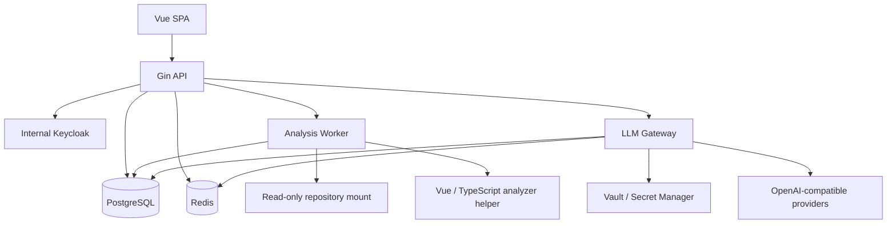

# Cosight MVP 개발 명세서

> 상태: 개발 초안 0.1  
> 작성일: 2026-09-19  
> 상위 문서: [DESIGN.md](./DESIGN.md)  
> 목적: Cosight MVP를 구현 가능한 수준으로 범위, 구조, 인터페이스와 완료 조건을 고정한다.

## 1. 문서 사용 방법

이 문서는 MVP 개발의 기준 문서다. `DESIGN.md`는 제품 전체 방향과 후속 범위를 설명하고, 이 문서는 첫 배포에서 실제로 구현할 범위만 정의한다.

충돌 시 적용 순서는 다음과 같다.

1. 보안 및 데이터 보호 요구사항
2. 이 문서의 MVP 범위와 인수 조건
3. `DESIGN.md`의 장기 설계
4. 구현 세부사항

이 문서에서 `MUST`는 MVP 완료 전에 반드시 구현해야 하는 항목, `SHOULD`는 특별한 사유가 없으면 구현할 항목, `MAY`는 일정에 따라 제외 가능한 항목을 의미한다.

## 2. MVP 목표

### 2.1 제품 목표

사용자가 Go + Gin + TypeScript + Vue 3 프로젝트를 등록하고 다음 질문에 답할 수 있어야 한다.

1. 특정 화면 또는 API는 어디에서 시작하고 어떻게 동작하는가?
2. 프런트엔드 요청은 어떤 Gin Handler, Service와 Repository 함수로 이어지는가?
3. 선택한 함수나 타입을 변경하면 어떤 코드와 테스트가 직접 영향을 받는가?
4. 그래프의 관계가 어떤 코드에서 만들어졌는가?
5. 선택한 코드와 실행 경로를 LLM이 근거와 함께 설명할 수 있는가?

### 2.2 대표 성공 시나리오

사용자가 `GET /api/projects/:id`를 선택하면 다음 결과를 얻는다.

```text
ProjectDetail.vue
 → useProject
 → projectApi.getProject
 → GET /api/projects/:id
 → projectHandler.Get
 → projectService.Get
 → projectRepository.FindByID
```

각 노드와 관계를 선택하면 Monaco Editor가 실제 정의 또는 호출 위치를 열고, AI 설명에는 유효한 근거 링크가 포함되어야 한다.

### 2.3 MVP 완료 기준

- 사내 Keycloak 계정으로 로그인 및 로그아웃할 수 있다.
- 모든 로그인 사용자가 프로젝트를 생성할 수 있고, 생성자는 자동으로 프로젝트 관리자가 된다.
- 프로젝트 관리자, 일반 개발자와 뷰어 역할이 서버에서 강제된다.
- 서버에 마운트된 저장소를 프로젝트로 등록하고 인덱싱할 수 있다.
- Go, TypeScript와 Vue SFC에서 MVP 필수 노드와 관계를 추출한다.
- 검색, 구조 그래프, 흐름 그래프, 직접 영향 분석과 코드 근거 이동이 동작한다.
- 여러 OpenAI-compatible LLM 연결과 논리 모델 프로필을 시스템 관리자가 설정할 수 있다.
- 프로젝트별 RPM, TPM, 동시 요청과 일·월 토큰 한도를 강제한다.
- 선택 코드·경로 설명, 자연어 검색, 다음 탐색 추천과 근거 기반 질의응답이 동작한다.
- 권한, LLM 관리와 주요 보안 작업이 감사 로그에 남는다.
- 이 문서의 필수 인수 테스트가 자동화되거나 재현 가능한 절차로 검증된다.

## 3. 확정 기술 스택

### 3.1 백엔드와 인프라

| 영역 | 선택 |
| --- | --- |
| 언어 | Go |
| HTTP 프레임워크 | Gin |
| 영구 저장소 | PostgreSQL |
| 분산 제한·단기 상태 | Redis |
| 인증 | 사내 Keycloak OIDC |
| 비밀 관리 | 사내 Vault 또는 승인된 Secret Manager |
| 관측 | OpenTelemetry 호환 Trace, Metric, Log |
| 코드 분석 실행 | Go Worker + 언어별 분석 어댑터 |

### 3.2 프런트엔드

| 영역 | 선택 |
| --- | --- |
| 프레임워크 | Vue 3 Composition API + `<script setup>` |
| UI | Naive UI |
| 스타일 | SCSS |
| 상태 | Pinia |
| 라우팅 | Vue Router |
| 코드 뷰 | Monaco Editor |
| 그래프 | Cytoscape.js |
| 자동 배치 | cytoscape-elk + elkjs Web Worker |
| 통계 차트 | Apache ECharts + vue-echarts |

### 3.3 분석 도구

| 대상 | 기본 구현 |
| --- | --- |
| Go | `go/packages`, `go/ast`, `go/types`, `golang.org/x/tools/go/ssa` |
| Gin | Go AST와 타입 정보를 사용하는 전용 규칙 어댑터 |
| Vue SFC | `@vue/compiler-sfc`, `@vue/compiler-dom` 기반 분석 Helper |
| TypeScript | TypeScript Compiler API와 Type Checker Helper |
| Git | 서버 로컬 Git CLI의 읽기 전용 명령 |

Vue와 TypeScript 분석 Helper는 Node 런타임을 사용할 수 있으나 외부 API 서버로 노출하지 않는다. Go 분석 Worker가 버전이 고정된 프로세스 또는 로컬 IPC로 호출하고 정규화된 JSON 결과만 받는다.

## 4. MVP 범위

### 4.1 포함 기능

#### 인증과 권한

- Keycloak Authorization Code Flow
- Gin 서버 세션과 HttpOnly 쿠키
- 시스템 관리자 Keycloak client role
- 조직과 프로젝트 구성원
- 로그인 사용자별 프로젝트 생성
- 프로젝트 생성자의 Project Admin 자동 지정
- Project Admin, Developer, Viewer 초대와 역할 관리
- 프로젝트 단위 데이터 격리
- 감사 로그

#### 프로젝트와 저장소

- 서버 마운트 경로 기반 저장소 등록
- 허용된 저장소 루트 아래 경로만 등록
- Git 브랜치와 현재 커밋 표시
- 최초 및 증분 인덱싱
- 제외 경로 설정
- 인덱싱 진행 상태와 오류

#### 코드 분석

- 파일과 디렉터리
- 패키지, 모듈, 함수, 메서드, 구조체, 인터페이스와 타입
- 정의, 참조와 import
- 기본 호출 그래프
- Go 인터페이스 구현 관계
- Gin Route, Group, Middleware와 Handler
- Vue 컴포넌트, Router, composable, Pinia와 API 호출
- Vue API 호출과 Gin Route 연결
- Git 변경 심볼
- 테스트와 대상 코드의 정적 연결
- 분석 근거와 신뢰도

#### 탐색 UI

- 프로젝트 트리
- 진입점 목록
- 통합 검색
- 구조 및 흐름 그래프
- 직접 영향 분석
- Monaco 코드 뷰
- 노드 및 관계 근거
- 관련 테스트와 Git 변경
- 탐색 세션 저장과 프로젝트 공유

#### LLM

- 여러 OpenAI-compatible 연결
- 실제 모델과 논리 모델 프로필
- 프로젝트 기능별 프로필 할당
- RPM, TPM, 동시 요청과 일·월 토큰 한도
- Provider 보고값 우선 토큰 계량
- 선택 코드 및 호출 경로 설명
- 자연어 코드 검색
- 다음 탐색 대상 추천
- 근거 기반 프로젝트 질의응답
- 운영 대시보드와 시스템 콘솔 내 임계치 표시

### 4.2 제외 기능

- 런타임 Trace와 Coverage 결합
- 자동 Fallback과 가중치 라우팅
- 사용자별 세부 LLM 한도
- 비용 청구
- 사용자 정의 역할
- 파일 및 디렉터리 단위 ACL
- GitHub·GitLab 권한 실시간 동기화
- 원격 Git 저장소 Clone 자격증명 관리
- 다중 저장소 연결
- 자동 테스트 생성
- 자동 코드 수정 및 사용자 승인 없는 파일 쓰기
- 정밀 Taint 분석
- SQL 구문, 테이블과 컬럼 단위 정적 분석
- 모바일 UI

## 5. 배포 구조



### 5.1 실행 단위

MVP는 동일 Go 코드베이스에서 다음 실행 모드를 제공한다.

```text
cosight api
cosight worker
cosight migrate
```

- `api`: HTTP, OIDC, 권한, 검색, 그래프 질의, 시스템 관리와 LLM Gateway
- `worker`: 저장소 스캔, 언어 분석, 인덱스 병합과 사용량 집계
- `migrate`: PostgreSQL schema migration

개발 환경에서는 단일 프로세스로 합칠 수 있지만 배포 환경에서는 API와 Worker를 별도 프로세스로 실행한다.

### 5.2 저장소 접근

MVP는 서버 파일 시스템에 읽기 전용으로 마운트된 저장소만 지원한다.

- 환경 설정 `COSIGHT_REPOSITORY_ROOTS`에 허용된 절대 경로를 등록한다.
- 프로젝트 경로는 허용 루트의 하위 경로여야 한다.
- 경로를 정규화한 후 prefix와 심볼릭 링크 탈출을 검사한다.
- Worker는 소스 파일을 수정하지 않는다.
- `.git` 읽기는 허용하지만 Git 명령은 읽기 전용 목록으로 제한한다.
- 저장소 경로는 프로젝트 구성원 외 사용자에게 원본 서버 경로 그대로 노출하지 않고 표시용 별칭을 사용한다.

## 6. 백엔드 모듈 구조

```text
backend/
 ├─ cmd/
 │   └─ cosight/
 ├─ internal/
 │   ├─ app/
 │   ├─ authn/
 │   ├─ authz/
 │   ├─ organization/
 │   ├─ project/
 │   ├─ repository/
 │   ├─ indexing/
 │   ├─ analysis/
 │   │   ├─ scanner/
 │   │   ├─ golang/
 │   │   ├─ ginadapter/
 │   │   ├─ vueadapter/
 │   │   ├─ typescript/
 │   │   ├─ linker/
 │   │   └─ evidence/
 │   ├─ graph/
 │   ├─ search/
 │   ├─ exploration/
 │   ├─ llm/
 │   │   ├─ gateway/
 │   │   ├─ provider/
 │   │   ├─ routing/
 │   │   ├─ ratelimit/
 │   │   ├─ usage/
 │   │   └─ evidence/
 │   ├─ audit/
 │   ├─ jobs/
 │   └─ platform/
 │       ├─ postgres/
 │       ├─ redis/
 │       ├─ secret/
 │       └─ telemetry/
 └─ migrations/
```

### 6.1 계층 규칙

- Gin Handler는 요청 파싱, 인증 컨텍스트와 응답 변환만 담당한다.
- 권한 검사는 공통 Authorization Service에서 수행한다.
- Service는 Repository interface에 의존한다.
- 분석 어댑터는 공통 `AnalysisResult`를 반환하고 DB에 직접 쓰지 않는다.
- 인덱스 병합기는 하나의 트랜잭션에서 현재 파일의 이전 결과를 교체한다.
- LLM Provider 어댑터는 프로젝트와 권한 정보를 알지 못한다.
- LLM Gateway가 정책과 계량을 수행한 후 Provider를 호출한다.

## 7. 프런트엔드 구조

```text
frontend/src/
 ├─ app/
 ├─ router/
 ├─ stores/
 ├─ api/
 ├─ layouts/
 ├─ pages/
 │   ├─ projects/          # 목록, 생성, 개요, 구성원, 프로젝트 설정
 │   ├─ invitations/       # 내 초대
 │   ├─ analysis/          # 코드 탐색, 저장된 탐색
 │   ├─ account/           # 내 계정
 │   └─ system-admin/      # LLM, 한도, 사용량, 감사
 ├─ features/
 │   ├─ project-tree/
 │   ├─ global-search/
 │   ├─ code-graph/
 │   ├─ source-viewer/
 │   ├─ inspector/
 │   ├─ exploration-session/
 │   ├─ project-members/
 │   ├─ project-settings/
 │   ├─ invitations/
 │   ├─ ai-assistant/
 │   └─ llm-admin/
 ├─ components/
 ├─ styles/
 └─ types/
```

### 7.1 주요 라우트

| 경로 | 화면 | 권한 |
| --- | --- | --- |
| `/` | 프로젝트 목록 | 로그인 |
| `/invitations` | 내 초대 | 로그인 |
| `/account` | 내 계정 | 로그인 |
| `/projects/new` | 프로젝트 생성 | 로그인 |
| `/projects/:projectId` | 프로젝트 개요 | `project.read` |
| `/projects/:projectId/explore` | 코드 분석 워크스페이스 | `graph.read` |
| `/projects/:projectId/explorations` | 저장된 탐색 | `project.read` |
| `/projects/:projectId/members` | 프로젝트 구성원 | `member.manage` |
| `/projects/:projectId/settings/general` | 프로젝트 일반 설정 | `project.manage` |
| `/projects/:projectId/settings/repository` | 저장소와 인덱싱 설정 | `repository.connect` |
| `/projects/:projectId/settings/ai` | 프로젝트 AI 설정과 사용량 | Project Admin |
| `/system` | 시스템 대시보드 | System Administrator |
| `/system/llm/connections` | LLM 연결 | System Administrator |
| `/system/llm/models` | 모델 레지스트리 | System Administrator |
| `/system/llm/profiles` | 논리 모델 프로필 | System Administrator |
| `/system/projects` | 프로젝트 AI 할당과 한도 | System Administrator |
| `/system/llm/usage` | 사용량 모니터링 | System Administrator |
| `/system/audit` | 감사 로그 | System Administrator |

권한이 없는 메뉴는 기본적으로 숨기되, URL 직접 접근 시 서버 응답을 기준으로 `403` 화면을 표시한다. 존재하지 않거나 사용자가 알 수 없는 프로젝트는 리소스 존재 여부가 노출되지 않도록 `404`로 처리한다.

### 7.2 전체 메뉴 구조

```text
Cosight
 ├─ 프로젝트
 │   ├─ 내 프로젝트
 │   ├─ 프로젝트 만들기
 │   └─ 내 초대
 ├─ 현재 프로젝트
 │   ├─ 개요
 │   ├─ 코드 탐색
 │   ├─ 저장된 탐색
 │   ├─ 구성원                    [Project Admin]
 │   └─ 설정                      [Project Admin]
 │       ├─ 일반
 │       ├─ 저장소와 인덱싱
 │       └─ AI와 사용량
 ├─ 시스템 관리                  [System Administrator]
 │   ├─ 대시보드
 │   ├─ LLM 연결
 │   ├─ 모델 레지스트리
 │   ├─ 논리 모델 프로필
 │   ├─ 프로젝트 할당과 한도
 │   ├─ 사용량과 상태
 │   └─ 감사 로그
 └─ 사용자 메뉴
     ├─ 내 계정
     └─ 로그아웃
```

| 메뉴 | Project Admin | Developer | Viewer | System Administrator |
| --- | ---: | ---: | ---: | ---: |
| 프로젝트 목록·생성·내 초대 | O | O | O | O |
| 프로젝트 개요 | O | O | O | 프로젝트 구성원일 때만 |
| 코드 탐색 | O | O | 읽기·개인 탐색 | 프로젝트 구성원일 때만 |
| 저장된 탐색 | O | O | 개인 탐색 | 프로젝트 구성원일 때만 |
| 구성원 | O | X | X | 프로젝트 구성원일 때만 |
| 프로젝트 설정 | O | X | X | 프로젝트 구성원일 때만 |
| 시스템 관리 | Keycloak 역할 보유 시 | Keycloak 역할 보유 시 | Keycloak 역할 보유 시 | O |

데스크톱에서는 전역 상단 바와 접을 수 있는 왼쪽 사이드바를 사용한다. 상단 바에는 프로젝트 전환기, 현재 브랜치, 통합 검색, 인덱싱 상태, 대기 중인 초대 수와 사용자 메뉴를 배치한다. 분석 워크스페이스에서는 화면 너비를 확보하기 위해 사이드바를 기본 축소할 수 있다.

### 7.3 화면별 기능

#### 로그인

- 제품 설명과 `사내 계정으로 로그인` 버튼을 제공한다.
- 로그인 실패, 세션 만료와 Keycloak 연결 실패를 구분해 표시한다.
- 로그인 후 원래 접근하려던 안전한 내부 경로로 복귀한다.

#### 내 프로젝트

- 사용자가 구성원인 프로젝트를 카드 또는 표로 표시한다.
- 이름, 역할, 상태, 저장소 별칭, 기본 브랜치, 마지막 인덱싱 시각으로 검색·필터·정렬한다.
- `프로젝트 만들기`, `프로젝트 열기`, `코드 탐색`을 주요 동작으로 제공한다.
- 대기 중인 초대가 있으면 상단 배너와 개수를 표시한다.
- 프로젝트가 없으면 프로젝트 생성과 초대 확인을 안내하는 빈 상태를 제공한다.

#### 프로젝트 만들기

- 조직, 프로젝트 이름, slug, 저장소 표시 이름, 서버 저장소 경로, 기본 브랜치와 제외 패턴을 입력한다.
- slug 중복, 허용되지 않은 경로, symlink 탈출과 필수값 오류를 필드 단위로 표시한다.
- 생성 전 입력 내용을 확인하고, 생성 완료 시 생성자가 Project Admin임을 표시한 뒤 프로젝트 개요로 이동한다.
- 프로젝트 생성과 최초 인덱싱은 분리한다. 생성 성공 후 인덱싱을 시작하며 실패 시 재시도할 수 있다.

#### 내 초대

- `대기 중`, `수락됨`, `만료됨` 탭으로 초대를 구분한다.
- 프로젝트 이름, 초대한 사용자, 부여될 역할과 만료 시각을 표시한다.
- 대기 중 초대를 수락하거나 거절할 수 있다. 수락 전 역할과 접근 범위를 다시 확인한다.
- 로그인 사용자와 초대 대상이 일치하지 않거나 토큰이 만료·취소된 경우 구체적인 복구 안내를 제공하되 다른 사용자의 정보는 노출하지 않는다.

#### 내 계정

- Keycloak에서 동기화된 표시 이름, 이메일과 마지막 로그인 시각을 읽기 전용으로 표시한다.
- 현재 프로젝트별 역할과 시스템 관리자 여부를 확인할 수 있다.
- 계정 정보 변경은 Keycloak 관리 경로를 안내하고 Cosight에서는 로그아웃만 제공한다.

#### 프로젝트 개요

- 프로젝트 상태, 사용자의 역할, 저장소 별칭, 브랜치·커밋, 마지막 인덱싱과 분석 경고를 요약한다.
- 언어별 파일·심볼·Gin Route·Vue Route·컴포넌트 수와 최근 탐색 세션을 표시한다.
- `코드 탐색 시작`, `인덱싱 실행`, `구성원 초대`, `프로젝트 설정` 바로가기를 권한에 맞게 제공한다.
- 인덱스가 없거나 실패한 프로젝트는 원인, 로그 요약과 재시도 동작을 우선 표시한다.

#### 코드 탐색

- 왼쪽에서 프로젝트 트리, 진입점, 변경 파일과 저장된 탐색을 선택한다.
- 중앙에서 구조·흐름·영향·버그 모드 그래프를 탐색하고 필터, 깊이, 상세 수준과 자동 배치를 제어한다.
- 오른쪽에서 개요, 코드, 근거, 참조, 테스트와 Git 정보를 확인한다.
- AI 패널에서 선택 코드 설명, 자연어 검색, 다음 탐색 추천과 근거 기반 질의응답을 실행한다.
- 현재 시작점, 그래프 상태, 필터, 고정 경로와 메모를 탐색 세션으로 저장한다.
- 하단 작업 표시줄에서 인덱싱·분석 진행률, 경고, 취소와 재시도를 제공한다.

#### 저장된 탐색

- 내 탐색과 프로젝트 공유 탐색을 탭으로 분리하고 이름, 작성자, 모드, 갱신일로 검색·정렬한다.
- 탐색을 열기, 이름 변경, 복제, 공개 범위 변경과 삭제할 수 있다.
- Viewer는 개인 탐색만 만들고 관리할 수 있으며, 공유 범위 변경은 `exploration.share` 권한이 있을 때만 제공한다.
- 저장 당시와 현재 index version이 다르면 오래된 결과임을 표시하고 새 인덱스로 다시 계산하도록 안내한다.

#### 프로젝트 구성원

- `구성원`과 `대기 중인 초대` 탭을 제공한다.
- 구성원 이름, 이메일, 역할, 참여일과 초대한 사용자를 표시하고 역할로 필터링한다.
- `사용자 초대` 대화상자에서 이메일과 `관리자 / 일반 개발자 / 뷰어` 역할을 선택한다.
- Project Admin은 초대 재전송·취소, 구성원 역할 변경과 제거를 수행할 수 있다.
- 자기 자신의 역할 변경 또는 탈퇴로 마지막 Project Admin이 없어지면 저장을 차단하고 다른 관리자를 먼저 지정하도록 안내한다.
- 역할별 권한 설명을 역할 선택 컨트롤 옆에 표시한다.

#### 프로젝트 설정

`일반` 탭:

- 프로젝트 이름, slug와 설명을 변경한다.
- 프로젝트 ID, 생성자와 생성 시각은 읽기 전용으로 표시한다.
- 프로젝트 삭제는 이름 재입력 확인과 영향 안내가 있는 위험 영역에 배치한다.

`저장소와 인덱싱` 탭:

- 저장소 별칭, 허용된 서버 경로, 기본 브랜치와 제외 패턴을 관리한다.
- 현재 커밋, 인덱스 버전, 마지막 성공·실패 시각과 실패 원인을 표시한다.
- 전체 재인덱싱, 증분 인덱싱, 실행 취소와 실패 작업 재시도를 제공한다.
- 실제 서버 절대 경로는 필요한 관리자에게만 제한적으로 표시하고 일반 구성원에게는 별칭만 노출한다.

`AI와 사용량` 탭:

- 기능별 논리 모델 프로필 할당을 읽고 시스템 관리자가 허용한 범위에서 선택한다.
- 코드 외부 전송 허용 여부와 전송 전 확인 정책을 설정한다.
- RPM·TPM, 동시 요청, 일·월 토큰 한도와 현재 사용률을 표시한다.
- 임계치 초과, Provider 장애와 AI 기능 비활성 원인을 표시한다.

#### 시스템 관리

`대시보드`:

- Provider 상태, 요청 성공률, p95 지연, 토큰 사용량, 열린 Circuit과 최근 관리 작업을 요약한다.
- 장애 연결, 한도 임박 프로젝트와 최근 권한 거부에서 상세 화면으로 이동한다.

`LLM 연결`:

- 연결 생성·수정·비활성화, Secret reference 교체, 연결 테스트와 사용 중인 모델 확인을 제공한다.
- 입력한 비밀 값은 저장 후 다시 표시하지 않는다.

`모델 레지스트리`와 `논리 모델 프로필`:

- Provider model ID, capability, context·출력 한도와 활성 상태를 관리한다.
- 논리 프로필의 목적, 실제 모델, 기본 파라미터와 허용 데이터 등급을 관리한다.

`프로젝트 할당과 한도`:

- 프로젝트별 AI 기능-프로필 할당과 RPM·TPM·동시 요청·일·월 토큰 한도를 관리한다.
- 프로젝트 이름, 조직, 상태와 한도 임박 여부로 검색·필터한다.

`사용량과 상태`:

- 기간, 프로젝트, 프로필, 모델과 연결별 요청·오류·토큰·지연을 조회한다.
- 내부 429와 Provider 429, reported·estimated 계량 비율을 구분한다.

`감사 로그`:

- 기간, 행위자, 프로젝트, action과 성공 여부로 필터하고 이벤트 상세를 확인한다.
- 원본 소스, 토큰과 비밀 값은 표시하거나 내보내지 않는다.

### 7.4 페이지별 구성 요소

페이지 컴포넌트는 라우트 파라미터 해석, 권한 확인, 데이터 조회와 mutation 조정을 담당한다. 하위 표시 컴포넌트는 API를 직접 호출하지 않고 `props`로 상태를 받고 `emit`으로 사용자 의도를 전달한다. 서버 상태는 기능별 query composable에서 관리하고 Pinia에는 인증, 현재 프로젝트, 탐색 작업 상태처럼 페이지 간 공유가 필요한 상태만 둔다.

#### `LoginPage`

```text
LoginPage
 └─ AuthLayout
     ├─ ProductIntroduction
     ├─ LoginCard
     │   ├─ KeycloakLoginButton
     │   └─ LoginPolicyNotice
     └─ AuthErrorAlert
```

- `ProductIntroduction`: 제품 목적과 사내 계정 사용 안내를 표시한다.
- `LoginCard`: 로그인 시작과 진행 중 상태를 관리하고 중복 클릭을 방지한다.
- `AuthErrorAlert`: 인증 거절, 설정 오류, Keycloak 장애와 세션 만료를 구분해 복구 동작을 제공한다.

#### `ProjectListPage`

```text
ProjectListPage
 ├─ GlobalHeader
 ├─ PendingInvitationBanner
 ├─ ProjectListHeader
 │   ├─ ProjectSearchInput
 │   ├─ ProjectRoleFilter
 │   ├─ ProjectStatusFilter
 │   ├─ ProjectSortSelect
 │   └─ CreateProjectButton
 ├─ ProjectViewToggle
 ├─ ProjectCardGrid / ProjectDataTable
 │   └─ ProjectCard / ProjectTableRow
 ├─ CursorPagination
 └─ ProjectListEmptyState
```

- 페이지는 `GET /projects`의 cursor, 검색어, 역할, 상태와 정렬 조건을 URL query에 동기화한다.
- `ProjectCard`는 이름, 역할, 상태, 저장소 별칭, 브랜치와 마지막 인덱싱 시각을 표시하고 개요·코드 탐색 동작을 제공한다.
- `PendingInvitationBanner`는 현재 사용자의 pending 초대 수와 내 초대 화면 바로가기를 제공한다.
- 카드/표 보기 선택은 사용자 로컬 설정으로 저장하되 서버 데이터에는 영향을 주지 않는다.

#### `ProjectCreatePage`

```text
ProjectCreatePage
 ├─ PageHeader
 ├─ ProjectCreateStepper
 │   ├─ ProjectIdentityStep
 │   ├─ RepositoryConnectionStep
 │   ├─ IndexingOptionsStep
 │   └─ ProjectCreateReviewStep
 ├─ FormErrorSummary
 └─ FormActionBar
```

- `ProjectIdentityStep`: 조직, 이름, slug와 설명을 입력하고 slug 형식과 중복을 검증한다.
- `RepositoryConnectionStep`: 저장소 별칭, 서버 경로와 기본 브랜치를 입력하고 경로 검증 결과를 표시한다.
- `IndexingOptionsStep`: 제외 패턴과 생성 후 최초 인덱싱 실행 여부를 설정한다.
- `ProjectCreateReviewStep`: 생성될 프로젝트와 생성자의 Project Admin 지정 사실을 확인한다.
- `FormActionBar`: 이전, 다음, 취소와 생성 동작을 제공하며 생성 요청 중에는 중복 제출을 차단한다.

#### `InvitationListPage`

```text
InvitationListPage
 ├─ PageHeader
 ├─ InvitationStatusTabs
 ├─ InvitationList
 │   └─ InvitationCard
 │       ├─ InvitationRoleBadge
 │       ├─ InvitationExpiry
 │       └─ InvitationActions
 ├─ InvitationAcceptDialog
 ├─ InvitationRejectDialog
 ├─ CursorPagination
 └─ InvitationEmptyState
```

- 상태 탭과 cursor를 URL query에 유지하며 `GET /project-invitations`를 조회한다.
- `InvitationAcceptDialog`는 프로젝트, 초대자, 역할과 권한 범위를 재확인한 뒤 수락 요청을 보낸다.
- 수락 성공 시 현재 목록, 프로젝트 목록과 전역 pending 초대 수를 함께 무효화해 다시 조회한다.
- 만료·취소·대상 불일치는 `InvitationUnavailableState`로 표시하고 프로젝트 정보는 최소한으로 노출한다.

#### `AccountPage`

```text
AccountPage
 ├─ AccountProfileCard
 ├─ AccountRoleSummary
 │   └─ ProjectRoleList
 ├─ IdentityProviderNotice
 └─ LogoutButton
```

- `AccountProfileCard`: 표시 이름, 이메일, 마지막 로그인과 계정 상태를 읽기 전용으로 표시한다.
- `AccountRoleSummary`: 접근 가능한 프로젝트와 각 역할, 시스템 관리자 여부를 표시한다.
- `IdentityProviderNotice`: 정보 변경은 Keycloak에서 수행된다는 안내와 관리 경로를 제공한다.

#### `ProjectOverviewPage`

```text
ProjectOverviewPage
 ├─ ProjectHeader
 │   ├─ ProjectStatusBadge
 │   ├─ CurrentUserRoleBadge
 │   └─ ProjectQuickActions
 ├─ RepositorySummaryCard
 ├─ IndexingStatusCard
 ├─ CodeInventoryStats
 ├─ AnalysisWarningPanel
 ├─ RecentExplorationList
 ├─ RecentActivityList
 └─ FirstIndexEmptyState
```

- `ProjectQuickActions`: 코드 탐색, 인덱싱, 구성원 초대와 설정 동작을 현재 권한에 따라 표시한다.
- `RepositorySummaryCard`: 저장소 별칭, 기본 브랜치, 현재 커밋과 동기화 시각을 표시한다.
- `IndexingStatusCard`: 단계별 진행률, 마지막 성공·실패, 취소와 재시도를 제공한다.
- `CodeInventoryStats`: 파일, 심볼, 진입점과 DB 객체 수를 선택 시 관련 탐색 화면의 필터로 연결한다.
- 페이지는 프로젝트 기본 정보와 요약 통계를 독립적으로 조회해 일부 요청이 실패해도 사용 가능한 카드는 유지한다.

#### `AnalysisWorkspacePage`

```text
AnalysisWorkspacePage
 ├─ WorkspaceHeader
 │   ├─ ProjectSwitcher
 │   ├─ BranchAndCommitSelector
 │   ├─ GlobalCodeSearch
 │   ├─ IndexingStatusIndicator
 │   └─ SaveExplorationButton
 ├─ ExplorerSidebar
 │   ├─ ProjectTreeTab
 │   ├─ EntryPointTab
 │   ├─ ChangedFilesTab
 │   └─ SavedExplorationTab
 ├─ GraphWorkspace
 │   ├─ AnalysisModeTabs
 │   ├─ GraphToolbar
 │   ├─ CodeGraphCanvas
 │   ├─ GraphLegend
 │   └─ GraphTextFallback
 ├─ InspectorPanel
 │   ├─ SymbolOverview
 │   ├─ SourceCodeViewer
 │   ├─ EvidenceList
 │   ├─ ReferenceList
 │   ├─ RelatedTests
 │   └─ GitHistory
 ├─ AIAssistantPanel
 ├─ SaveExplorationDialog
 └─ AnalysisJobBar
```

- 페이지가 선택 노드·관계, 그래프 query, 활성 코드 위치, 패널 크기와 탐색 history를 조정한다.
- `CodeGraphCanvas`는 렌더링과 선택 이벤트만 담당하고 서버 query 구성은 `useGraphQuery`에 둔다.
- `SourceCodeViewer`는 Monaco model, decoration과 리소스 정리를 담당하며 파일 조회 권한 오류를 별도로 처리한다.
- `AIAssistantPanel`은 요청 전 전송 문맥을 보여주고 SSE metadata·delta·evidence·usage·error 이벤트를 표시한다.
- `GraphTextFallback`은 그래프를 사용할 수 없는 환경에서 선택 경로를 순서 있는 텍스트 목록으로 제공한다.
- Monaco와 Cytoscape 인스턴스는 `shallowRef` 또는 Vue 외부 객체로 관리하고 컴포넌트 해제 시 model, event listener, worker와 구독을 명시적으로 정리한다.

#### `ExplorationListPage`

```text
ExplorationListPage
 ├─ PageHeader
 ├─ ExplorationScopeTabs
 ├─ ExplorationFilterBar
 ├─ ExplorationDataTable
 │   └─ ExplorationRowActions
 ├─ ExplorationRenameDialog
 ├─ ExplorationShareDialog
 ├─ ExplorationDeleteDialog
 ├─ StaleIndexWarning
 └─ CursorPagination
```

- `ExplorationFilterBar`: 이름, 작성자, 분석 모드와 갱신일을 URL query 기반으로 필터링한다.
- `ExplorationRowActions`: 열기, 복제, 이름 변경, 공유 범위 변경과 삭제를 소유권·권한에 맞게 제공한다.
- `StaleIndexWarning`: 저장된 index version과 현재 버전이 다를 때 원본 열기 또는 재계산을 선택하게 한다.

#### `ProjectMembersPage`

```text
ProjectMembersPage
 ├─ PageHeader
 │   └─ InviteMemberButton
 ├─ MemberAndInvitationTabs
 ├─ MemberFilterBar
 ├─ MemberDataTable
 │   ├─ MemberRoleSelect
 │   └─ MemberRowActions
 ├─ PendingInvitationTable
 │   └─ InvitationRowActions
 ├─ InviteMemberDialog
 ├─ ChangeRoleConfirmDialog
 ├─ RemoveMemberDialog
 └─ LastAdminGuardDialog
```

- `InviteMemberDialog`: 이메일, 역할과 역할별 권한 설명을 제공하며 중복 초대 오류를 해당 필드에 표시한다.
- `MemberRoleSelect`: 현재 사용자 자신을 포함한 역할 변경을 지원하되 마지막 Project Admin 보호 조건을 선검사한다.
- `InvitationRowActions`: 재전송과 취소를 제공하고 만료·수락된 초대에서는 사용할 수 없게 한다.
- mutation 성공 후 구성원 목록, 초대 목록과 감사 이벤트 요약을 무효화해 최신 상태를 조회한다.

#### `ProjectSettingsLayout`

```text
ProjectSettingsLayout
 ├─ ProjectSettingsNav
 └─ RouterView
     ├─ ProjectGeneralSettingsPage
     ├─ RepositorySettingsPage
     └─ ProjectAISettingsPage
```

`ProjectGeneralSettingsPage`:

```text
ProjectGeneralSettingsPage
 ├─ ProjectGeneralForm
 ├─ ProjectMetadataCard
 ├─ UnsavedChangesGuard
 └─ DeleteProjectDangerZone
     └─ DeleteProjectDialog
```

- 일반 폼은 이름, slug와 설명을 수정하고 서버 validation 오류를 필드에 매핑한다.
- `UnsavedChangesGuard`는 수정 중 라우트 이탈과 브라우저 종료를 경고한다.
- 삭제 대화상자는 프로젝트 이름 재입력, 삭제 영향과 복구 정책을 표시한다.

`RepositorySettingsPage`:

```text
RepositorySettingsPage
 ├─ RepositoryConnectionForm
 ├─ BranchSettingsForm
 ├─ ExcludePatternEditor
 ├─ RepositoryValidationResult
 ├─ IndexVersionHistory
 ├─ IndexJobList
 └─ ReindexConfirmDialog
```

- 저장 전 서버 경로 정규화와 allowlist 검증 결과를 표시한다.
- `ExcludePatternEditor`는 패턴별 예시, 중복 검사와 기본 제외 패턴 복원을 제공한다.
- `IndexJobList`는 작업 단계, 진행률, 시작자, 시각, 오류 요약과 취소·재시도를 표시한다.

`ProjectAISettingsPage`:

```text
ProjectAISettingsPage
 ├─ AIFeatureBindingTable
 ├─ CodeExportPolicyForm
 ├─ ProjectQuotaCards
 ├─ ProjectUsageChart
 ├─ AIAvailabilityAlert
 └─ AISettingsSaveBar
```

- `AIFeatureBindingTable`: 설명, 자연어 검색, 다음 탐색과 Q&A 기능별 허용 프로필을 선택한다.
- `CodeExportPolicyForm`: 외부 전송 허용과 사용자 확인 정책을 변경한다.
- `ProjectQuotaCards`: RPM·TPM·동시 요청·일·월 한도와 현재 사용률을 함께 표시한다.
- 권한 또는 시스템 정책으로 변경할 수 없는 값은 비활성 상태와 이유를 표시한다.

#### 시스템 관리 페이지

`SystemDashboardPage`:

```text
SystemDashboardPage
 ├─ SystemHealthSummary
 ├─ ProviderHealthGrid
 ├─ UsageSummaryCards
 ├─ QuotaRiskTable
 ├─ OpenCircuitList
 └─ RecentAdminActivity
```

`LLMConnectionListPage`와 `LLMConnectionDetailPage`:

```text
LLMConnectionListPage
 ├─ ConnectionFilterBar
 ├─ ConnectionDataTable
 └─ CreateConnectionButton

LLMConnectionDetailPage
 ├─ ConnectionGeneralForm
 ├─ SecretReferenceForm
 ├─ ConnectionTestPanel
 ├─ LinkedModelList
 ├─ ConnectionHealthHistory
 └─ DisableConnectionDialog
```

- 연결 시험은 일반 저장과 분리하고 진행·성공·지연·실패 사유를 표시한다.
- Secret 입력값은 제출 후 UI 상태와 로그에서 즉시 제거하며 기존 값을 다시 표시하지 않는다.

`ModelRegistryPage`와 `ModelProfilePage`:

```text
ModelRegistryPage
 ├─ ModelFilterBar
 ├─ ModelDataTable
 └─ ModelEditorDrawer

ModelProfilePage
 ├─ ProfileDataTable
 ├─ ProfileEditorDrawer
 ├─ ModelParameterForm
 └─ ProfileAssignmentSummary
```

- 모델 편집은 capability, context·출력 한도와 활성 상태를 관리한다.
- 프로필 편집은 목적, 실제 모델, 파라미터, 데이터 등급과 사용 프로젝트를 관리한다.

`SystemProjectPolicyPage`:

```text
SystemProjectPolicyPage
 ├─ ProjectPolicyFilterBar
 ├─ ProjectPolicyDataTable
 ├─ FeatureBindingDrawer
 ├─ QuotaPolicyDrawer
 └─ PolicyChangeConfirmDialog
```

- 한도 변경 전 현재 사용량과 변경 후 예상 제한 상태를 함께 보여준다.
- 여러 프로젝트의 값을 일괄 변경하는 기능은 MVP에서 제외하고 한 프로젝트씩 명시적으로 저장한다.

`SystemUsagePage`:

```text
SystemUsagePage
 ├─ UsageDateRangePicker
 ├─ UsageDimensionFilters
 ├─ UsageMetricCards
 ├─ TokenUsageChart
 ├─ RequestAndErrorChart
 ├─ LatencyChart
 └─ UsageBreakdownTable
```

- 차트와 표는 동일한 기간·프로젝트·프로필·모델·연결 필터를 공유한다.
- 시간대는 사용자 로컬 시간으로 표시하되 내보내기와 API 값은 UTC를 사용한다.

`AuditLogPage`:

```text
AuditLogPage
 ├─ AuditFilterBar
 ├─ AuditEventTable
 ├─ AuditEventDetailDrawer
 └─ CursorPagination
```

- 상세 drawer는 행위자, 대상, 결과, 요청 ID와 안전하게 정제된 metadata를 표시한다.
- 원본 소스코드, 토큰, Secret과 환경변수 값은 필드가 존재하더라도 렌더링하지 않는다.

### 7.5 공통 컴포넌트와 화면 규칙

공통 컴포넌트:

| 컴포넌트 | 책임 |
| --- | --- |
| `GlobalHeader` | 프로젝트 전환, 전역 초대 수, 사용자 메뉴와 시스템 관리 진입 |
| `ProjectSidebar` | 프로젝트 메뉴, 현재 라우트와 권한별 메뉴 표시 |
| `PageHeader` | 제목, 설명, breadcrumb와 대표 동작 |
| `PermissionGate` | 세부 권한에 따른 표시 제어. 서버 권한 검사를 대체하지 않음 |
| `AsyncContent` | loading, empty, error, partial과 retry 상태의 일관된 표현 |
| `CursorPagination` | cursor 기반 이전·다음 페이지와 페이지 크기 관리 |
| `ConfirmDialog` | 영향 설명, 확인 문구와 요청 진행 상태 관리 |
| `JobStatusIndicator` | 비동기 작업 단계, 진행률, 취소와 재시도 |
| `RoleBadge` | 관리자·일반 개발자·뷰어 역할을 텍스트와 아이콘으로 표현 |
| `QuotaProgress` | 현재 사용량, 경고 임계치와 한도 상태 표현 |
| `RequestErrorPanel` | request ID가 포함된 복구 가능한 오류 표시 |

공통 규칙:

- 모든 목록은 loading, empty, error와 partial 상태를 구분하고 cursor pagination을 사용한다.
- 파괴적 동작은 영향 범위와 복구 가능 여부를 보여준 뒤 명시적으로 확인한다.
- 비동기 작업은 요청 직후 job ID를 기준으로 진행 상태를 표시하며 화면 이동 후에도 다시 확인할 수 있다.
- 성공·실패 알림만으로 상태를 전달하지 않고 변경된 행, 카드 또는 폼에도 결과를 남긴다.
- 키보드 탐색, focus 표시, 색상 외 상태 표현과 그래프의 텍스트 대체 목록을 제공한다.
- 메뉴 노출 여부는 사용성을 위한 처리이며, 실제 권한은 모든 API에서 다시 검증한다.

## 8. 인증과 권한

### 8.1 OIDC 흐름

1. 브라우저가 `GET /api/v1/auth/login`을 호출한다.
2. Gin이 `state`, `nonce`와 PKCE 값을 생성하고 Keycloak으로 리다이렉트한다.
3. Keycloak 인증 후 `/api/v1/auth/callback`으로 돌아온다.
4. Gin이 code를 교환하고 issuer, audience, signature, nonce와 만료를 검증한다.
5. 사용자 정보를 upsert하고 서버 세션을 만든다.
6. 브라우저에는 Secure, HttpOnly, SameSite 쿠키만 전달한다.

### 8.2 MVP 역할

| 역할 | 핵심 권한 |
| --- | --- |
| System Administrator | 모든 시스템 관리 API |
| Organization Admin | 조직 정책과 조직 구성원 관리 |
| Project Admin | 프로젝트 설정, 구성원, 저장소, 분석 및 공유 |
| Developer (일반 개발자) | 코드 열람, 분석 실행, 개인·프로젝트 탐색 세션 |
| Viewer (뷰어) | 코드·그래프 읽기와 개인 탐색 세션 |

모든 active 로그인 사용자는 자신이 속한 조직에 프로젝트를 생성할 수 있다. 프로젝트 생성 트랜잭션은 프로젝트와 생성자의 `project_admin` membership을 함께 저장해야 하며, 둘 중 하나라도 실패하면 전체를 rollback한다. System Administrator는 Keycloak `cosight-system-admin` client role에서 가져온다. Organization Admin과 프로젝트 역할은 PostgreSQL membership에서 관리한다. System Administrator 권한만으로 프로젝트 원본 코드 열람 권한을 자동 부여하지 않는다.

### 8.3 필수 권한

```text
project.read
project.manage
project.delete
member.invite
member.manage
repository.connect
repository.sync
source.read
source.search
graph.read
analysis.run
analysis.cancel
analysis.result.read
exploration.create
exploration.update
exploration.share
ai.use
audit.read
```

모든 API는 기본 거부한다. 프로젝트 ID를 받는 요청은 URL, Body 또는 세션의 값을 신뢰하지 않고 DB membership을 확인한다.

프로젝트 초대 시 지정 가능한 역할은 `project_admin`, `developer`, `viewer`로 고정한다. 초대 생성, 재전송과 취소는 Project Admin만 수행할 수 있다. 초대받은 사용자는 초대를 수락한 뒤 구성원이 되며, 초대에 지정된 역할을 스스로 변경할 수 없다. 프로젝트에는 항상 한 명 이상의 Project Admin이 있어야 하므로 마지막 관리자의 강등과 제거는 거부한다.

## 9. 데이터 모델

모든 ID는 UUID를 사용하고 시각은 UTC로 저장한다. 삭제 복구가 필요한 관리 리소스는 `deleted_at`을 사용하며 코드 인덱스 세부 데이터는 버전 교체 방식으로 관리한다.

### 9.1 인증과 조직

#### `users`

```text
id uuid PK
issuer text NOT NULL
subject text NOT NULL
email text
display_name text
status text NOT NULL
last_login_at timestamptz
created_at timestamptz NOT NULL
updated_at timestamptz NOT NULL
UNIQUE (issuer, subject)
```

#### `user_sessions`

```text
id uuid PK
user_id uuid FK users
session_hash text UNIQUE NOT NULL
expires_at timestamptz NOT NULL
last_seen_at timestamptz NOT NULL
created_at timestamptz NOT NULL
revoked_at timestamptz
```

Refresh Token이 필요하면 별도 암호화 컬럼 또는 Secret Manager 참조로 저장하며 평문 저장을 금지한다.

#### `organizations`, `organization_members`

```text
organizations(id, name, created_at, updated_at)
organization_members(organization_id, user_id, role, created_at)
PK (organization_id, user_id)
```

### 9.2 프로젝트와 구성원

#### `projects`

```text
id uuid PK
organization_id uuid FK organizations
name text NOT NULL
slug text NOT NULL
description text
repository_alias text NOT NULL
repository_path text NOT NULL
default_branch text
current_commit text
status text NOT NULL
active_index_version bigint NOT NULL DEFAULT 0
created_by uuid FK users
created_at timestamptz NOT NULL
updated_at timestamptz NOT NULL
UNIQUE (organization_id, slug)
```

`repository_path`는 API 응답에서 원문을 반환하지 않는다.

#### `project_members`

```text
project_id uuid FK projects
user_id uuid FK users
role text NOT NULL
created_at timestamptz NOT NULL
created_by uuid FK users
PK (project_id, user_id)
CHECK (role IN ('project_admin', 'developer', 'viewer'))
```

#### `project_invitations`

```text
id uuid PK
project_id uuid FK projects
invitee_email text NOT NULL
invitee_user_id uuid FK users NULL
role text NOT NULL
status text NOT NULL
token_hash text UNIQUE NOT NULL
expires_at timestamptz NOT NULL
accepted_at timestamptz
revoked_at timestamptz
created_at timestamptz NOT NULL
created_by uuid FK users
CHECK (role IN ('project_admin', 'developer', 'viewer'))
CHECK (status IN ('pending', 'accepted', 'revoked', 'expired'))
```

동일 프로젝트와 이메일에는 유효한 `pending` 초대를 하나만 허용한다. 수락 시 초대 상태 변경과 `project_members` upsert를 하나의 트랜잭션으로 처리하며, 서버는 로그인 사용자의 검증된 Keycloak 이메일 또는 내부 사용자 ID가 초대 대상과 일치하는지 확인한다.

### 9.3 코드 인덱스

#### `code_index_versions`

```text
id bigint
project_id uuid NOT NULL
git_commit text
status text NOT NULL
analysis_schema_version text NOT NULL
analyzer_versions jsonb NOT NULL
file_count int NOT NULL DEFAULT 0
node_count int NOT NULL DEFAULT 0
edge_count int NOT NULL DEFAULT 0
warning_count int NOT NULL DEFAULT 0
started_at timestamptz NOT NULL
completed_at timestamptz
activated_at timestamptz
created_by uuid FK users
PK (project_id, id)
CHECK (status IN ('building', 'active', 'superseded', 'failed', 'cancelled'))
```

프로젝트별로 `active` 버전은 하나만 허용한다. 새 버전의 파일·노드·관계·근거 저장과 검증이 모두 끝난 후 `projects.active_index_version`을 같은 트랜잭션에서 교체한다.

#### `code_files`

```text
id uuid PK
project_id uuid NOT NULL
path text NOT NULL
language text NOT NULL
content_hash text NOT NULL
is_test boolean NOT NULL
is_generated boolean NOT NULL
parse_status text NOT NULL
index_version bigint NOT NULL
created_at timestamptz NOT NULL
UNIQUE (project_id, path, index_version)
CHECK (language IN ('go', 'typescript', 'vue'))
CHECK (parse_status IN ('pending', 'parsed', 'partial', 'failed', 'skipped'))
```

#### `code_nodes`

```text
id uuid PK
project_id uuid NOT NULL
file_id uuid
stable_key text NOT NULL
kind text NOT NULL
name text NOT NULL
qualified_name text
language text NOT NULL
start_line int
start_column int
end_line int
end_column int
parent_node_id uuid
metadata jsonb NOT NULL DEFAULT '{}'
index_version bigint NOT NULL
UNIQUE (project_id, stable_key, index_version)
```

MVP `kind` 값:

```text
repository directory file package module
struct interface class type_alias enum
function method constructor field property variable constant
parameter type_parameter
vue_component vue_template vue_composable vue_route pinia_store
vue_prop vue_emit vue_slot
http_route http_request middleware
test external_system unresolved
```

#### `code_edges`

```text
id uuid PK
project_id uuid NOT NULL
source_node_id uuid NOT NULL
target_node_id uuid NOT NULL
kind text NOT NULL
confidence text NOT NULL
metadata jsonb NOT NULL DEFAULT '{}'
index_version bigint NOT NULL
```

MVP `kind` 값:

```text
contains imports defines references calls implements
extends embeds exports overrides
registers_route applies_middleware
renders emits_event handles_event uses_composable
reads_state writes_state
http_calls maps_to_route
tested_by changed_with
```

노드와 관계의 언어별 필수 `metadata` schema는 11장에서 정의한다. 자유 형식 JSON을 무제한 허용하지 않고 analyzer 결과를 버전이 지정된 schema로 검증한 뒤 저장한다.

#### `source_evidence`

```text
id uuid PK
project_id uuid NOT NULL
edge_id uuid
node_id uuid
analyzer text NOT NULL
analyzer_version text NOT NULL
file_id uuid NOT NULL
start_line int NOT NULL
start_column int NOT NULL
end_line int NOT NULL
end_column int NOT NULL
reason text NOT NULL
index_version bigint NOT NULL
CHECK ((edge_id IS NOT NULL) <> (node_id IS NOT NULL))
```

필수 인덱스:

```text
code_nodes(project_id, index_version, kind)
code_nodes(project_id, index_version, qualified_name)
code_edges(project_id, index_version, source_node_id, kind)
code_edges(project_id, index_version, target_node_id, kind)
source_evidence(project_id, edge_id)
source_evidence(project_id, node_id)
```

#### `analysis_warnings`

```text
id uuid PK
project_id uuid NOT NULL
index_version bigint NOT NULL
file_id uuid
analyzer text NOT NULL
code text NOT NULL
severity text NOT NULL
message text NOT NULL
start_line int
start_column int
end_line int
end_column int
metadata jsonb NOT NULL DEFAULT '{}'
created_at timestamptz NOT NULL
CHECK (severity IN ('info', 'warning', 'error'))
```

파싱 실패, 해석하지 못한 import·호출, 동적 URL과 source map 실패를 경고로 저장한다. 경고 때문에 전체 인덱싱을 실패시키지 않되, 필수 analyzer 프로세스가 시작되지 않거나 결과 schema가 유효하지 않으면 해당 index version을 `failed`로 처리한다.

### 9.4 작업과 탐색 세션

#### `analysis_jobs`

```text
id uuid PK
project_id uuid NOT NULL
type text NOT NULL
status text NOT NULL
requested_by uuid NOT NULL
requested_permission text NOT NULL
target_index_version bigint
progress_current bigint
progress_total bigint
current_step text
error_code text
error_message text
created_at timestamptz NOT NULL
started_at timestamptz
finished_at timestamptz
```

상태 전이:

```text
queued → running → completed
               ├→ failed
               └→ cancelled
```

#### `exploration_sessions`

```text
id uuid PK
project_id uuid NOT NULL
owner_id uuid NOT NULL
name text NOT NULL
visibility text NOT NULL
base_commit text
index_version bigint NOT NULL
state jsonb NOT NULL
created_at timestamptz NOT NULL
updated_at timestamptz NOT NULL
```

### 9.5 LLM 관리

핵심 테이블:

```text
llm_connections
llm_models
llm_model_profiles
llm_project_bindings
llm_rate_limit_policies
llm_requests
llm_usage_daily
llm_health_checks
```

#### `llm_connections`

```text
id uuid PK
name text UNIQUE NOT NULL
provider_type text NOT NULL
base_url text NOT NULL
auth_type text NOT NULL
secret_ref text NOT NULL
network_class text NOT NULL
region text
timeout_ms int NOT NULL
status text NOT NULL
created_by uuid NOT NULL
created_at timestamptz NOT NULL
updated_at timestamptz NOT NULL
```

#### `llm_models`, `llm_model_profiles`

```text
llm_models(
  id, connection_id, provider_model_id, display_name,
  capabilities, context_limit, max_output_tokens,
  tokenizer, status, created_at, updated_at
)

llm_model_profiles(
  id, name, purpose, model_id,
  max_input_tokens, max_output_tokens,
  allow_streaming, data_classification,
  timeout_ms, prompt_version, status,
  created_at, updated_at
)
```

#### `llm_project_bindings`

```text
id uuid PK
project_id uuid NOT NULL
feature text NOT NULL
profile_id uuid NOT NULL
enabled boolean NOT NULL
allow_external_transfer boolean NOT NULL
created_at timestamptz NOT NULL
updated_at timestamptz NOT NULL
UNIQUE (project_id, feature)
```

#### `llm_rate_limit_policies`

```text
id uuid PK
scope_type text NOT NULL
scope_id uuid NOT NULL
rpm int
tpm bigint
max_concurrency int
daily_tokens bigint
monthly_tokens bigint
version bigint NOT NULL
updated_at timestamptz NOT NULL
UNIQUE (scope_type, scope_id)
```

#### `llm_requests`

```text
id uuid PK
request_id text UNIQUE NOT NULL
organization_id uuid NOT NULL
project_id uuid NOT NULL
user_id uuid NOT NULL
feature text NOT NULL
profile_id uuid NOT NULL
connection_id uuid NOT NULL
model_id uuid NOT NULL
status text NOT NULL
input_tokens bigint
output_tokens bigint
token_source text
latency_ms bigint
time_to_first_token_ms bigint
provider_request_id text
error_type text
created_at timestamptz NOT NULL
completed_at timestamptz
```

프롬프트와 응답 본문은 저장하지 않는다.

### 9.6 감사 로그

```text
audit_events(
  id, occurred_at, actor_type, actor_id,
  organization_id, project_id,
  action, resource_type, resource_id,
  result, request_id, ip_address, user_agent, metadata
)
```

감사 `metadata`에는 소스코드, 토큰, API Key, Client Secret, 프롬프트와 LLM 응답 본문을 넣지 않는다.

## 10. HTTP API

모든 API는 `/api/v1` prefix를 사용하고 JSON을 기본 형식으로 한다. 목록은 cursor pagination을 사용한다.

### 10.1 공통 오류 형식

```json
{
  "error": {
    "code": "PROJECT_ACCESS_DENIED",
    "message": "프로젝트에 접근할 수 없습니다.",
    "requestId": "req_...",
    "details": {}
  }
}
```

내부 경로, SQL, Token, Stack trace와 Provider 비밀 정보는 응답에 포함하지 않는다.

### 10.2 인증

| Method | Path | 설명 |
| --- | --- | --- |
| GET | `/auth/login` | Keycloak 로그인 시작 |
| GET | `/auth/callback` | OIDC callback |
| POST | `/auth/logout` | 로컬 및 Keycloak 로그아웃 |
| GET | `/auth/me` | 사용자, 시스템 역할과 프로젝트 요약 |

### 10.3 프로젝트

| Method | Path | 권한 | 설명 |
| --- | --- | --- | --- |
| GET | `/projects` | 로그인 | 접근 가능한 프로젝트 목록 |
| POST | `/projects` | 로그인 및 조직 소속 | 프로젝트 생성, 요청자를 Project Admin으로 지정 |
| GET | `/projects/:id` | `project.read` | 프로젝트 상세 |
| PATCH | `/projects/:id` | `project.manage` | 이름, 제외 경로와 설정 변경 |
| DELETE | `/projects/:id` | `project.delete` | 프로젝트 삭제 요청 |
| POST | `/projects/:id/index` | `analysis.run` | 최초 또는 증분 인덱싱 시작 |
| GET | `/projects/:id/index/status` | `project.read` | 현재 인덱스와 작업 상태 |
| GET | `/projects/:id/index/versions` | `project.read` | 활성·이전 인덱스 버전과 analyzer 버전 |
| GET | `/projects/:id/members` | `member.manage` | 구성원 목록 |
| POST | `/projects/:id/invitations` | `member.invite` | 관리자·일반 개발자·뷰어 역할로 초대 |
| GET | `/projects/:id/invitations` | `member.manage` | 대기·만료·취소된 초대 목록 |
| DELETE | `/projects/:id/invitations/:invitationId` | `member.invite` | 대기 중인 초대 취소 |
| GET | `/project-invitations` | 로그인 | 현재 사용자의 초대 목록 |
| POST | `/project-invitations/accept` | 로그인 및 초대 대상 일치 | Body의 초대 토큰을 검증하고 구성원 등록 |
| POST | `/project-invitations/reject` | 로그인 및 초대 대상 일치 | Body의 초대 토큰을 검증하고 초대 거절 |
| PUT | `/projects/:id/members/:userId` | `member.manage` | 구성원 역할 변경 |
| DELETE | `/projects/:id/members/:userId` | `member.manage` | 구성원 제거 |

프로젝트 생성 요청:

```json
{
  "organizationId": "uuid",
  "name": "Cosight",
  "slug": "cosight",
  "description": "코드 구조와 실행 흐름을 탐색하는 프로젝트",
  "repositoryAlias": "cosight-main",
  "repositoryPath": "C:/repositories/cosight",
  "excludePatterns": ["node_modules/**", "dist/**", "vendor/**"]
}
```

서버는 경로를 정규화하고 허용 루트 하위인지 확인한 후 저장한다.

프로젝트 초대 요청:

```json
{
  "email": "developer@example.com",
  "role": "developer"
}
```

`role`은 `project_admin`, `developer`, `viewer` 중 하나여야 한다. 서버는 클라이언트가 보낸 초대자 ID나 프로젝트 역할을 신뢰하지 않고 현재 세션과 DB membership으로 `member.invite`를 다시 확인한다.

### 10.4 검색과 진입점

| Method | Path | 권한 | 설명 |
| --- | --- | --- | --- |
| GET | `/projects/:id/search?q=&kinds=&cursor=` | `source.search` | 통합 검색 |
| GET | `/projects/:id/entry-points?kind=&cursor=` | `graph.read` | Gin·Vue 진입점 |
| GET | `/projects/:id/files/tree?parentId=&cursor=` | `source.read` | 지연 로딩 파일 트리 |
| GET | `/projects/:id/files/:fileId/content` | `source.read` | 코드 내용 |
| GET | `/projects/:id/files/:fileId/symbols` | `source.read` | 파일의 심볼과 범위 |
| GET | `/projects/:id/symbols/:nodeId` | `source.read` | 심볼 상세 |
| GET | `/projects/:id/analysis/summary` | `graph.read` | 언어·종류별 파일, 노드, 관계와 경고 집계 |
| GET | `/projects/:id/analysis/warnings?severity=&language=&cursor=` | `graph.read` | 분석하지 못한 파일과 원인 |

검색 결과는 `file`, `symbol`, `http_route`, `http_request`, `vue_component`, `vue_route`, `pinia_store`, `error_string` 종류를 지원한다.

분석 요약 응답은 다음 집계를 제공한다.

```json
{
  "indexVersion": 12,
  "languages": [
    {"language": "go", "files": 84, "nodes": 920, "edges": 1730},
    {"language": "typescript", "files": 51, "nodes": 610, "edges": 1040},
    {"language": "vue", "files": 23, "nodes": 280, "edges": 430}
  ],
  "nodeKinds": [{"kind": "function", "count": 420}],
  "edgeKinds": [{"kind": "calls", "count": 690}],
  "warnings": {"info": 4, "warning": 8, "error": 1}
}
```

파일 내용 응답에는 `contentHash`, `language`, `indexVersion`을 포함한다. 현재 파일 hash가 활성 인덱스의 hash와 다르면 `stale: true`를 반환하고 그래프 근거 범위를 최신 코드에 확정적으로 강조하지 않는다.

### 10.5 그래프

| Method | Path | 권한 | 설명 |
| --- | --- | --- | --- |
| POST | `/projects/:id/graph/query` | `graph.read` | 시작점과 모드 기반 그래프 조회 |
| POST | `/projects/:id/graph/expand` | `graph.read` | 노드 주변 한 단계 확장 |
| GET | `/projects/:id/edges/:edgeId/evidence` | `graph.read` | 관계 근거 |
| GET | `/projects/:id/nodes/:nodeId/evidence` | `graph.read` | 노드 근거 |
| POST | `/projects/:id/impact` | `analysis.run` | 직접 영향 분석 |

그래프 질의 요청:

```json
{
  "mode": "flow",
  "startNodeIds": ["uuid"],
  "direction": "outgoing",
  "depth": 2,
  "edgeKinds": ["calls", "http_calls", "maps_to_route"],
  "maxNodes": 200
}
```

응답:

```json
{
  "indexVersion": 12,
  "partial": false,
  "nodes": [
    {
      "id": "uuid",
      "kind": "function",
      "name": "GetProject",
      "qualifiedName": "example/internal/project.(*Service).GetProject",
      "language": "go",
      "fileId": "uuid",
      "range": {"startLine": 42, "startColumn": 1, "endLine": 58, "endColumn": 2},
      "parentId": "uuid",
      "metadata": {"signature": "func (s *Service) GetProject(ctx context.Context, id string)"}
    }
  ],
  "edges": [
    {
      "id": "uuid",
      "source": "uuid",
      "target": "uuid",
      "kind": "calls",
      "confidence": "confirmed",
      "evidenceCount": 1
    }
  ],
  "aggregates": [],
  "warnings": []
}
```

서버는 `depth`와 `maxNodes`에 상한을 적용한다. 상한을 넘는 결과는 집계 노드로 반환한다.

API는 그래프의 의미 데이터만 반환하고 색상, 좌표와 픽셀 크기는 반환하지 않는다. 프런트엔드는 `kind`, `language`, `confidence`, `depth`와 사용자 상태를 기준으로 시각 속성을 계산한다. 저장된 탐색 세션에는 사용자 위치를 보존하기 위한 선택적 좌표 override만 저장한다.

분석 결과 API와 프런트 사용처:

| API | 전송 내용 | 형식 | 주요 소비 컴포넌트 |
| --- | --- | --- | --- |
| `GET /projects/:id/index/status` | 단계, 진행률, 처리·실패 파일 수, 현재 job | JSON | `IndexingStatusCard`, `JobStatusIndicator` |
| `GET /jobs/:jobId/events` | 단계 변경, 진행률, warning, 완료·실패 | SSE | `AnalysisJobBar`, `IndexJobList` |
| `GET /projects/:id/analysis/summary` | 언어·노드·관계·confidence·warning 집계 | JSON | `CodeInventoryStats`, ECharts 요약 차트 |
| `GET /projects/:id/files/tree` | directory·file 계층, 언어, parse 상태 | cursor JSON | `ProjectTreeTab`, Naive UI `NTree` |
| `GET /projects/:id/search` | file·symbol·route·component 검색 결과와 range | cursor JSON | `GlobalCodeSearch`, 검색 결과 목록 |
| `GET /projects/:id/entry-points` | Vue route, Gin route, component와 public function | cursor JSON | `EntryPointTab` |
| `GET /projects/:id/files/:fileId/content` | 코드, hash, 언어, stale 여부 | JSON | `SourceCodeViewer` |
| `GET /projects/:id/files/:fileId/symbols` | outline symbol과 range | JSON | Monaco outline와 breadcrumb |
| `GET /projects/:id/symbols/:nodeId` | signature, metadata, 관계 수와 위치 | JSON | `SymbolOverview` |
| `POST /projects/:id/graph/query` | 중심점 기준 node·edge·aggregate | JSON | `CodeGraphCanvas` |
| `POST /projects/:id/graph/expand` | 기존 그래프에 추가할 node·edge | JSON | 점진적 그래프 확장 |
| `POST /projects/:id/impact` | 거리별 영향 node, 경로와 관련 test | JSON | 영향 모드와 `RelatedTests` |
| `GET /projects/:id/nodes/:nodeId/evidence` | 노드 생성 근거와 원본 범위 | cursor JSON | `EvidenceList`, Monaco decoration |
| `GET /projects/:id/edges/:edgeId/evidence` | 관계 근거, analyzer, confidence와 이유 | cursor JSON | `EvidenceList`, 관계 상세 |
| `GET /projects/:id/analysis/warnings` | 파일별 parse·resolution·source map 경고 | cursor JSON | `AnalysisWarningPanel`, 경고 표 |

모든 분석 응답에는 `indexVersion`을 포함한다. 한 화면에서 서로 다른 index version의 결과가 섞이면 프런트는 결합하지 않고 최신 active version으로 다시 조회한다. 목록 응답은 `items`, `nextCursor`, `hasMore`, `indexVersion`을 사용하며, 부분 결과는 `partial=true`와 `warnings`를 함께 반환한다.

### 10.6 탐색 세션

| Method | Path | 권한 | 설명 |
| --- | --- | --- | --- |
| GET | `/projects/:id/explorations` | `project.read` | 접근 가능한 세션 목록 |
| POST | `/projects/:id/explorations` | `exploration.create` | 세션 저장 |
| GET | `/projects/:id/explorations/:sessionId` | `project.read` | 세션 조회 |
| PATCH | `/projects/:id/explorations/:sessionId` | `exploration.update` | 세션 갱신 |
| DELETE | `/projects/:id/explorations/:sessionId` | 소유자 또는 Admin | 세션 삭제 |

### 10.7 LLM 프로젝트 기능

| Method | Path | 권한 | 설명 |
| --- | --- | --- | --- |
| POST | `/projects/:id/ai/explain` | `ai.use` | 코드 또는 경로 설명 |
| POST | `/projects/:id/ai/search-intent` | `ai.use` | 자연어를 그래프 질의로 변환 |
| POST | `/projects/:id/ai/next-actions` | `ai.use` | 다음 탐색 추천 |
| POST | `/projects/:id/ai/ask` | `ai.use` | 근거 기반 질의응답 |
| GET/PUT | `/projects/:id/ai/bindings` | Project Admin | 허용된 기능별 논리 프로필 조회 및 할당 |
| GET/PUT | `/projects/:id/ai/policy` | Project Admin | 코드 반출과 사용자 확인 정책 조회 및 변경 |
| GET | `/projects/:id/ai/usage` | Project Admin | 프로젝트 사용량 |

AI 요청은 `feature`, `profile`, `selectedNodeIds`, `selectedEdgeIds`, `question`과 Git 기준점을 받는다. 서버가 Context Builder를 통해 실제 코드 문맥을 구성하므로 클라이언트가 임의 소스 문맥을 Provider로 전달하지 않는다.

Streaming은 SSE를 사용한다.

```text
event: metadata
event: delta
event: evidence
event: usage
event: done
event: error
```

SSE 연결에도 세션, 프로젝트 권한과 사용량 제한을 적용한다.

### 10.8 시스템 관리 API

모든 경로는 Keycloak `cosight-system-admin` 역할을 요구한다.

| Method | Path | 설명 |
| --- | --- | --- |
| GET/POST | `/system/llm/connections` | 연결 목록 및 생성 |
| GET/PATCH/DELETE | `/system/llm/connections/:id` | 연결 관리 |
| POST | `/system/llm/connections/:id/test` | 연결 시험 |
| POST | `/system/llm/connections/:id/rotate-secret` | 자격증명 참조 교체 |
| GET/POST | `/system/llm/models` | 실제 모델 목록 및 등록 |
| GET/POST | `/system/llm/profiles` | 논리 프로필 목록 및 등록 |
| PATCH | `/system/llm/profiles/:id` | 프로필 수정 |
| PUT | `/system/projects/:id/llm-bindings/:feature` | 프로젝트 기능별 프로필 할당 |
| GET/PUT | `/system/llm/limits/:scopeType/:scopeId` | 한도 조회 및 변경 |
| GET | `/system/llm/usage` | 사용량과 성능 집계 |
| GET | `/system/llm/health` | Provider 상태 |
| GET | `/system/audit` | 감사 로그 |

비밀 교체 API는 실제 비밀 값을 DB에 저장하지 않고 Secret Manager에 기록한 뒤 `secret_ref`만 갱신한다.

### 10.9 작업 상태

| Method | Path | 권한 | 설명 |
| --- | --- | --- | --- |
| GET | `/jobs/:jobId` | 해당 프로젝트 읽기 | 작업 상세 |
| POST | `/jobs/:jobId/cancel` | `analysis.cancel` | 작업 취소 요청 |
| GET | `/jobs/:jobId/events` | 해당 프로젝트 읽기 | SSE 진행 이벤트 |

## 11. 분석 파이프라인

### 11.1 MVP 대상과 파일 판별

MVP 정적 분석 대상은 다음 세 언어로 제한한다.

| 언어 | 포함 파일 | 제외 또는 별도 처리 |
| --- | --- | --- |
| Go | `*.go` | `vendor`, generated file, 제외 패턴. 테스트 파일은 분석하되 `is_test=true` |
| TypeScript | `*.ts`, `*.tsx`, `*.mts`, `*.cts` | `*.d.ts`는 타입 해석에 사용하되 기본 그래프에서는 숨김 |
| Vue | `*.vue` | Template, `<script>`, `<script setup>` 분석. Style block은 MVP 의미 분석에서 제외 |

JavaScript, JSX, SQL, SCSS와 생성물은 MVP 의미 분석 대상이 아니다. TypeScript의 타입 해석에 필요한 외부 선언 파일과 `node_modules` package metadata는 resolver 입력으로 사용할 수 있지만 외부 라이브러리 내부 노드를 모두 저장하지 않고 `external_system` 또는 외부 모듈 노드로 축약한다.

### 11.2 공통 분석 결과 계약

```go
type Analyzer interface {
    Name() string
    Version() string
    Supports(path string, language string) bool
    Analyze(ctx context.Context, input AnalyzeInput) (AnalysisResult, error)
}

type AnalysisResult struct {
    Nodes     []CodeNode
    Edges     []CodeEdge
    Evidence  []SourceEvidence
    Warnings  []AnalysisWarning
}
```

모든 analyzer는 다음 공통 규칙을 따른다.

- 각 노드는 언어, 종류, 이름, qualified name, 원본 파일 범위, 부모와 `stable_key`를 반환한다.
- 각 관계는 source, target, 관계 종류, confidence와 하나 이상의 source evidence를 반환한다.
- `stable_key`는 같은 symbol의 본문이나 signature가 변경되어도 유지되도록 언어별 qualified name과 lexical parent를 사용한다. signature hash는 변경 감지 metadata로 별도 저장한다.
- 언어별 metadata는 `analysis_schema_version`에 연결된 JSON schema로 검증한다.
- 외부 패키지와 해석할 수 없는 대상은 전체 소스를 저장하지 않고 이름, package와 resolution reason만 저장한다.

언어별 stable key 형식:

```text
go:<module>/<package>:<kind>:<receiver>.<symbol>
ts:<tsconfig-id>:<module-path>:<kind>:<lexical-qualified-name>
vue:<relative-sfc-path>:<block>:<symbol-kind>:<name>
```

이름 없는 callback과 동일 scope의 중복 선언은 부모 stable key와 AST 순서 기반 ordinal을 붙인다. 파일 이동으로 stable key가 바뀐 경우에는 Git rename과 content hash를 보조 신호로 사용해 이전 버전 symbol과 연결하되 ID를 재사용하지 않는다.

### 11.3 Go와 Gin 분석

분석 도구:

- `go/packages`: module·package 로딩, build tag와 import graph 해석
- `go/ast`, `go/token`: 선언, 문장과 정확한 원본 범위
- `go/types`: 식별자 binding, method set, interface 구현과 호출 대상 확인
- `golang.org/x/tools/go/ssa`: 함수 본문 SSA와 정적 호출 후보

추출 내용:

| 영역 | 추출 노드 | 추출 관계 |
| --- | --- | --- |
| 구조 | module, package, file | `contains`, `imports`, `defines` |
| 선언 | struct, interface, type, function, method, field, variable, constant, parameter | `defines`, `references`, `embeds`, `implements` |
| 실행 | function, method, constructor 성격의 factory | `calls`, `references` |
| 테스트 | `*_test.go`, `Test*`, `Benchmark*`, `Example*` | `tested_by`, `calls`, `references` |
| Gin | route group, HTTP route, middleware, handler | `registers_route`, `applies_middleware`, `calls` |

Go analyzer 처리 순서:

1. 저장소의 `go.work`와 `go.mod`를 발견하고 analysis unit을 나눈다.
2. `go/packages`를 `NeedName`, `NeedFiles`, `NeedCompiledGoFiles`, `NeedSyntax`, `NeedTypes`, `NeedTypesInfo`, `NeedImports`, `NeedDeps` 모드로 로드한다.
3. AST 선언과 `types.Info` binding으로 정의·참조·직접 호출을 생성한다.
4. method set을 비교해 interface 구현 관계를 생성한다. 컴파일러 타입 정보로 유일하게 확인되면 `confirmed`, 호출 지점에서 가능한 구현이 여러 개면 후보 호출을 `probable`로 저장한다.
5. SSA에서 정적 callee를 확인하고 AST call evidence와 결합한다. reflection, `unsafe`, plugin과 런타임 등록은 경고로 남긴다.
6. Gin 전용 linker가 `gin.New`, `gin.Default`, `Group`, HTTP method 등록과 `Use` 호출을 타입 정보로 식별해 최종 method·path·middleware 순서를 계산한다.

Go 노드 metadata 예시:

```json
{
  "signature": "func (s *Service) Get(ctx context.Context, id string) (*Project, error)",
  "receiver": "*Service",
  "exported": true,
  "packagePath": "example/internal/project"
}
```

### 11.4 TypeScript 분석

분석 도구:

- TypeScript Compiler API의 `Program`, AST와 `TypeChecker`
- `tsconfig.json`의 `extends`, `references`, `paths`, `baseUrl`과 module resolution
- Vue virtual TypeScript 파일은 Vue analyzer가 생성한 source map과 함께 같은 Type Checker 파이프라인에 전달

추출 내용:

| 영역 | 추출 노드 | 추출 관계 |
| --- | --- | --- |
| 모듈 | module, file, import, export | `contains`, `imports`, `exports` |
| 선언 | class, interface, type alias, enum, function, method, constructor, property, variable, parameter | `defines`, `references`, `extends`, `implements`, `overrides` |
| 실행 | function, method, callback | `calls`, `references` |
| 상태 | Pinia store, state, getter, action | `reads_state`, `writes_state`, `calls` |
| 네트워크 | `fetch`, Axios와 설정된 HTTP client wrapper | `http_calls` 및 `http_request` 노드 |
| 테스트 | Vitest/Jest의 suite와 test callback | `tested_by`, `calls`, `references` |

TypeScript analyzer 처리 순서:

1. 가장 가까운 `tsconfig.json`을 기준으로 project graph를 만들고 project reference 순서로 Program을 구성한다.
2. AST만으로 선언 범위를 수집한 뒤 Type Checker symbol을 사용해 alias, re-export, overload와 실제 참조 대상을 해석한다.
3. 직접 식별 가능한 함수·메서드 호출은 `confirmed`로 저장한다. union, dynamic property, decorator와 runtime DI로 대상이 여러 개면 후보를 `probable`로 저장하거나 unresolved 경고를 만든다.
4. Pinia의 `defineStore`와 반환 객체를 인식해 store·state·getter·action을 연결한다.
5. `fetch`, Axios와 프로젝트 설정의 HTTP wrapper 호출에서 method, 정적 URL segment와 path parameter를 정규화한다. 완전히 동적인 URL은 `http_request` 노드와 경고만 만든다.

TypeScript 노드 metadata 예시:

```json
{
  "signature": "getProject(id: string): Promise<Project>",
  "exported": true,
  "async": true,
  "modulePath": "src/api/projects.ts"
}
```

### 11.5 Vue SFC 분석

분석 도구:

- `@vue/compiler-sfc`: SFC block parsing과 `compileScript`
- `@vue/compiler-dom`: template AST와 directive·event·component 사용 분석
- Vue SFC의 script virtual file과 원본 `.vue` 위치를 연결하는 source map

추출 내용:

| 영역 | 추출 노드 | 추출 관계 |
| --- | --- | --- |
| SFC | component, template, script block | `contains`, `defines` |
| 공개 계약 | prop, emit, slot | `defines`, `emits_event`, `handles_event` |
| Template | 사용 component, expression, event handler | `renders`, `references`, `handles_event`, `calls` |
| Composition API | ref, reactive, computed, watch, lifecycle hook | `references`, `reads_state`, `writes_state`, `calls` |
| 재사용 로직 | composable | `uses_composable`, `calls` |
| Router | route record, lazy component | `defines`, `renders`, `references` |
| Pinia | store 사용, state와 action | `reads_state`, `writes_state`, `calls` |

Vue analyzer 처리 순서:

1. SFC descriptor에서 template, script와 script setup block을 분리하고 원본 범위를 보존한다.
2. `compileScript` 결과와 source map을 사용해 `defineProps`, `defineEmits`, `defineExpose`, `withDefaults`와 script 선언을 TypeScript symbol에 연결한다.
3. Template AST에서 component tag, `v-if`, `v-for`, `v-model`, `v-bind`, `v-on`과 interpolation expression의 참조를 추출한다.
4. 로컬·전역 component import를 해석해 `renders` 관계를 만들고, 동적 component는 가능한 후보 또는 unresolved 경고로 저장한다.
5. Vue Router의 route record에서 path, name, component와 children을 복원하고 lazy import를 실제 component에 연결한다.
6. 모든 template/script evidence 범위는 생성된 virtual file이 아니라 원본 `.vue` 파일 위치로 역매핑한다.

Vue component metadata 예시:

```json
{
  "componentName": "ProjectDetail",
  "scriptSetup": true,
  "props": ["projectId"],
  "emits": ["updated"],
  "routePaths": ["/projects/:projectId"]
}
```

### 11.6 교차 언어 및 프레임워크 연결

linker는 개별 analyzer 결과를 저장 형식으로 정규화한 뒤 다음 관계를 생성한다.

| Source | Target | 연결 방식 | Confidence |
| --- | --- | --- | --- |
| Vue template component tag | Vue component | import와 TypeScript symbol 일치 | `confirmed` |
| Vue/TS composable 호출 | TypeScript 또는 Vue composable | Type Checker symbol | `confirmed` |
| Vue/TS API client 호출 | `http_request` | HTTP client 규칙과 정적 URL 구간 | `confirmed` 또는 `probable` |
| `http_request` | Gin `http_route` | HTTP method와 정규화 path pattern 일치 | 기본 `probable` |
| Gin route | Go handler | Gin 등록 call의 타입 정보 | `confirmed` |
| Go test / TS test | 대상 symbol | 직접 import·reference·call | `confirmed` |

URL 정규화 예:

```text
client.get(`/api/projects/${id}`) → GET /api/projects/:param
projects.GET("/:id", handler.Get) → GET /api/projects/:id
```

parameter 이름이 달라도 method와 정적 segment가 같으면 연결한다. 같은 패턴의 Gin route가 여러 개면 자동 확정하지 않고 후보와 경고를 반환한다. OpenAPI 생성 클라이언트라는 근거가 있으면 `confirmed`로 승격할 수 있다.

### 11.7 작업 흐름과 증분 분석

```text
1. 프로젝트 경로와 Git 기준점 검증
2. ignore·제외 패턴 적용 및 Go·TypeScript·Vue 파일 inventory 생성
3. content hash, 설정 파일과 analyzer version 비교
4. 영향받는 Go package, TS project, Vue SFC analysis unit 계산
5. 언어별 parse·type check·framework 분석
6. 노드·관계·근거·경고 schema 검증 및 정규화
7. Vue↔TypeScript, HTTP request↔Gin route 교차 연결
8. building index_version에 결과 저장
9. 참조 무결성, evidence, count와 중복 stable key 검증
10. projects.active_index_version 원자적 교체
11. 검색 인덱스와 집계 갱신
```

증분 invalidation 규칙:

- Go 파일 변경은 같은 package를 다시 분석하고 public API가 바뀌면 직접 import package의 연결 단계를 다시 실행한다.
- TypeScript 파일 변경은 소속 tsconfig project와 Type Checker가 보고한 의존 모듈을 다시 분석한다.
- Vue 파일 변경은 해당 SFC, import consumer, router와 component registration 연결을 다시 분석한다.
- `go.mod`, `go.work`, `tsconfig*.json`, `package.json`, lockfile 또는 analyzer version 변경은 관련 analysis unit 전체를 무효화한다.
- 삭제 파일의 노드와 관계는 새 버전에 복사하지 않으며 해당 대상을 참조하던 관계를 다시 계산한다.

### 11.8 결과 저장과 버전 관리

- 분석 중인 결과는 `building` index version에만 기록하고 일반 조회 API는 계속 `active` 버전을 사용한다.
- 완료 검증 후 새 버전을 `active`, 이전 버전을 `superseded`로 원자적으로 변경한다.
- 기본 보존은 활성 버전과 직전 성공 버전이다. 실패·취소 버전은 진단 metadata와 warning만 30일 보존하고 대용량 노드·관계는 정리한다.
- node ID는 버전별 UUID이고, 버전 간 동일 심볼 추적에는 `stable_key`를 사용한다.
- 같은 `content_hash`의 변경되지 않은 파일 결과는 새 버전에 논리적으로 복사하되 모든 edge target이 새 버전 노드를 가리키도록 remap한다.
- 저장소 원본 전체를 코드 인덱스 테이블에 중복 저장하지 않는다. 코드 조회 시 파일 hash를 재검증하며 불일치하면 stale 상태를 반환한다.
- analyzer 이름·버전, analysis schema version, Git commit과 설정 hash를 index version에 기록해 결과를 재현할 수 있게 한다.
- 검색 document와 요약 집계에도 `project_id`, `index_version`을 포함하며 활성 버전 변경 전에는 노출하지 않는다.

### 11.9 정확도와 실패 규칙

- 직접 AST 및 타입 확인 관계만 `confirmed`로 저장한다.
- 인터페이스 구현 후보와 정적 URL 매칭은 `probable`로 저장한다.
- 문자열 또는 명명 규칙은 `inferred`로 저장한다.
- 동적 호출을 분석하지 못하면 관계를 만들지 않는 대신 `unresolved` 노드 또는 경고를 생성한다.
- 모든 엣지는 최소 하나의 `source_evidence`를 가져야 한다.
- 근거가 없는 LLM 추론은 코드 그래프 엣지로 영구 저장하지 않는다.
- 한 파일의 parse 실패는 파일을 `parse_status=failed`로 표시하고 나머지 파일 분석을 계속한다.
- type check 오류가 있어도 확인 가능한 AST 결과는 저장하되 타입에 의존하는 관계를 확정하지 않는다.
- source map 역매핑에 실패한 Vue 관계는 원본 근거가 없으므로 영구 edge로 저장하지 않고 경고로 반환한다.

### 11.10 필수 인수 예시

Gin route 복원:

```go
r := gin.New()
api := r.Group("/api", AuthMiddleware())
projects := api.Group("/projects")
projects.GET("/:id", PermissionMiddleware(), handler.Get)
```

기대 결과:

```text
GET /api/projects/:id
middleware: AuthMiddleware → PermissionMiddleware
handler: handler.Get
```

Vue·TypeScript·Gin 연결:

```typescript
client.get(`/api/projects/${id}`)
```

정적 문자열 구간과 path parameter를 정규화해 `GET /api/projects/:id`와 `probable` 관계를 만든다. OpenAPI 생성 클라이언트 근거가 있으면 `confirmed`로 승격할 수 있다.

## 12. 그래프 질의와 UI 동작

### 12.1 시각화 라이브러리

| 목적 | 라이브러리 | 사용 범위 |
| --- | --- | --- |
| 관계 그래프 | Cytoscape.js | 노드·edge 렌더링, 선택, 확대·이동, class 기반 스타일 |
| 계층형 배치 | cytoscape-elk + elkjs Web Worker | 구조와 흐름 그래프의 layered layout |
| 영향 배치 | Cytoscape.js built-in concentric layout | 영향 거리별 ring 배치 |
| 코드와 근거 | Monaco Editor | 읽기 전용 코드, symbol·evidence·Git decoration |
| 집계 차트 | Apache ECharts + vue-echarts | 언어·노드·관계·경고·인덱싱 추이 차트 |
| 트리·목록·표 | Naive UI `NTree`, `NDataTable`, `NVirtualList` | 프로젝트 트리, 검색 결과, 경고와 상세 목록 |

D3.js를 별도 그래프 렌더러로 함께 사용하지 않는다. 그래프 좌표와 상호작용의 단일 소유자는 Cytoscape.js로 유지한다. ECharts는 집계 데이터에만 사용하고 코드 관계 탐색에는 사용하지 않는다.

### 12.2 화면별 시각화

| 화면 | 표현 | 주요 데이터 | 시각화 방식 |
| --- | --- | --- | --- |
| 프로젝트 개요 | 언어 구성 | 언어별 파일·노드 수 | ECharts donut와 접근 가능한 표 |
| 프로젝트 개요 | 분석 품질 | confidence와 severity별 수 | ECharts stacked bar |
| 프로젝트 개요 | 인덱싱 상태 | 단계, 처리 파일, 경고 | Naive UI progress와 status list |
| 프로젝트 트리 | 디렉터리·파일·symbol 계층 | `contains`, file language | `NTree` virtual mode, language icon |
| 구조 모드 | package·module·file·type 구조 | `contains`, `imports`, `extends`, `implements` | Cytoscape compound node + ELK layered |
| 흐름 모드 | Vue/TS에서 Gin handler까지 실행 경로 | `calls`, `renders`, `uses_composable`, `http_calls`, `maps_to_route` | Cytoscape left-to-right + ELK layered |
| 영향 모드 | 직접 caller·reference·test | incoming edge와 `tested_by` | Cytoscape concentric, 거리별 ring |
| 코드 상세 | 정의와 관계 근거 | file content, source range | Monaco Editor decoration |
| 분석 경고 | 실패 파일과 unresolved 원인 | `analysis_warnings` | `NDataTable`, severity filter와 코드 이동 |

모든 ECharts 그래프 옆에는 동일 데이터를 제공하는 표 또는 요약 문장을 제공한다. 색상만으로 언어, confidence 또는 오류 상태를 구분하지 않는다.

### 12.3 그래프 시각 문법

노드 표현:

| 분류 | 기본 형태 | 라벨 보조 정보 |
| --- | --- | --- |
| package·module·directory | round-rectangle 또는 compound container | 언어, 하위 노드 수 |
| file | rectangle | 상대 경로, 언어 icon |
| class·struct·interface·type | hexagon | 종류, package/module |
| function·method·composable | round-rectangle | signature 축약, 언어 |
| Vue component | rectangle with component icon | component명, route 여부 |
| HTTP request·Gin route | pill | HTTP method와 정규화 path |
| test | diamond | test framework와 대상 수 |
| unresolved·aggregate | dashed rectangle | 원인 또는 숨겨진 노드 수 |

edge 표현:

- `confirmed`: 실선, 높은 대비
- `probable`: 파선과 `가능성 높음` tooltip
- `inferred`: 점선과 `추론` label
- 호출·참조·상속·HTTP 연결은 색상뿐 아니라 line style, arrow와 label로 구분한다.
- 선택 경로만 강조하고 비선택 edge는 opacity를 낮추되 완전히 숨기지 않는다.
- 양방향 관계는 겹치는 단일 선이 아니라 방향별 edge와 화살표를 유지한다.

프런트엔드 style mapper는 서버의 `kind`, `language`, `confidence`를 Cytoscape class로 변환한다.

```text
node classes: node--go node--typescript node--vue kind--function kind--http-route
edge classes: edge--calls edge--imports edge--http confidence--confirmed
state classes: is-selected is-path is-dimmed is-stale is-unresolved
```

### 12.4 그래프 모드와 배치

| 모드 | 기본 시작점 | 포함 관계 | 배치 |
| --- | --- | --- | --- |
| 구조 | repository, package/module, file | `contains`, `imports`, `extends`, `implements`, `renders` | ELK layered top-to-bottom, compound grouping |
| 흐름 | Vue route/component, Gin route, function | `calls`, `renders`, `uses_composable`, `http_calls`, `maps_to_route`, `applies_middleware` | ELK layered left-to-right |
| 영향 | symbol 또는 변경 symbol | incoming `calls`, `references`, `implements`, `tested_by` | concentric, 선택 노드 중심 |

버그 전용 모드는 후속 UI로 두되 오류 문자열 검색과 관련 호출 경로 탐색은 MVP에서 지원한다. 흐름 그래프는 Go, TypeScript와 Vue lane을 배경 그룹으로 표시해 언어 경계를 드러내며 HTTP request와 Gin route 사이를 시스템 경계로 강조한다.

ELK 설정 기본값:

```text
algorithm: layered
direction: RIGHT (flow), DOWN (structure)
edgeRouting: ORTHOGONAL
nodePlacement.strategy: NETWORK_SIMPLEX
spacing.nodeNode: 32
layered.spacing.nodeNodeBetweenLayers: 72
```

ELK는 Web Worker에서 실행한다. 새 요청이 시작되면 이전 layout job을 취소하거나 job ID로 늦은 결과를 폐기한다. 고정 노드와 사용자가 이동한 노드는 증분 배치에서 위치를 우선 보존한다.

### 12.5 노드와 관계 상호작용

- 한 번 선택: 코드와 상세 정보 열기
- 더블클릭 또는 Enter: 해당 노드를 중심점으로 새 query 실행
- 호출 대상 펼치기: outgoing 한 단계 추가
- 호출자 펼치기: incoming 한 단계 추가
- 집중 보기: 선택 경로 외 노드 숨김
- 경로 고정: 레이아웃 변경에도 유지
- 영향 분석: 영향 모드로 전환
- 관련 테스트: 테스트 목록 표시

한 번의 확장은 기본 50개 노드, 서버 최대 200개 노드로 제한한다. 초과 결과는 종류별 집계 노드로 반환한다.

관계를 선택하면 다음을 표시한다.

```text
관계 종류
source와 target
confidence
analyzer와 version
근거 파일과 범위
분석 이유와 한계
```

근거를 클릭하면 Monaco가 해당 파일을 열고 범위를 중앙에 표시한다.

### 12.6 Monaco 코드와 근거 시각화

- 기본 읽기 전용
- 파일별 고유 URI Model
- 정의 범위는 outline, 호출·참조 근거는 inline highlight, Git 변경은 gutter marker로 구분한다.
- 현재 선택, 관계 근거, 분석 경고와 Git 변경을 별도 Decoration collection으로 관리한다.
- hover에는 node kind, qualified name, signature와 confidence를 표시한다.
- evidence 목록 선택 시 정확한 range로 reveal하고 여러 근거는 이전·다음으로 이동한다.
- 활성 index의 content hash와 현재 파일이 다르면 stale banner를 표시하고 정확한 range highlight를 비활성화한다.
- 프로젝트 전환 시 사용하지 않는 Model dispose
- 그래프 선택은 코드로 즉시 이동
- 코드 심볼 선택은 그래프 변경을 제안하지만 자동으로 기준점을 바꾸지 않음

### 12.7 성능과 접근성

- 초기 그래프 응답은 기본 200개, 화면 렌더링 상한은 노드 500개와 edge 1,500개로 제한한다.
- 상한을 넘는 결과는 package, directory, kind 또는 거리별 aggregate node로 접고 사용자가 명시적으로 펼친다.
- Cytoscape element는 전체 교체보다 ID 기반 diff로 추가·갱신·제거한다.
- tooltip과 상세 패널은 viewport에 필요한 경우에만 렌더링한다.
- 키보드로 노드 이동, 선택, 펼치기와 상세 열기를 수행할 수 있게 한다.
- `GraphTextFallback`은 현재 경로를 `source → relation → target` 목록으로 제공하며 코드 근거 링크를 포함한다.
- `prefers-reduced-motion`에서는 animated layout transition을 비활성화한다.

## 13. LLM Gateway 명세

### 13.1 처리 순서

```text
1. 사용자 세션 확인
2. project membership 및 ai.use 확인
3. 기능별 프로젝트 binding 조회
4. 코드 반출 정책 확인
5. Context Builder 실행
6. RPM·TPM·동시 요청 예약
7. 논리 프로필을 실제 연결과 모델로 해석
8. Secret Manager에서 자격증명 조회
9. Provider 호출
10. 응답 근거 검증
11. 실제 사용량 정산
12. 요청 기록과 Metric 저장
```

### 13.2 Context Builder

기능별 허용 문맥:

| 기능 | 문맥 |
| --- | --- |
| Explain | 선택 노드·엣지, 근거 코드, 주변 1단계 |
| Search intent | 사용자 질문과 허용된 종류·관계 schema |
| Next actions | 현재 선택, 주변 1단계, 관련 테스트 |
| Ask | 선택 경로, 질문, 관련 근거 코드와 타입 |

MVP에서 한 요청의 코드 문맥은 프로젝트 정책과 모델 프로필의 최대 입력 토큰보다 작아야 한다. 초과 시 관련도가 낮은 주변 노드, 긴 구현, 테스트 순으로 축소하고 축소 사실을 응답에 표시한다.

### 13.3 구조화 응답

```json
{
  "summary": "...",
  "facts": [
    {"text": "...", "evidenceIds": ["uuid"]}
  ],
  "hypotheses": [
    {"text": "...", "confidence": "medium", "nextNodeIds": ["uuid"]}
  ],
  "unknowns": ["..."]
}
```

Evidence Validator는 ID가 현재 프로젝트, 인덱스 버전과 요청 문맥에 존재하는지 검사한다. 실패한 근거는 제거하고 해당 문장을 `unknowns` 또는 근거 없는 추론으로 표시한다.

### 13.4 Rate limit

적용 계층:

```text
system → connection → profile → project
```

실제 한도는 가장 작은 유효값을 사용한다.

- RPM: Redis sliding window 또는 token bucket
- TPM: 예상 입력 + 최대 출력 예약 후 실제 사용량 정산
- 동시 요청: Redis semaphore
- 일·월 토큰: PostgreSQL 집계와 Redis 단기 증분

제한 실패는 Provider를 호출하기 전에 429와 `retryAfterSeconds`를 반환한다.

### 13.5 토큰 정산

- Provider 사용량 응답이 있으면 `reported`로 저장한다.
- 없으면 모델별 tokenizer 값으로 `estimated`를 저장한다.
- Streaming 중단도 확인 가능한 토큰을 기록한다.
- 재시도는 각 Provider attempt의 사용량을 합산한다.
- 프롬프트, 응답과 내부 추론 원문은 저장하지 않는다.

### 13.6 MVP 장애 처리

- 자동 Fallback을 수행하지 않는다.
- 연결 Timeout은 프로필 설정을 따른다.
- Retry는 응답 전 일시적 네트워크 오류에 한해 최대 1회다.
- Streaming이 시작된 후 재시도하지 않는다.
- 연속 실패가 임계값을 넘으면 Circuit Breaker를 연다.
- 열린 Circuit은 관리 화면과 Metric에 표시한다.

## 14. 시스템 관리 화면

### 14.1 LLM 연결

- 목록, 상태와 마지막 검사
- 연결 생성 및 수정
- Secret reference 등록과 교체
- 연결 테스트
- 활성·비활성 전환
- 연결을 사용하는 모델과 프로젝트 확인

비밀 값은 입력 후 다시 표시하지 않는다.

### 14.2 모델과 프로필

- Provider model ID와 capability 등록
- Context 및 출력 한도
- 논리 프로필 이름과 목적
- 기능별 파라미터와 데이터 등급
- 프로젝트 할당 현황

### 14.3 사용량

필수 지표:

- 요청·성공·실패 수
- Input·Output·Total tokens
- RPM·TPM과 동시 요청
- p50·p95·p99 지연
- Provider 429와 내부 429
- `reported`와 `estimated` 비율
- 프로젝트·프로필·모델·연결별 필터

### 14.4 임계치 상태

MVP는 화면 내 상태만 제공한다.

- 프로젝트 RPM·TPM 80%, 90%, 100%
- 일·월 토큰 80%, 90%, 100%
- Provider 연결 실패
- 오류율과 p95 지연 초과
- 자격증명 만료 임박
- Circuit Breaker 열림

## 15. 보안 요구사항

### 15.1 필수 통제

- 모든 API는 기본 거부한다.
- 프로젝트 리소스 접근은 매 요청 membership을 확인한다.
- 프로젝트 생성자에게 Project Admin membership을 트랜잭션으로 부여한다.
- 초대 토큰은 원문을 저장하지 않고 hash만 저장하며, 단일 사용과 만료 시간을 강제한다.
- 마지막 Project Admin의 강등과 제거를 금지한다.
- 시스템 관리 API는 Keycloak client role을 확인한다.
- 저장소 경로는 allowlist와 실제 경로를 검증한다.
- LLM 자격증명은 Secret Manager에 저장한다.
- 로그와 Trace에 소스 본문, 토큰, 비밀, 프롬프트와 응답을 기록하지 않는다.
- AI 요청 전에 프로젝트 코드 반출 정책을 검사한다.
- 다운로드 또는 SSE도 일반 API와 동일하게 권한을 검사한다.
- 캐시 키에 organization, project, index version과 permission version을 포함한다.
- PostgreSQL 질의는 항상 project scope를 포함한다.

### 15.2 감사 대상

- 로그인, 로그아웃과 로그인 실패
- 프로젝트 생성과 구성원 초대·수락·취소·역할 변경·제거
- 저장소 등록과 인덱싱
- LLM 연결, 자격증명 참조, 모델과 프로필 변경
- 프로젝트 LLM binding과 한도 변경
- AI 요청과 코드 반출
- 탐색 세션 공유 범위 변경
- 내보내기
- 권한 거부

### 15.3 데이터 보존

MVP 기본값:

| 데이터 | 보존 |
| --- | --- |
| 코드 인덱스 | 프로젝트가 존재하는 동안 활성 및 직전 1개 버전 |
| 분석 작업 | 30일 |
| LLM 요청 메타데이터 | 90일 |
| 시간별 사용량 | 90일 |
| 일별 사용량 | 1년 |
| 감사 로그 | 사내 정책 적용, 기본 1년 |
| 프롬프트·응답 본문 | 저장하지 않음 |

실제 기간은 사내 보안 정책 확인 후 환경 설정으로 변경 가능하게 한다.

## 16. 관측과 운영

### 16.1 공통 식별자

모든 요청과 작업에 다음 식별자를 전파한다.

```text
request_id
trace_id
user_id
organization_id
project_id
job_id
llm_request_id
```

소스코드와 비밀 값은 label 또는 attribute로 사용하지 않는다.

### 16.2 필수 Metric

```text
http_server_request_duration
http_server_requests_total
analysis_jobs_total
analysis_job_duration
analysis_files_total
analysis_warnings_total
graph_query_duration
graph_query_nodes
llm_requests_total
llm_request_duration
llm_input_tokens
llm_output_tokens
llm_rate_limit_rejections_total
llm_active_requests
```

### 16.3 Health endpoint

| Path | 용도 |
| --- | --- |
| `/health/live` | 프로세스 생존 |
| `/health/ready` | PostgreSQL, Redis와 필수 초기화 상태 |

외부 LLM 또는 Keycloak 일시 장애는 API 자체 readiness를 반드시 실패시키지 않는다. 상세 상태는 시스템 관리 Health에서 확인한다.

## 17. 환경 설정

필수 환경 변수 이름의 초안:

```text
COSIGHT_ENV
COSIGHT_PUBLIC_URL
COSIGHT_HTTP_ADDR
COSIGHT_DATABASE_URL
COSIGHT_REDIS_URL
COSIGHT_REPOSITORY_ROOTS
COSIGHT_SESSION_SECRET_REF

COSIGHT_OIDC_ISSUER
COSIGHT_OIDC_CLIENT_ID
COSIGHT_OIDC_CLIENT_SECRET_REF
COSIGHT_OIDC_REDIRECT_URL
COSIGHT_OIDC_SYSTEM_ADMIN_ROLE

COSIGHT_SECRET_PROVIDER
COSIGHT_SECRET_PROVIDER_ADDR

COSIGHT_OTEL_EXPORTER_ENDPOINT
COSIGHT_LOG_LEVEL
```

실제 Secret은 환경 변수 값에 직접 넣기보다 Secret reference나 실행 환경의 안전한 주입 방식을 사용한다.

## 18. 테스트 전략

### 18.1 단위 테스트

- 역할-권한 매핑
- 초대 역할 enum 검증과 마지막 Project Admin 보호
- 저장소 경로 정규화와 탈출 방지
- 심볼 stable key
- Go 선언·호출·interface 구현과 Gin Route 결합
- TypeScript import·export·호출·Pinia·HTTP 요청 추출
- Vue SFC source map, props·emit·template component·Router 추출
- Gin Route 경로 결합
- Vue URL 정규화
- Evidence confidence 규칙
- RPM·TPM 계산과 정산
- Context Builder 토큰 축소
- Evidence Validator

### 18.2 통합 테스트

- Keycloak 테스트 realm 로그인과 역할
- PostgreSQL migration 및 프로젝트 격리
- 프로젝트 생성과 생성자 Project Admin 지정의 원자성
- 초대 수락, 만료, 취소, 중복 및 대상 사용자 일치 검증
- Redis 동시 Rate limit
- Worker 인덱스 버전 전환
- Go, TypeScript와 Vue Analyzer Helper 프로토콜
- analyzer schema 불일치와 부분 parse 실패 처리
- 활성 index version 원자적 교체와 이전 버전 보존
- OpenAI-compatible Mock Provider의 일반·Streaming·429·Timeout 응답
- Secret Manager Mock의 조회와 교체

### 18.3 E2E 테스트

1. 로그인한다.
2. 일반 로그인 사용자가 프로젝트를 생성하고 Project Admin이 되었는지 확인한다.
3. 다른 사용자를 Project Admin, Developer, Viewer 역할로 각각 초대하고 수락한다.
4. Project Admin이 구성원 역할을 변경하고 Developer와 Viewer는 초대·역할 변경 API에서 거부되는지 확인한다.
5. 인덱싱 완료를 기다린다.
6. Gin Route를 검색한다.
7. Vue component에서 TypeScript API client와 Gin Handler까지 그래프를 연다.
8. 관계 근거를 Monaco에서 확인한다.
9. 직접 영향 분석을 실행한다.
10. AI로 흐름 설명을 생성하고 근거 링크를 확인한다.
11. Viewer가 분석 실행 및 시스템 관리 API에서 거부되는지 확인한다.
12. 프로젝트 한도를 초과해 429가 반환되는지 확인한다.

### 18.4 보안 테스트

- 다른 프로젝트 ID로 수평 권한 상승 시도
- Developer 또는 Viewer의 구성원 초대와 역할 상승 시도
- 타인의 초대 토큰 수락과 만료·취소 토큰 재사용
- 마지막 Project Admin의 강등 또는 제거 시도
- 다른 사용자의 private 탐색 세션 접근
- 경로 traversal과 symlink escape
- 시스템 관리자 역할 위조
- SSE 재연결 시 권한 누락
- Redis key scope 충돌
- 프롬프트에 포함된 비밀 후보 차단
- 로그와 Trace의 소스 및 Secret 노출 검사

## 19. 성능 목표

성능 목표는 기준 개발 장비와 샘플 저장소를 명시해 측정한다.

| 항목 | MVP 목표 |
| --- | --- |
| 1단계 그래프 조회 | p95 1초 이내 |
| 통합 검색 | p95 500ms 이내 |
| 코드 파일 열기 | p95 500ms 이내, 대용량 파일 제외 |
| 그래프 렌더링 | 노드 500, 엣지 1,500에서 선택·이동 가능 |
| 증분 인덱싱 | 저장 후 변경 파일이 수 초 내 작업에 포함 |
| API 일반 오류율 | 정상 운영 구간 1% 미만 |

최초 전체 인덱싱 시간은 저장소 크기와 언어 도구의 영향을 크게 받으므로 절대 SLA 대신 처리 파일 수, 현재 단계와 예상 범위를 표시한다.

## 20. 구현 마일스톤

### M0. 프로젝트 골격과 개발 환경

- Go API와 Worker 실행 모드
- Vue SPA
- PostgreSQL과 Redis
- Migration과 기본 CI
- 공통 오류와 Request ID
- 로컬 Keycloak 및 Mock LLM 개발 구성

완료 조건: 로그인 전 SPA, API health, DB migration과 Worker 기동이 자동화된다.

### M1. 인증·권한·프로젝트

- Keycloak OIDC와 서버 세션
- System Administrator 역할
- 조직, 프로젝트와 구성원
- 사용자별 프로젝트 생성과 생성자 Project Admin 자동 지정
- Project Admin, Developer, Viewer 초대·수락과 역할 관리
- 저장소 경로 allowlist
- 감사 로그 기반

완료 조건: 역할별 API 접근과 다른 프로젝트 격리 테스트가 통과한다.

### M2. 코드 인덱스 기반

- 파일 스캔과 증분 작업
- 공통 노드·엣지·근거 모델
- Go 심볼·타입·import·기본 호출
- TypeScript symbol·import·export·기본 호출
- Vue SFC block과 원본 source map
- 파일 트리와 검색 API
- 작업 상태 SSE

완료 조건: 샘플 프로젝트의 Go, TypeScript와 Vue 심볼 및 직접 관계를 원본 코드 근거로 조회한다.

### M3. 프레임워크 연결

- Gin Route와 Middleware
- Vue SFC, Router, composable, Pinia와 API 호출
- Vue API와 Gin Route 연결
- 테스트 연결과 Git 변경 심볼

완료 조건: 대표 성공 시나리오의 전체 경로가 생성된다.

### M4. 탐색 워크스페이스

- 프로젝트 트리와 진입점
- Cytoscape 구조·흐름·영향 모드와 시각 문법
- ELK Web Worker
- Monaco와 근거 동기화
- ECharts 분석 요약 차트
- 탐색 세션

완료 조건: 사용자가 그래프에서 코드로 이동하고 한 단계 확장 및 직접 영향 분석을 수행한다.

### M5. LLM 관리와 Gateway

- 시스템 관리 콘솔
- 연결, 모델, 프로필과 프로젝트 binding
- Secret Manager 연동
- Redis Rate limiter
- 토큰 예약과 정산
- 사용량과 Health

완료 조건: 서로 다른 프로젝트 한도가 독립적으로 적용되고 시스템 관리자가 사용량을 조회한다.

### M6. 근거 기반 AI

- Context Builder
- 코드·경로 설명
- 자연어 검색
- 다음 탐색 추천
- 근거 기반 Q&A
- Evidence Validator와 Streaming UI

완료 조건: 모든 사실 문장이 유효한 근거를 갖거나 추론·미확인으로 명시된다.

### M7. 안정화와 배포

- 성능 측정과 인덱스 튜닝
- 권한 및 보안 테스트
- 장애 복구와 운영 문서
- 데이터 보존 작업
- 라이선스 고지

완료 조건: 이 문서의 Definition of Done을 충족한다.

## 21. Definition of Done

기능은 다음 조건을 모두 만족해야 완료로 간주한다.

- 인수 조건이 테스트 또는 재현 가능한 검증 절차로 존재한다.
- 서버 권한 검사가 구현되어 있다.
- 실패, 빈 상태와 부분 결과 UI가 있다.
- 로그에 Request ID와 필요한 운영 문맥이 있다.
- 소스코드, Secret과 토큰이 로그에 포함되지 않는다.
- Metric과 감사 이벤트가 정의된 기능은 실제로 기록된다.
- DB migration과 rollback 또는 복구 절차가 있다.
- API schema와 프런트엔드 타입이 일치한다.
- 관련 단위·통합 테스트가 통과한다.
- 주요 사용자 경로의 E2E 테스트가 통과한다.
- 사용자 문서 또는 시스템 관리자 문서가 갱신된다.

## 22. 개발 시작 전 확정할 항목

다음 항목은 M0 종료 전 확정해야 한다.

1. 사내 Keycloak realm, client와 callback URL
2. `cosight-system-admin` 역할의 관리 주체
3. 저장소 마운트 허용 루트와 운영 배포 방식
4. 사내 Vault 또는 Secret Manager 제품과 접근 방식
5. MVP에서 연결할 OpenAI-compatible Provider와 데이터 처리 지역
6. 기본 RPM, TPM, 동시 요청과 일·월 토큰 한도
7. 감사 로그와 LLM 사용량의 실제 보존 기간
8. 기준 샘플 저장소와 성능 측정 장비
9. Vue·TypeScript Analyzer Helper의 실행·배포 방식
10. TypeScript HTTP client wrapper의 프로젝트별 인식 설정 형식

미확정 항목은 기본값을 코드에 하드코딩하지 않고 환경 설정 또는 Adapter interface 뒤에 둔다.

## 23. 후속 문서

M0~M1에서 다음 문서를 추가한다.

- `docs/api/openapi.yaml`: REST 및 SSE API 계약
- `docs/database/schema.md`: 테이블, 제약과 migration 정책
- `docs/analysis/protocol.md`: 언어 분석 Helper 프로토콜
- `docs/analysis/graph-schema.md`: 노드, 엣지와 근거 enum
- `docs/security/threat-model.md`: 인증, 저장소, LLM과 관리자 위협 모델
- `docs/operations/runbook.md`: 장애, 백업, 자격증명 교체와 Rate limit 운영
- `docs/testing/acceptance.md`: 샘플 저장소와 기대 분석 결과
