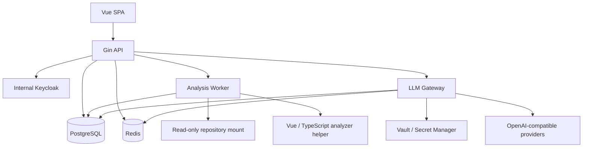

# Cosight MVP 개발 명세서

> 상태: 개발 초안 0.1  
> 작성일: 2026-09-19  
> 상위 문서: [DESIGN.md](./DESIGN.md)  
> 목적: Cosight MVP를 구현 가능한 수준으로 범위, 구조, 인터페이스와 완료 조건을 고정한다.

## 1. 문서 사용 방법

이 문서는 MVP 개발의 기준 문서다. `DESIGN.md`는 제품 전체 방향과 후속 범위를 설명하고, 이 문서는 첫 배포에서 실제로 구현할 범위만 정의한다.

충돌 시 적용 순서는 다음과 같다.

1. 보안 및 데이터 보호 요구사항
2. 이 문서의 MVP 범위와 인수 조건
3. `DESIGN.md`의 장기 설계
4. 구현 세부사항

이 문서에서 `MUST`는 MVP 완료 전에 반드시 구현해야 하는 항목, `SHOULD`는 특별한 사유가 없으면 구현할 항목, `MAY`는 일정에 따라 제외 가능한 항목을 의미한다.

## 2. MVP 목표

### 2.1 제품 목표

사용자가 Go + Gin + Vue 3 + TypeScript + PostgreSQL 프로젝트를 등록하고 다음 질문에 답할 수 있어야 한다.

1. 특정 화면 또는 API는 어디에서 시작하고 어떻게 동작하는가?
2. 프런트엔드 요청은 어떤 Gin Handler, Service, Repository와 DB 테이블로 이어지는가?
3. 선택한 함수나 타입을 변경하면 어떤 코드와 테스트가 직접 영향을 받는가?
4. 그래프의 관계가 어떤 코드에서 만들어졌는가?
5. 선택한 코드와 실행 경로를 LLM이 근거와 함께 설명할 수 있는가?

### 2.2 대표 성공 시나리오

사용자가 `GET /api/projects/:id`를 선택하면 다음 결과를 얻는다.

```text
ProjectDetail.vue
 → useProject
 → projectApi.getProject
 → GET /api/projects/:id
 → projectHandler.Get
 → projectService.Get
 → projectRepository.FindByID
 → PostgreSQL projects
```

각 노드와 관계를 선택하면 Monaco Editor가 실제 정의 또는 호출 위치를 열고, AI 설명에는 유효한 근거 링크가 포함되어야 한다.

### 2.3 MVP 완료 기준

- 사내 Keycloak 계정으로 로그인 및 로그아웃할 수 있다.
- 프로젝트 관리자, 개발자와 조회자 역할이 서버에서 강제된다.
- 서버에 마운트된 저장소를 프로젝트로 등록하고 인덱싱할 수 있다.
- Go, Gin, Vue SFC, TypeScript와 PostgreSQL SQL에서 MVP 필수 노드와 관계를 추출한다.
- 검색, 구조 그래프, 흐름 그래프, 직접 영향 분석과 코드 근거 이동이 동작한다.
- 여러 OpenAI-compatible LLM 연결과 논리 모델 프로필을 시스템 관리자가 설정할 수 있다.
- 프로젝트별 RPM, TPM, 동시 요청과 일·월 토큰 한도를 강제한다.
- 선택 코드·경로 설명, 자연어 검색, 다음 탐색 추천과 근거 기반 질의응답이 동작한다.
- 권한, LLM 관리와 주요 보안 작업이 감사 로그에 남는다.
- 이 문서의 필수 인수 테스트가 자동화되거나 재현 가능한 절차로 검증된다.

## 3. 확정 기술 스택

### 3.1 백엔드와 인프라

| 영역 | 선택 |
| --- | --- |
| 언어 | Go |
| HTTP 프레임워크 | Gin |
| 영구 저장소 | PostgreSQL |
| 분산 제한·단기 상태 | Redis |
| 인증 | 사내 Keycloak OIDC |
| 비밀 관리 | 사내 Vault 또는 승인된 Secret Manager |
| 관측 | OpenTelemetry 호환 Trace, Metric, Log |
| 코드 분석 실행 | Go Worker + 언어별 분석 어댑터 |

### 3.2 프런트엔드

| 영역 | 선택 |
| --- | --- |
| 프레임워크 | Vue 3 Composition API + `<script setup>` |
| UI | Naive UI |
| 스타일 | SCSS |
| 상태 | Pinia |
| 라우팅 | Vue Router |
| 코드 뷰 | Monaco Editor |
| 그래프 | Cytoscape.js |
| 자동 배치 | cytoscape-elk + elkjs Web Worker |

### 3.3 분석 도구

| 대상 | 기본 구현 |
| --- | --- |
| Go | `go/packages`, `go/ast`, `go/types`, SSA |
| Gin | Go AST와 타입 정보를 사용하는 전용 규칙 어댑터 |
| Vue SFC | `@vue/compiler-sfc` 기반 분석 Helper |
| TypeScript | TypeScript Compiler API 또는 Language Service Helper |
| PostgreSQL SQL | PostgreSQL 문법 호환 파서 |
| Git | 서버 로컬 Git CLI의 읽기 전용 명령 |

Vue와 TypeScript 분석 Helper는 Node 런타임을 사용할 수 있으나 외부 API 서버로 노출하지 않는다. Go 분석 Worker가 버전이 고정된 프로세스 또는 로컬 IPC로 호출하고 정규화된 JSON 결과만 받는다.

## 4. MVP 범위

### 4.1 포함 기능

#### 인증과 권한

- Keycloak Authorization Code Flow
- Gin 서버 세션과 HttpOnly 쿠키
- 시스템 관리자 Keycloak client role
- 조직과 프로젝트 구성원
- Project Admin, Developer, Viewer
- 프로젝트 단위 데이터 격리
- 감사 로그

#### 프로젝트와 저장소

- 서버 마운트 경로 기반 저장소 등록
- 허용된 저장소 루트 아래 경로만 등록
- Git 브랜치와 현재 커밋 표시
- 최초 및 증분 인덱싱
- 제외 경로 설정
- 인덱싱 진행 상태와 오류

#### 코드 분석

- 파일과 디렉터리
- 패키지, 모듈, 함수, 메서드, 구조체, 인터페이스와 타입
- 정의, 참조와 import
- 기본 호출 그래프
- Go 인터페이스 구현 관계
- Gin Route, Group, Middleware와 Handler
- Vue 컴포넌트, Router, composable, Pinia와 API 호출
- PostgreSQL 테이블 및 컬럼 읽기·쓰기
- Vue API 호출과 Gin Route 연결
- Git 변경 심볼
- 테스트와 대상 코드의 정적 연결
- 분석 근거와 신뢰도

#### 탐색 UI

- 프로젝트 트리
- 진입점 목록
- 통합 검색
- 구조 및 흐름 그래프
- 직접 영향 분석
- Monaco 코드 뷰
- 노드 및 관계 근거
- 관련 테스트와 Git 변경
- 탐색 세션 저장과 프로젝트 공유

#### LLM

- 여러 OpenAI-compatible 연결
- 실제 모델과 논리 모델 프로필
- 프로젝트 기능별 프로필 할당
- RPM, TPM, 동시 요청과 일·월 토큰 한도
- Provider 보고값 우선 토큰 계량
- 선택 코드 및 호출 경로 설명
- 자연어 코드 검색
- 다음 탐색 대상 추천
- 근거 기반 프로젝트 질의응답
- 운영 대시보드와 시스템 콘솔 내 임계치 표시

### 4.2 제외 기능

- 런타임 Trace와 Coverage 결합
- 자동 Fallback과 가중치 라우팅
- 사용자별 세부 LLM 한도
- 비용 청구
- 사용자 정의 역할
- 파일 및 디렉터리 단위 ACL
- GitHub·GitLab 권한 실시간 동기화
- 원격 Git 저장소 Clone 자격증명 관리
- 다중 저장소 연결
- 자동 테스트 생성
- 자동 코드 수정 및 사용자 승인 없는 파일 쓰기
- 정밀 Taint 분석
- 모바일 UI

## 5. 배포 구조



### 5.1 실행 단위

MVP는 동일 Go 코드베이스에서 다음 실행 모드를 제공한다.

```text
cosight api
cosight worker
cosight migrate
```

- `api`: HTTP, OIDC, 권한, 검색, 그래프 질의, 시스템 관리와 LLM Gateway
- `worker`: 저장소 스캔, 언어 분석, 인덱스 병합과 사용량 집계
- `migrate`: PostgreSQL schema migration

개발 환경에서는 단일 프로세스로 합칠 수 있지만 배포 환경에서는 API와 Worker를 별도 프로세스로 실행한다.

### 5.2 저장소 접근

MVP는 서버 파일 시스템에 읽기 전용으로 마운트된 저장소만 지원한다.

- 환경 설정 `COSIGHT_REPOSITORY_ROOTS`에 허용된 절대 경로를 등록한다.
- 프로젝트 경로는 허용 루트의 하위 경로여야 한다.
- 경로를 정규화한 후 prefix와 심볼릭 링크 탈출을 검사한다.
- Worker는 소스 파일을 수정하지 않는다.
- `.git` 읽기는 허용하지만 Git 명령은 읽기 전용 목록으로 제한한다.
- 저장소 경로는 프로젝트 구성원 외 사용자에게 원본 서버 경로 그대로 노출하지 않고 표시용 별칭을 사용한다.

## 6. 백엔드 모듈 구조

```text
backend/
 ├─ cmd/
 │   └─ cosight/
 ├─ internal/
 │   ├─ app/
 │   ├─ authn/
 │   ├─ authz/
 │   ├─ organization/
 │   ├─ project/
 │   ├─ repository/
 │   ├─ indexing/
 │   ├─ analysis/
 │   │   ├─ scanner/
 │   │   ├─ golang/
 │   │   ├─ ginadapter/
 │   │   ├─ vueadapter/
 │   │   ├─ sqladapter/
 │   │   ├─ linker/
 │   │   └─ evidence/
 │   ├─ graph/
 │   ├─ search/
 │   ├─ exploration/
 │   ├─ llm/
 │   │   ├─ gateway/
 │   │   ├─ provider/
 │   │   ├─ routing/
 │   │   ├─ ratelimit/
 │   │   ├─ usage/
 │   │   └─ evidence/
 │   ├─ audit/
 │   ├─ jobs/
 │   └─ platform/
 │       ├─ postgres/
 │       ├─ redis/
 │       ├─ secret/
 │       └─ telemetry/
 └─ migrations/
```

### 6.1 계층 규칙

- Gin Handler는 요청 파싱, 인증 컨텍스트와 응답 변환만 담당한다.
- 권한 검사는 공통 Authorization Service에서 수행한다.
- Service는 Repository interface에 의존한다.
- 분석 어댑터는 공통 `AnalysisResult`를 반환하고 DB에 직접 쓰지 않는다.
- 인덱스 병합기는 하나의 트랜잭션에서 현재 파일의 이전 결과를 교체한다.
- LLM Provider 어댑터는 프로젝트와 권한 정보를 알지 못한다.
- LLM Gateway가 정책과 계량을 수행한 후 Provider를 호출한다.

## 7. 프런트엔드 구조

```text
frontend/src/
 ├─ app/
 ├─ router/
 ├─ stores/
 ├─ api/
 ├─ layouts/
 ├─ pages/
 │   ├─ projects/
 │   ├─ analysis/
 │   ├─ settings/
 │   └─ system-admin/
 ├─ features/
 │   ├─ project-tree/
 │   ├─ global-search/
 │   ├─ code-graph/
 │   ├─ source-viewer/
 │   ├─ inspector/
 │   ├─ exploration-session/
 │   ├─ ai-assistant/
 │   └─ llm-admin/
 ├─ components/
 ├─ styles/
 └─ types/
```

### 7.1 주요 라우트

| 경로 | 화면 | 권한 |
| --- | --- | --- |
| `/` | 프로젝트 목록 | 로그인 |
| `/projects/:projectId` | 프로젝트 개요 | `project.read` |
| `/projects/:projectId/explore` | 코드 분석 워크스페이스 | `graph.read` |
| `/projects/:projectId/settings` | 프로젝트 설정 | `project.manage` |
| `/projects/:projectId/members` | 프로젝트 구성원 | `member.manage` |
| `/system` | 시스템 대시보드 | System Administrator |
| `/system/llm/connections` | LLM 연결 | System Administrator |
| `/system/llm/models` | 모델 레지스트리 | System Administrator |
| `/system/llm/usage` | 사용량 모니터링 | System Administrator |
| `/system/audit` | 감사 로그 | System Administrator |

### 7.2 분석 워크스페이스 컴포넌트

```text
AnalysisWorkspace
 ├─ WorkspaceHeader
 ├─ ExplorerSidebar
 ├─ GraphWorkspace
 │   ├─ AnalysisModeTabs
 │   ├─ GraphToolbar
 │   └─ CodeGraphCanvas
 ├─ InspectorPanel
 │   ├─ SymbolOverview
 │   ├─ SourceCodeViewer
 │   ├─ EvidenceList
 │   ├─ ReferenceList
 │   ├─ RelatedTests
 │   └─ GitHistory
 ├─ AIAssistantPanel
 └─ AnalysisJobBar
```

Monaco와 Cytoscape 인스턴스는 `shallowRef` 또는 Vue 외부 객체로 관리하고 컴포넌트 해제 시 리소스와 구독을 명시적으로 정리한다.

## 8. 인증과 권한

### 8.1 OIDC 흐름

1. 브라우저가 `GET /api/v1/auth/login`을 호출한다.
2. Gin이 `state`, `nonce`와 PKCE 값을 생성하고 Keycloak으로 리다이렉트한다.
3. Keycloak 인증 후 `/api/v1/auth/callback`으로 돌아온다.
4. Gin이 code를 교환하고 issuer, audience, signature, nonce와 만료를 검증한다.
5. 사용자 정보를 upsert하고 서버 세션을 만든다.
6. 브라우저에는 Secure, HttpOnly, SameSite 쿠키만 전달한다.

### 8.2 MVP 역할

| 역할 | 핵심 권한 |
| --- | --- |
| System Administrator | 모든 시스템 관리 API |
| Organization Admin | 조직 프로젝트 생성과 조직 구성원 관리 |
| Project Admin | 프로젝트 설정, 구성원, 저장소, 분석 및 공유 |
| Developer | 코드 열람, 분석 실행, 개인·프로젝트 탐색 세션 |
| Viewer | 코드·그래프 읽기와 개인 탐색 세션 |

System Administrator는 Keycloak `cosight-system-admin` client role에서 가져온다. Organization Admin과 프로젝트 역할은 PostgreSQL membership에서 관리한다. System Administrator 권한만으로 프로젝트 원본 코드 열람 권한을 자동 부여하지 않는다.

### 8.3 필수 권한

```text
project.read
project.manage
member.manage
repository.connect
repository.sync
source.read
source.search
graph.read
analysis.run
analysis.cancel
analysis.result.read
exploration.create
exploration.update
exploration.share
ai.use
audit.read
```

모든 API는 기본 거부한다. 프로젝트 ID를 받는 요청은 URL, Body 또는 세션의 값을 신뢰하지 않고 DB membership을 확인한다.

## 9. 데이터 모델

모든 ID는 UUID를 사용하고 시각은 UTC로 저장한다. 삭제 복구가 필요한 관리 리소스는 `deleted_at`을 사용하며 코드 인덱스 세부 데이터는 버전 교체 방식으로 관리한다.

### 9.1 인증과 조직

#### `users`

```text
id uuid PK
issuer text NOT NULL
subject text NOT NULL
email text
display_name text
status text NOT NULL
last_login_at timestamptz
created_at timestamptz NOT NULL
updated_at timestamptz NOT NULL
UNIQUE (issuer, subject)
```

#### `user_sessions`

```text
id uuid PK
user_id uuid FK users
session_hash text UNIQUE NOT NULL
expires_at timestamptz NOT NULL
last_seen_at timestamptz NOT NULL
created_at timestamptz NOT NULL
revoked_at timestamptz
```

Refresh Token이 필요하면 별도 암호화 컬럼 또는 Secret Manager 참조로 저장하며 평문 저장을 금지한다.

#### `organizations`, `organization_members`

```text
organizations(id, name, created_at, updated_at)
organization_members(organization_id, user_id, role, created_at)
PK (organization_id, user_id)
```

### 9.2 프로젝트와 구성원

#### `projects`

```text
id uuid PK
organization_id uuid FK organizations
name text NOT NULL
slug text NOT NULL
repository_alias text NOT NULL
repository_path text NOT NULL
default_branch text
current_commit text
status text NOT NULL
active_index_version bigint NOT NULL DEFAULT 0
created_by uuid FK users
created_at timestamptz NOT NULL
updated_at timestamptz NOT NULL
UNIQUE (organization_id, slug)
```

`repository_path`는 API 응답에서 원문을 반환하지 않는다.

#### `project_members`

```text
project_id uuid FK projects
user_id uuid FK users
role text NOT NULL
created_at timestamptz NOT NULL
created_by uuid FK users
PK (project_id, user_id)
```

### 9.3 코드 인덱스

#### `code_files`

```text
id uuid PK
project_id uuid NOT NULL
path text NOT NULL
language text NOT NULL
content_hash text NOT NULL
is_test boolean NOT NULL
is_generated boolean NOT NULL
parse_status text NOT NULL
index_version bigint NOT NULL
created_at timestamptz NOT NULL
UNIQUE (project_id, path, index_version)
```

#### `code_nodes`

```text
id uuid PK
project_id uuid NOT NULL
file_id uuid
stable_key text NOT NULL
kind text NOT NULL
name text NOT NULL
qualified_name text
language text NOT NULL
start_line int
start_column int
end_line int
end_column int
parent_node_id uuid
metadata jsonb NOT NULL DEFAULT '{}'
index_version bigint NOT NULL
UNIQUE (project_id, stable_key, index_version)
```

MVP `kind` 값:

```text
repository directory file package module
struct interface type function method variable
vue_component vue_composable vue_route pinia_store
http_route middleware
db_table db_column sql_statement
test external_system unresolved
```

#### `code_edges`

```text
id uuid PK
project_id uuid NOT NULL
source_node_id uuid NOT NULL
target_node_id uuid NOT NULL
kind text NOT NULL
confidence text NOT NULL
metadata jsonb NOT NULL DEFAULT '{}'
index_version bigint NOT NULL
```

MVP `kind` 값:

```text
contains imports defines references calls implements
registers_route applies_middleware
renders uses_composable reads_state writes_state
http_calls maps_to_route
db_reads db_writes db_joins
tested_by changed_with
```

#### `source_evidence`

```text
id uuid PK
project_id uuid NOT NULL
edge_id uuid
node_id uuid
analyzer text NOT NULL
analyzer_version text NOT NULL
file_id uuid NOT NULL
start_line int NOT NULL
start_column int NOT NULL
end_line int NOT NULL
end_column int NOT NULL
reason text NOT NULL
index_version bigint NOT NULL
CHECK ((edge_id IS NOT NULL) <> (node_id IS NOT NULL))
```

필수 인덱스:

```text
code_nodes(project_id, index_version, kind)
code_nodes(project_id, index_version, qualified_name)
code_edges(project_id, index_version, source_node_id, kind)
code_edges(project_id, index_version, target_node_id, kind)
source_evidence(project_id, edge_id)
source_evidence(project_id, node_id)
```

### 9.4 작업과 탐색 세션

#### `analysis_jobs`

```text
id uuid PK
project_id uuid NOT NULL
type text NOT NULL
status text NOT NULL
requested_by uuid NOT NULL
requested_permission text NOT NULL
target_index_version bigint
progress_current bigint
progress_total bigint
current_step text
error_code text
error_message text
created_at timestamptz NOT NULL
started_at timestamptz
finished_at timestamptz
```

상태 전이:

```text
queued → running → completed
               ├→ failed
               └→ cancelled
```

#### `exploration_sessions`

```text
id uuid PK
project_id uuid NOT NULL
owner_id uuid NOT NULL
name text NOT NULL
visibility text NOT NULL
base_commit text
index_version bigint NOT NULL
state jsonb NOT NULL
created_at timestamptz NOT NULL
updated_at timestamptz NOT NULL
```

### 9.5 LLM 관리

핵심 테이블:

```text
llm_connections
llm_models
llm_model_profiles
llm_project_bindings
llm_rate_limit_policies
llm_requests
llm_usage_daily
llm_health_checks
```

#### `llm_connections`

```text
id uuid PK
name text UNIQUE NOT NULL
provider_type text NOT NULL
base_url text NOT NULL
auth_type text NOT NULL
secret_ref text NOT NULL
network_class text NOT NULL
region text
timeout_ms int NOT NULL
status text NOT NULL
created_by uuid NOT NULL
created_at timestamptz NOT NULL
updated_at timestamptz NOT NULL
```

#### `llm_models`, `llm_model_profiles`

```text
llm_models(
  id, connection_id, provider_model_id, display_name,
  capabilities, context_limit, max_output_tokens,
  tokenizer, status, created_at, updated_at
)

llm_model_profiles(
  id, name, purpose, model_id,
  max_input_tokens, max_output_tokens,
  allow_streaming, data_classification,
  timeout_ms, prompt_version, status,
  created_at, updated_at
)
```

#### `llm_project_bindings`

```text
id uuid PK
project_id uuid NOT NULL
feature text NOT NULL
profile_id uuid NOT NULL
enabled boolean NOT NULL
allow_external_transfer boolean NOT NULL
created_at timestamptz NOT NULL
updated_at timestamptz NOT NULL
UNIQUE (project_id, feature)
```

#### `llm_rate_limit_policies`

```text
id uuid PK
scope_type text NOT NULL
scope_id uuid NOT NULL
rpm int
tpm bigint
max_concurrency int
daily_tokens bigint
monthly_tokens bigint
version bigint NOT NULL
updated_at timestamptz NOT NULL
UNIQUE (scope_type, scope_id)
```

#### `llm_requests`

```text
id uuid PK
request_id text UNIQUE NOT NULL
organization_id uuid NOT NULL
project_id uuid NOT NULL
user_id uuid NOT NULL
feature text NOT NULL
profile_id uuid NOT NULL
connection_id uuid NOT NULL
model_id uuid NOT NULL
status text NOT NULL
input_tokens bigint
output_tokens bigint
token_source text
latency_ms bigint
time_to_first_token_ms bigint
provider_request_id text
error_type text
created_at timestamptz NOT NULL
completed_at timestamptz
```

프롬프트와 응답 본문은 저장하지 않는다.

### 9.6 감사 로그

```text
audit_events(
  id, occurred_at, actor_type, actor_id,
  organization_id, project_id,
  action, resource_type, resource_id,
  result, request_id, ip_address, user_agent, metadata
)
```

감사 `metadata`에는 소스코드, 토큰, API Key, Client Secret, 프롬프트와 LLM 응답 본문을 넣지 않는다.

## 10. HTTP API

모든 API는 `/api/v1` prefix를 사용하고 JSON을 기본 형식으로 한다. 목록은 cursor pagination을 사용한다.

### 10.1 공통 오류 형식

```json
{
  "error": {
    "code": "PROJECT_ACCESS_DENIED",
    "message": "프로젝트에 접근할 수 없습니다.",
    "requestId": "req_...",
    "details": {}
  }
}
```

내부 경로, SQL, Token, Stack trace와 Provider 비밀 정보는 응답에 포함하지 않는다.

### 10.2 인증

| Method | Path | 설명 |
| --- | --- | --- |
| GET | `/auth/login` | Keycloak 로그인 시작 |
| GET | `/auth/callback` | OIDC callback |
| POST | `/auth/logout` | 로컬 및 Keycloak 로그아웃 |
| GET | `/auth/me` | 사용자, 시스템 역할과 프로젝트 요약 |

### 10.3 프로젝트

| Method | Path | 권한 | 설명 |
| --- | --- | --- | --- |
| GET | `/projects` | 로그인 | 접근 가능한 프로젝트 목록 |
| POST | `/projects` | 조직 관리자 | 프로젝트 등록 |
| GET | `/projects/:id` | `project.read` | 프로젝트 상세 |
| PATCH | `/projects/:id` | `project.manage` | 이름, 제외 경로와 설정 변경 |
| POST | `/projects/:id/index` | `analysis.run` | 최초 또는 증분 인덱싱 시작 |
| GET | `/projects/:id/index/status` | `project.read` | 현재 인덱스와 작업 상태 |
| GET | `/projects/:id/members` | `member.manage` | 구성원 목록 |
| PUT | `/projects/:id/members/:userId` | `member.manage` | 역할 지정 |
| DELETE | `/projects/:id/members/:userId` | `member.manage` | 구성원 제거 |

프로젝트 생성 요청:

```json
{
  "organizationId": "uuid",
  "name": "Cosight",
  "slug": "cosight",
  "repositoryAlias": "cosight-main",
  "repositoryPath": "C:/repositories/cosight",
  "excludePatterns": ["node_modules/**", "dist/**", "vendor/**"]
}
```

서버는 경로를 정규화하고 허용 루트 하위인지 확인한 후 저장한다.

### 10.4 검색과 진입점

| Method | Path | 권한 | 설명 |
| --- | --- | --- | --- |
| GET | `/projects/:id/search?q=&kinds=&cursor=` | `source.search` | 통합 검색 |
| GET | `/projects/:id/entry-points?kind=&cursor=` | `graph.read` | Gin·Vue 진입점 |
| GET | `/projects/:id/files/tree` | `source.read` | 파일 트리 |
| GET | `/projects/:id/files/:fileId/content` | `source.read` | 코드 내용 |
| GET | `/projects/:id/symbols/:nodeId` | `source.read` | 심볼 상세 |

검색 결과는 `file`, `symbol`, `http_route`, `vue_route`, `error_string`, `db_table` 종류를 지원한다.

### 10.5 그래프

| Method | Path | 권한 | 설명 |
| --- | --- | --- | --- |
| POST | `/projects/:id/graph/query` | `graph.read` | 시작점과 모드 기반 그래프 조회 |
| POST | `/projects/:id/graph/expand` | `graph.read` | 노드 주변 한 단계 확장 |
| GET | `/projects/:id/edges/:edgeId/evidence` | `graph.read` | 관계 근거 |
| GET | `/projects/:id/nodes/:nodeId/evidence` | `graph.read` | 노드 근거 |
| POST | `/projects/:id/impact` | `analysis.run` | 직접 영향 분석 |

그래프 질의 요청:

```json
{
  "mode": "flow",
  "startNodeIds": ["uuid"],
  "direction": "outgoing",
  "depth": 2,
  "edgeKinds": ["calls", "http_calls", "maps_to_route", "db_reads"],
  "maxNodes": 200
}
```

응답:

```json
{
  "indexVersion": 12,
  "partial": false,
  "nodes": [],
  "edges": [],
  "aggregates": [],
  "warnings": []
}
```

서버는 `depth`와 `maxNodes`에 상한을 적용한다. 상한을 넘는 결과는 집계 노드로 반환한다.

### 10.6 탐색 세션

| Method | Path | 권한 | 설명 |
| --- | --- | --- | --- |
| GET | `/projects/:id/explorations` | `project.read` | 접근 가능한 세션 목록 |
| POST | `/projects/:id/explorations` | `exploration.create` | 세션 저장 |
| GET | `/projects/:id/explorations/:sessionId` | `project.read` | 세션 조회 |
| PATCH | `/projects/:id/explorations/:sessionId` | `exploration.update` | 세션 갱신 |
| DELETE | `/projects/:id/explorations/:sessionId` | 소유자 또는 Admin | 세션 삭제 |

### 10.7 LLM 프로젝트 기능

| Method | Path | 권한 | 설명 |
| --- | --- | --- | --- |
| POST | `/projects/:id/ai/explain` | `ai.use` | 코드 또는 경로 설명 |
| POST | `/projects/:id/ai/search-intent` | `ai.use` | 자연어를 그래프 질의로 변환 |
| POST | `/projects/:id/ai/next-actions` | `ai.use` | 다음 탐색 추천 |
| POST | `/projects/:id/ai/ask` | `ai.use` | 근거 기반 질의응답 |
| GET | `/projects/:id/ai/usage` | Project Admin | 프로젝트 사용량 |

AI 요청은 `feature`, `profile`, `selectedNodeIds`, `selectedEdgeIds`, `question`과 Git 기준점을 받는다. 서버가 Context Builder를 통해 실제 코드 문맥을 구성하므로 클라이언트가 임의 소스 문맥을 Provider로 전달하지 않는다.

Streaming은 SSE를 사용한다.

```text
event: metadata
event: delta
event: evidence
event: usage
event: done
event: error
```

SSE 연결에도 세션, 프로젝트 권한과 사용량 제한을 적용한다.

### 10.8 시스템 관리 API

모든 경로는 Keycloak `cosight-system-admin` 역할을 요구한다.

| Method | Path | 설명 |
| --- | --- | --- |
| GET/POST | `/system/llm/connections` | 연결 목록 및 생성 |
| GET/PATCH/DELETE | `/system/llm/connections/:id` | 연결 관리 |
| POST | `/system/llm/connections/:id/test` | 연결 시험 |
| POST | `/system/llm/connections/:id/rotate-secret` | 자격증명 참조 교체 |
| GET/POST | `/system/llm/models` | 실제 모델 목록 및 등록 |
| GET/POST | `/system/llm/profiles` | 논리 프로필 목록 및 등록 |
| PATCH | `/system/llm/profiles/:id` | 프로필 수정 |
| PUT | `/system/projects/:id/llm-bindings/:feature` | 프로젝트 기능별 프로필 할당 |
| GET/PUT | `/system/llm/limits/:scopeType/:scopeId` | 한도 조회 및 변경 |
| GET | `/system/llm/usage` | 사용량과 성능 집계 |
| GET | `/system/llm/health` | Provider 상태 |
| GET | `/system/audit` | 감사 로그 |

비밀 교체 API는 실제 비밀 값을 DB에 저장하지 않고 Secret Manager에 기록한 뒤 `secret_ref`만 갱신한다.

### 10.9 작업 상태

| Method | Path | 권한 | 설명 |
| --- | --- | --- | --- |
| GET | `/jobs/:jobId` | 해당 프로젝트 읽기 | 작업 상세 |
| POST | `/jobs/:jobId/cancel` | `analysis.cancel` | 작업 취소 요청 |
| GET | `/jobs/:jobId/events` | 해당 프로젝트 읽기 | SSE 진행 이벤트 |

## 11. 분석 파이프라인

### 11.1 작업 흐름

```text
1. 프로젝트 경로 검증
2. 파일 스캔 및 ignore 적용
3. 파일 해시 비교
4. 변경 파일 언어별 분석
5. 노드·관계·근거 정규화
6. Gin·Vue·SQL 프레임워크 연결
7. 변경 파일 결과 트랜잭션 반영
8. 제거된 파일 결과 삭제
9. 전체 연결 후처리
10. 새 index_version 활성화
11. 검색 인덱스 갱신
```

새 인덱스가 완료되기 전까지 기존 활성 버전을 서비스한다. 최초 인덱싱에서는 완료된 파일의 부분 결과를 별도 `partial` 상태로 제공할 수 있지만 완전한 결과로 표시하지 않는다.

### 11.2 어댑터 인터페이스

```go
type Analyzer interface {
    Name() string
    Version() string
    Supports(path string, language string) bool
    Analyze(ctx context.Context, input AnalyzeInput) (AnalysisResult, error)
}

type AnalysisResult struct {
    Nodes     []CodeNode
    Edges     []CodeEdge
    Evidence  []SourceEvidence
    Warnings  []AnalysisWarning
}
```

### 11.3 MVP 분석 정확도 규칙

- 직접 AST 및 타입 확인 관계만 `confirmed`로 저장한다.
- 인터페이스 구현 후보와 정적 URL 매칭은 `probable`로 저장한다.
- 문자열 또는 명명 규칙은 `inferred`로 저장한다.
- 동적 호출을 분석하지 못하면 관계를 만들지 않는 대신 `unresolved` 노드 또는 경고를 생성한다.
- 모든 엣지는 최소 하나의 `source_evidence`를 가져야 한다.
- 근거가 없는 LLM 추론은 코드 그래프 엣지로 영구 저장하지 않는다.

### 11.4 Gin 분석 인수 조건

다음을 복원해야 한다.

```go
r := gin.New()
api := r.Group("/api", AuthMiddleware())
projects := api.Group("/projects")
projects.GET("/:id", PermissionMiddleware(), handler.Get)
```

기대 결과:

```text
GET /api/projects/:id
middleware: AuthMiddleware → PermissionMiddleware
handler: handler.Get
```

### 11.5 Vue·Gin 연결 인수 조건

다음 API 호출을 Gin Route와 연결한다.

```typescript
client.get(`/api/projects/${id}`)
```

정적 문자열 구간과 path parameter를 정규화해 `GET /api/projects/:id`와 `probable` 관계를 만든다. OpenAPI 생성 클라이언트 근거가 있으면 `confirmed`로 승격할 수 있다.

### 11.6 SQL 분석 인수 조건

다음 SQL에서 테이블과 컬럼 관계를 추출한다.

```sql
SELECT p.id, p.name, u.name AS owner_name
FROM projects p
JOIN users u ON u.id = p.owner_id
WHERE p.id = $1;
```

기대 결과:

```text
reads projects.id
reads projects.name
reads projects.owner_id
reads users.id
reads users.name
joins projects.owner_id → users.id
```

## 12. 그래프 질의와 UI 동작

### 12.1 기본 모드

MVP는 다음 세 모드를 제공한다.

| 모드 | 결과 |
| --- | --- |
| 구조 | 패키지, 파일, 타입과 의존 관계 |
| 흐름 | 선택 진입점에서 호출·HTTP·DB 방향 경로 |
| 영향 | 선택 노드의 직접 호출자, 참조와 테스트 |

버그 전용 모드는 후속 UI로 두되 오류 문자열 검색과 관련 호출 경로 탐색은 MVP에서 지원한다.

### 12.2 노드 상호작용

- 한 번 선택: 코드와 상세 정보 열기
- 호출 대상 펼치기: outgoing 한 단계 추가
- 호출자 펼치기: incoming 한 단계 추가
- 집중 보기: 선택 경로 외 노드 숨김
- 경로 고정: 레이아웃 변경에도 유지
- 영향 분석: 영향 모드로 전환
- 관련 테스트: 테스트 목록 표시

한 번의 확장은 기본 50개 노드, 서버 최대 200개 노드로 제한한다. 초과 결과는 종류별 집계 노드로 반환한다.

### 12.3 관계 상호작용

관계를 선택하면 다음을 표시한다.

```text
관계 종류
source와 target
confidence
analyzer와 version
근거 파일과 범위
분석 이유와 한계
```

근거를 클릭하면 Monaco가 해당 파일을 열고 범위를 중앙에 표시한다.

### 12.4 Monaco 동작

- 기본 읽기 전용
- 파일별 고유 URI Model
- 현재 선택, 관계 근거와 Git 변경을 별도 Decoration으로 관리
- 프로젝트 전환 시 사용하지 않는 Model dispose
- 그래프 선택은 코드로 즉시 이동
- 코드 심볼 선택은 그래프 변경을 제안하지만 자동으로 기준점을 바꾸지 않음

### 12.5 Cytoscape와 ELK

- Cytoscape는 렌더링, 선택, 확대와 이동을 담당한다.
- ELK는 Web Worker에서 계층형 좌표를 계산한다.
- 고정 노드와 사용자가 이동한 노드는 불필요한 전체 재배치에서 제외한다.
- 새 레이아웃 요청이 시작되면 이전 결과에 작업 ID를 붙여 늦은 결과 적용을 방지한다.

## 13. LLM Gateway 명세

### 13.1 처리 순서

```text
1. 사용자 세션 확인
2. project membership 및 ai.use 확인
3. 기능별 프로젝트 binding 조회
4. 코드 반출 정책 확인
5. Context Builder 실행
6. RPM·TPM·동시 요청 예약
7. 논리 프로필을 실제 연결과 모델로 해석
8. Secret Manager에서 자격증명 조회
9. Provider 호출
10. 응답 근거 검증
11. 실제 사용량 정산
12. 요청 기록과 Metric 저장
```

### 13.2 Context Builder

기능별 허용 문맥:

| 기능 | 문맥 |
| --- | --- |
| Explain | 선택 노드·엣지, 근거 코드, 주변 1단계 |
| Search intent | 사용자 질문과 허용된 종류·관계 schema |
| Next actions | 현재 선택, 주변 1단계, 관련 테스트 |
| Ask | 선택 경로, 질문, 관련 근거 코드와 타입 |

MVP에서 한 요청의 코드 문맥은 프로젝트 정책과 모델 프로필의 최대 입력 토큰보다 작아야 한다. 초과 시 관련도가 낮은 주변 노드, 긴 구현, 테스트 순으로 축소하고 축소 사실을 응답에 표시한다.

### 13.3 구조화 응답

```json
{
  "summary": "...",
  "facts": [
    {"text": "...", "evidenceIds": ["uuid"]}
  ],
  "hypotheses": [
    {"text": "...", "confidence": "medium", "nextNodeIds": ["uuid"]}
  ],
  "unknowns": ["..."]
}
```

Evidence Validator는 ID가 현재 프로젝트, 인덱스 버전과 요청 문맥에 존재하는지 검사한다. 실패한 근거는 제거하고 해당 문장을 `unknowns` 또는 근거 없는 추론으로 표시한다.

### 13.4 Rate limit

적용 계층:

```text
system → connection → profile → project
```

실제 한도는 가장 작은 유효값을 사용한다.

- RPM: Redis sliding window 또는 token bucket
- TPM: 예상 입력 + 최대 출력 예약 후 실제 사용량 정산
- 동시 요청: Redis semaphore
- 일·월 토큰: PostgreSQL 집계와 Redis 단기 증분

제한 실패는 Provider를 호출하기 전에 429와 `retryAfterSeconds`를 반환한다.

### 13.5 토큰 정산

- Provider 사용량 응답이 있으면 `reported`로 저장한다.
- 없으면 모델별 tokenizer 값으로 `estimated`를 저장한다.
- Streaming 중단도 확인 가능한 토큰을 기록한다.
- 재시도는 각 Provider attempt의 사용량을 합산한다.
- 프롬프트, 응답과 내부 추론 원문은 저장하지 않는다.

### 13.6 MVP 장애 처리

- 자동 Fallback을 수행하지 않는다.
- 연결 Timeout은 프로필 설정을 따른다.
- Retry는 응답 전 일시적 네트워크 오류에 한해 최대 1회다.
- Streaming이 시작된 후 재시도하지 않는다.
- 연속 실패가 임계값을 넘으면 Circuit Breaker를 연다.
- 열린 Circuit은 관리 화면과 Metric에 표시한다.

## 14. 시스템 관리 화면

### 14.1 LLM 연결

- 목록, 상태와 마지막 검사
- 연결 생성 및 수정
- Secret reference 등록과 교체
- 연결 테스트
- 활성·비활성 전환
- 연결을 사용하는 모델과 프로젝트 확인

비밀 값은 입력 후 다시 표시하지 않는다.

### 14.2 모델과 프로필

- Provider model ID와 capability 등록
- Context 및 출력 한도
- 논리 프로필 이름과 목적
- 기능별 파라미터와 데이터 등급
- 프로젝트 할당 현황

### 14.3 사용량

필수 지표:

- 요청·성공·실패 수
- Input·Output·Total tokens
- RPM·TPM과 동시 요청
- p50·p95·p99 지연
- Provider 429와 내부 429
- `reported`와 `estimated` 비율
- 프로젝트·프로필·모델·연결별 필터

### 14.4 임계치 상태

MVP는 화면 내 상태만 제공한다.

- 프로젝트 RPM·TPM 80%, 90%, 100%
- 일·월 토큰 80%, 90%, 100%
- Provider 연결 실패
- 오류율과 p95 지연 초과
- 자격증명 만료 임박
- Circuit Breaker 열림

## 15. 보안 요구사항

### 15.1 필수 통제

- 모든 API는 기본 거부한다.
- 프로젝트 리소스 접근은 매 요청 membership을 확인한다.
- 시스템 관리 API는 Keycloak client role을 확인한다.
- 저장소 경로는 allowlist와 실제 경로를 검증한다.
- LLM 자격증명은 Secret Manager에 저장한다.
- 로그와 Trace에 소스 본문, 토큰, 비밀, 프롬프트와 응답을 기록하지 않는다.
- AI 요청 전에 프로젝트 코드 반출 정책을 검사한다.
- 다운로드 또는 SSE도 일반 API와 동일하게 권한을 검사한다.
- 캐시 키에 organization, project, index version과 permission version을 포함한다.
- PostgreSQL 질의는 항상 project scope를 포함한다.

### 15.2 감사 대상

- 로그인, 로그아웃과 로그인 실패
- 프로젝트와 구성원 변경
- 저장소 등록과 인덱싱
- LLM 연결, 자격증명 참조, 모델과 프로필 변경
- 프로젝트 LLM binding과 한도 변경
- AI 요청과 코드 반출
- 탐색 세션 공유 범위 변경
- 내보내기
- 권한 거부

### 15.3 데이터 보존

MVP 기본값:

| 데이터 | 보존 |
| --- | --- |
| 코드 인덱스 | 프로젝트가 존재하는 동안 활성 및 직전 1개 버전 |
| 분석 작업 | 30일 |
| LLM 요청 메타데이터 | 90일 |
| 시간별 사용량 | 90일 |
| 일별 사용량 | 1년 |
| 감사 로그 | 사내 정책 적용, 기본 1년 |
| 프롬프트·응답 본문 | 저장하지 않음 |

실제 기간은 사내 보안 정책 확인 후 환경 설정으로 변경 가능하게 한다.

## 16. 관측과 운영

### 16.1 공통 식별자

모든 요청과 작업에 다음 식별자를 전파한다.

```text
request_id
trace_id
user_id
organization_id
project_id
job_id
llm_request_id
```

소스코드와 비밀 값은 label 또는 attribute로 사용하지 않는다.

### 16.2 필수 Metric

```text
http_server_request_duration
http_server_requests_total
analysis_jobs_total
analysis_job_duration
analysis_files_total
analysis_warnings_total
graph_query_duration
graph_query_nodes
llm_requests_total
llm_request_duration
llm_input_tokens
llm_output_tokens
llm_rate_limit_rejections_total
llm_active_requests
```

### 16.3 Health endpoint

| Path | 용도 |
| --- | --- |
| `/health/live` | 프로세스 생존 |
| `/health/ready` | PostgreSQL, Redis와 필수 초기화 상태 |

외부 LLM 또는 Keycloak 일시 장애는 API 자체 readiness를 반드시 실패시키지 않는다. 상세 상태는 시스템 관리 Health에서 확인한다.

## 17. 환경 설정

필수 환경 변수 이름의 초안:

```text
COSIGHT_ENV
COSIGHT_PUBLIC_URL
COSIGHT_HTTP_ADDR
COSIGHT_DATABASE_URL
COSIGHT_REDIS_URL
COSIGHT_REPOSITORY_ROOTS
COSIGHT_SESSION_SECRET_REF

COSIGHT_OIDC_ISSUER
COSIGHT_OIDC_CLIENT_ID
COSIGHT_OIDC_CLIENT_SECRET_REF
COSIGHT_OIDC_REDIRECT_URL
COSIGHT_OIDC_SYSTEM_ADMIN_ROLE

COSIGHT_SECRET_PROVIDER
COSIGHT_SECRET_PROVIDER_ADDR

COSIGHT_OTEL_EXPORTER_ENDPOINT
COSIGHT_LOG_LEVEL
```

실제 Secret은 환경 변수 값에 직접 넣기보다 Secret reference나 실행 환경의 안전한 주입 방식을 사용한다.

## 18. 테스트 전략

### 18.1 단위 테스트

- 역할-권한 매핑
- 저장소 경로 정규화와 탈출 방지
- 심볼 stable key
- Gin Route 경로 결합
- Vue URL 정규화
- SQL 테이블·컬럼 추출
- Evidence confidence 규칙
- RPM·TPM 계산과 정산
- Context Builder 토큰 축소
- Evidence Validator

### 18.2 통합 테스트

- Keycloak 테스트 realm 로그인과 역할
- PostgreSQL migration 및 프로젝트 격리
- Redis 동시 Rate limit
- Worker 인덱스 버전 전환
- Go와 Vue Analyzer Helper 프로토콜
- OpenAI-compatible Mock Provider의 일반·Streaming·429·Timeout 응답
- Secret Manager Mock의 조회와 교체

### 18.3 E2E 테스트

1. 로그인한다.
2. 프로젝트를 등록한다.
3. 인덱싱 완료를 기다린다.
4. Gin Route를 검색한다.
5. Vue에서 PostgreSQL까지 그래프를 연다.
6. 관계 근거를 Monaco에서 확인한다.
7. 직접 영향 분석을 실행한다.
8. AI로 흐름 설명을 생성하고 근거 링크를 확인한다.
9. Viewer가 분석 실행 및 시스템 관리 API에서 거부되는지 확인한다.
10. 프로젝트 한도를 초과해 429가 반환되는지 확인한다.

### 18.4 보안 테스트

- 다른 프로젝트 ID로 수평 권한 상승 시도
- 다른 사용자의 private 탐색 세션 접근
- 경로 traversal과 symlink escape
- 시스템 관리자 역할 위조
- SSE 재연결 시 권한 누락
- Redis key scope 충돌
- 프롬프트에 포함된 비밀 후보 차단
- 로그와 Trace의 소스 및 Secret 노출 검사

## 19. 성능 목표

성능 목표는 기준 개발 장비와 샘플 저장소를 명시해 측정한다.

| 항목 | MVP 목표 |
| --- | --- |
| 1단계 그래프 조회 | p95 1초 이내 |
| 통합 검색 | p95 500ms 이내 |
| 코드 파일 열기 | p95 500ms 이내, 대용량 파일 제외 |
| 그래프 렌더링 | 노드 500, 엣지 1,500에서 선택·이동 가능 |
| 증분 인덱싱 | 저장 후 변경 파일이 수 초 내 작업에 포함 |
| API 일반 오류율 | 정상 운영 구간 1% 미만 |

최초 전체 인덱싱 시간은 저장소 크기와 언어 도구의 영향을 크게 받으므로 절대 SLA 대신 처리 파일 수, 현재 단계와 예상 범위를 표시한다.

## 20. 구현 마일스톤

### M0. 프로젝트 골격과 개발 환경

- Go API와 Worker 실행 모드
- Vue SPA
- PostgreSQL과 Redis
- Migration과 기본 CI
- 공통 오류와 Request ID
- 로컬 Keycloak 및 Mock LLM 개발 구성

완료 조건: 로그인 전 SPA, API health, DB migration과 Worker 기동이 자동화된다.

### M1. 인증·권한·프로젝트

- Keycloak OIDC와 서버 세션
- System Administrator 역할
- 조직, 프로젝트와 구성원
- 저장소 경로 allowlist
- 감사 로그 기반

완료 조건: 역할별 API 접근과 다른 프로젝트 격리 테스트가 통과한다.

### M2. 코드 인덱스 기반

- 파일 스캔과 증분 작업
- 공통 노드·엣지·근거 모델
- Go 심볼·타입·import·기본 호출
- 파일 트리와 검색 API
- 작업 상태 SSE

완료 조건: 샘플 Go 프로젝트의 심볼과 직접 호출 관계를 코드 근거로 조회한다.

### M3. 프레임워크 연결

- Gin Route와 Middleware
- Vue SFC, Router, composable, Pinia와 API 호출
- PostgreSQL SQL 읽기·쓰기
- Vue API와 Gin Route 연결
- 테스트 연결과 Git 변경 심볼

완료 조건: 대표 성공 시나리오의 전체 경로가 생성된다.

### M4. 탐색 워크스페이스

- 프로젝트 트리와 진입점
- Cytoscape 구조·흐름·영향 모드
- ELK Web Worker
- Monaco와 근거 동기화
- 탐색 세션

완료 조건: 사용자가 그래프에서 코드로 이동하고 한 단계 확장 및 직접 영향 분석을 수행한다.

### M5. LLM 관리와 Gateway

- 시스템 관리 콘솔
- 연결, 모델, 프로필과 프로젝트 binding
- Secret Manager 연동
- Redis Rate limiter
- 토큰 예약과 정산
- 사용량과 Health

완료 조건: 서로 다른 프로젝트 한도가 독립적으로 적용되고 시스템 관리자가 사용량을 조회한다.

### M6. 근거 기반 AI

- Context Builder
- 코드·경로 설명
- 자연어 검색
- 다음 탐색 추천
- 근거 기반 Q&A
- Evidence Validator와 Streaming UI

완료 조건: 모든 사실 문장이 유효한 근거를 갖거나 추론·미확인으로 명시된다.

### M7. 안정화와 배포

- 성능 측정과 인덱스 튜닝
- 권한 및 보안 테스트
- 장애 복구와 운영 문서
- 데이터 보존 작업
- 라이선스 고지

완료 조건: 이 문서의 Definition of Done을 충족한다.

## 21. Definition of Done

기능은 다음 조건을 모두 만족해야 완료로 간주한다.

- 인수 조건이 테스트 또는 재현 가능한 검증 절차로 존재한다.
- 서버 권한 검사가 구현되어 있다.
- 실패, 빈 상태와 부분 결과 UI가 있다.
- 로그에 Request ID와 필요한 운영 문맥이 있다.
- 소스코드, Secret과 토큰이 로그에 포함되지 않는다.
- Metric과 감사 이벤트가 정의된 기능은 실제로 기록된다.
- DB migration과 rollback 또는 복구 절차가 있다.
- API schema와 프런트엔드 타입이 일치한다.
- 관련 단위·통합 테스트가 통과한다.
- 주요 사용자 경로의 E2E 테스트가 통과한다.
- 사용자 문서 또는 시스템 관리자 문서가 갱신된다.

## 22. 개발 시작 전 확정할 항목

다음 항목은 M0 종료 전 확정해야 한다.

1. 사내 Keycloak realm, client와 callback URL
2. `cosight-system-admin` 역할의 관리 주체
3. 저장소 마운트 허용 루트와 운영 배포 방식
4. 사내 Vault 또는 Secret Manager 제품과 접근 방식
5. MVP에서 연결할 OpenAI-compatible Provider와 데이터 처리 지역
6. 기본 RPM, TPM, 동시 요청과 일·월 토큰 한도
7. 감사 로그와 LLM 사용량의 실제 보존 기간
8. 기준 샘플 저장소와 성능 측정 장비
9. Vue·TypeScript Analyzer Helper의 실행·배포 방식
10. PostgreSQL SQL Parser 선정

미확정 항목은 기본값을 코드에 하드코딩하지 않고 환경 설정 또는 Adapter interface 뒤에 둔다.

## 23. 후속 문서

M0~M1에서 다음 문서를 추가한다.

- `docs/api/openapi.yaml`: REST 및 SSE API 계약
- `docs/database/schema.md`: 테이블, 제약과 migration 정책
- `docs/analysis/protocol.md`: 언어 분석 Helper 프로토콜
- `docs/analysis/graph-schema.md`: 노드, 엣지와 근거 enum
- `docs/security/threat-model.md`: 인증, 저장소, LLM과 관리자 위협 모델
- `docs/operations/runbook.md`: 장애, 백업, 자격증명 교체와 Rate limit 운영
- `docs/testing/acceptance.md`: 샘플 저장소와 기대 분석 결과
